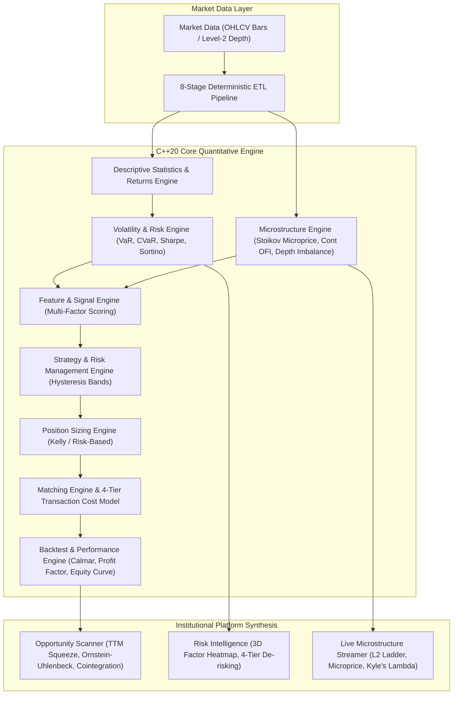

# Comprehensive Mathematical & Quantitative Models Specification
## Platform: QuantPulse-VP (Institutional Quantitative Trading & Risk Platform)

---

## Executive Summary

**QuantPulse-VP** is a multi-tier quantitative trading and risk analytics platform built with:
1. **Core Quantitative Engine (`cpp-engine/`)**: High-performance, zero-allocation C++20 library implementing deterministic financial mathematics, market microstructure metrics, risk intelligence, limit order book matching, and event-driven backtesting.
2. **Platform & Orchestration Layer (`backend/`)**: Node.js / TypeScript / Express platform providing an 8-stage financial ETL pipeline, cross-sectional opportunity scanners, synthetic broker feeds, and portfolio stress testing.
3. **Institutional Frontend (`frontend/`)**: React 19 / Vite / Tailwind platform visualizing real-time depth ladders, 3D risk heatmaps, interactive TradingView lightweight charts, and strategy equity curves.

This document details **every mathematical formula, statistical model, and quantitative algorithm** implemented in this codebase. For every model, this specification provides:
- **Code Evidence**: File paths and line numbers linking directly to the C++ engine, TypeScript backend, or React frontend.
- **What It Is**: Mathematical and financial theory explaining why institutional quants use it.
- **How It Works**: Formal equations, variable definitions, and computational mechanics.
- **Concrete Data Example**: Step-by-step numerical calculation using real market data (e.g. RELIANCE, TCS, NIFTY 50, Level-2 quotes).
- **How It Calculates What**: Exact mapping from raw inputs through intermediate transformations to final metrics.
- **How It Is Used for Prediction & Alpha**: How strategies, signals, execution algorithms, and risk managers forecast prices, volatility regimes, or downside tail risks.
- **How It Is Displayed by Frontend**: The exact React component, visual chart type, UI badges, color semantics, and user interactions.

---

---

## 1. Descriptive Statistics & Time-Series Foundations

The statistical core is implemented in [`cpp-engine/include/quantpulse/domain/statistics/StatisticsEngine.hpp`](file:///root/project/QuantPulse-VP/cpp-engine/include/quantpulse/domain/statistics/StatisticsEngine.hpp) and [`cpp-engine/src/domain/statistics/StatisticsEngine.cpp`](file:///root/project/QuantPulse-VP/cpp-engine/src/domain/statistics/StatisticsEngine.cpp). All functions enforce strict input validation, finite floating-point checks (`std::isfinite`), and exact degree-of-freedom bounds.

---

### 1.1 Arithmetic Mean

#### What It Is
The arithmetic mean represents the central tendency (expected value) of a financial time series (e.g., asset returns, close prices, or order sizes). In quantitative finance, it serves as the baseline drift term $\mu$ in stochastic price models and the empirical baseline for excess return calculations.

#### How It Works & Mathematical Formulation
- **Code Reference**: [`cpp-engine/include/quantpulse/domain/statistics/StatisticsEngine.hpp#L34-L36`](file:///root/project/QuantPulse-VP/cpp-engine/include/quantpulse/domain/statistics/StatisticsEngine.hpp#L34-L36), [`cpp-engine/src/domain/statistics/StatisticsEngine.cpp#L19-L33`](file:///root/project/QuantPulse-VP/cpp-engine/src/domain/statistics/StatisticsEngine.cpp#L19-L33)
- **Formula**:
  $$\mu = \frac{1}{N} \sum_{i=1}^{N} x_i$$
- **Parameters & Inputs**:
  - `values` (`const std::vector<double>&`): Array of observations ($N \ge 1$). Every entry must satisfy `std::isfinite(x)`. If empty, the engine throws `std::invalid_argument("Cannot compute mean of empty vector")`.
- **Calculation Procedure**:
  1. Validate vector length $N \ge 1$.
  2. Iterate through elements with an accumulator initialized to `0.0`. If any element is NaN or infinite, throw `std::invalid_argument`.
  3. Divide accumulated sum by $N$ using 64-bit IEEE 754 precision.

#### Concrete Data Example (Step-by-Step Calculation)
- **Sample Data**: 5 closing prices of **RELIANCE** (₹):
  $$\mathbf{P} = [2840.00, 2845.50, 2852.00, 2848.25, 2860.25]$$
- **Step 1: Check inputs**: $N = 5$, all elements are finite real numbers.
- **Step 2: Accumulate Sum**:
  $$\sum_{i=1}^{5} P_i = 2840.00 + 2845.50 + 2852.00 + 2848.25 + 2860.25 = 14246.00$$
- **Step 3: Divide by $N$**:
  $$\mu = \frac{14246.00}{5} = 2849.20$$
- **Output**: $\mu = 2849.20\text{ ₹}$.

#### How It Calculates What
- **Input**: Vector of $N$ raw asset prices or returns $\mathbf{x} \in \mathbb{R}^N$.
- **Intermediate**: Total sum $S = \sum_{i=1}^N x_i$.
- **Output**: Arithmetic mean $\mu \in \mathbb{R}$, used as expected value.

#### How It Is Used for Prediction
The arithmetic mean is used as the center anchor for moving averages (SMA), trend baselines, and expected returns in CAPM Alpha ($E[R_p]$). When price deviates significantly from $\mu$, mean-reversion models predict a directional pull back toward $\mu$.

#### How It Is Displayed by Frontend
- **Component**: [`frontend/features/risk/RiskIntelligenceDashboard.tsx#L51`](file:///root/project/QuantPulse-VP/frontend/features/risk/RiskIntelligenceDashboard.tsx#L51) & [`frontend/components/market/PriceChart.tsx`](file:///root/project/QuantPulse-VP/frontend/components/market/PriceChart.tsx).
- **Visualization**: In the Return Distribution histogram, the central bin is marked with `isMean: true` rendered as a sky-blue vertical baseline (`#38bdf8`). On the price chart, rolling means are plotted as continuous indicator overlays.

---

### 1.2 Median (Order Statistics)

#### What It Is
The median is the 50th percentile order statistic. Unlike the mean, it is non-parametric and robust against fat-tailed black swan outliers, sudden market flash crashes, or bad exchange data ticks.

#### How It Works & Mathematical Formulation
- **Code Reference**: [`cpp-engine/include/quantpulse/domain/statistics/StatisticsEngine.hpp#L53-L55`](file:///root/project/QuantPulse-VP/cpp-engine/include/quantpulse/domain/statistics/StatisticsEngine.hpp#L53-L55), [`cpp-engine/src/domain/statistics/StatisticsEngine.cpp#L35-L58`](file:///root/project/QuantPulse-VP/cpp-engine/src/domain/statistics/StatisticsEngine.cpp#L35-L58)
- **Formula**:
  $$\text{Median} = \begin{cases} x_{(\frac{N+1}{2})}, & \text{if } N \text{ is odd} \\ \frac{x_{(\frac{N}{2})} + x_{(\frac{N}{2} + 1)}}{2}, & \text{if } N \text{ is even} \end{cases}$$
- **Parameters & Inputs**:
  - `values` (`std::vector<double>` passed by value): Dataset of size $N \ge 1$.
- **Calculation Procedure**:
  1. Validate non-empty and finite values.
  2. Sort elements ascending using `std::sort` ($O(N \log N)$).
  3. If $N$ is odd, return `sorted[N / 2]`. If even, return `(sorted[N / 2 - 1] + sorted[N / 2]) / 2.0`.

#### Concrete Data Example (Step-by-Step Calculation)
- **Sample Data**: 6 intraday trade execution sizes on **TCS**:
  $$\mathbf{V} = [150, 20, 500, 10000, 100, 300]$$ (Notice the 10,000 outlier block trade).
- **Step 1: Sort ascending**:
  $$\mathbf{V}_{\text{sorted}} = [20, 100, 150, 300, 500, 10000]$$
- **Step 2: Check length**: $N = 6$ (even). Indices: $N/2 - 1 = 2$ ($150$), $N/2 = 3$ ($300$).
- **Step 3: Interpolate**:
  $$\text{Median} = \frac{150 + 300}{2} = 225.00$$
- *(Comparison: Arithmetic mean is $(20+100+150+300+500+10000)/6 = 1845.00$, heavily distorted by the block trade).*
- **Output**: $\text{Median} = 225.00$ shares.

#### How It Calculates What
- **Input**: Unordered series $\mathbf{x} \in \mathbb{R}^N$.
- **Intermediate**: Ordered ranks $x_{(1)} \le x_{(2)} \le \dots \le x_{(N)}$.
- **Output**: 50th percentile rank value $\tilde{x} \in \mathbb{R}$.

#### How It Is Used for Prediction
Used to filter out fake bid/ask quote spikes in high-frequency order book data. The median spread or median trade size provides an uncorrupted benchmark for institutional execution algorithms.

#### How It Is Displayed by Frontend
- **Component**: [`frontend/features/live-market/LiveMarketDashboard.tsx`](file:///root/project/QuantPulse-VP/frontend/features/live-market/LiveMarketDashboard.tsx).
- **Visualization**: Displayed in trade execution distribution panels as the baseline typical volume size, filtering out institutional block anomalies.

---

### 1.3 Population & Sample Variance

#### What It Is
Variance measures the expected squared deviation from the mean, quantifying the dispersion or risk of an asset. The platform implements both:
- **Population Variance ($\sigma^2$)**: Used when the dataset represents the entire historical universe.
- **Sample Variance ($s^2$)**: Employs Bessel's correction ($N-1$) to provide an unbiased estimator when estimating true variance from a finite sample window.

#### How It Works & Mathematical Formulation
- **Code Reference**: [`cpp-engine/include/quantpulse/domain/statistics/StatisticsEngine.hpp#L74-L76`](file:///root/project/QuantPulse-VP/cpp-engine/include/quantpulse/domain/statistics/StatisticsEngine.hpp#L74-L76), [`cpp-engine/src/domain/statistics/StatisticsEngine.cpp#L60-L112`](file:///root/project/QuantPulse-VP/cpp-engine/src/domain/statistics/StatisticsEngine.cpp#L60-L112)
- **Formulas**:
  $$\sigma^2 = \frac{1}{N} \sum_{i=1}^{N} (x_i - \mu)^2 \quad (\text{Population})$$
  $$s^2 = \frac{1}{N - 1} \sum_{i=1}^{N} (x_i - \bar{x})^2 \quad (\text{Sample})$$
- **Parameters & Inputs**:
  - `values` (`const std::vector<double>&`): $N \ge 1$ for population; $N \ge 2$ for sample variance.
- **Calculation Procedure**:
  1. Calculate sample mean $\bar{x} = \text{mean}(values)$.
  2. Accumulate sum of squared differences $\sum (x_i - \bar{x})^2$.
  3. Divide by $N$ (population) or $N-1$ (sample).

#### Concrete Data Example (Step-by-Step Calculation)
- **Sample Data**: Daily percentage returns of **INFY** over 4 sessions (%):
  $$\mathbf{R} = [1.20, -0.80, 0.40, -0.20]$$
- **Step 1: Compute Mean**:
  $$\bar{x} = \frac{1.20 - 0.80 + 0.40 - 0.20}{4} = \frac{0.60}{4} = 0.15\%$$
- **Step 2: Squared Deviations**:
  - $(1.20 - 0.15)^2 = (1.05)^2 = 1.1025$
  - $(-0.80 - 0.15)^2 = (-0.95)^2 = 0.9025$
  - $(0.40 - 0.15)^2 = (0.25)^2 = 0.0625$
  - $(-0.20 - 0.15)^2 = (-0.35)^2 = 0.1225$
  - $\text{Sum of Squares} = 1.1025 + 0.9025 + 0.0625 + 0.1225 = 2.1900$
- **Step 3: Sample Variance ($N-1 = 3$)**:
  $$s^2 = \frac{2.1900}{3} = 0.7300\%^2$$
- **Output**: $s^2 = 0.7300$ ($\%^2$).

#### How It Calculates What
- **Input**: Series of observations $\mathbf{x} \in \mathbb{R}^N$ with $N \ge 2$.
- **Intermediate**: Mean $\bar{x}$, squared residual vector $\mathbf{e}^2 = (x_i - \bar{x})^2$.
- **Output**: Unbiased dispersion metric $s^2 \ge 0$.

#### How It Is Used for Prediction
Used directly in volatility forecasting, Markowitz portfolio risk estimation (covariance diagonal), and Bollinger Band envelope expansion. A sudden surge in $s^2$ predicts high volatility regimes and triggers automatic de-leveraging.

#### How It Is Displayed by Frontend
- **Component**: [`frontend/features/risk/RiskIntelligenceDashboard.tsx`](file:///root/project/QuantPulse-VP/frontend/features/risk/RiskIntelligenceDashboard.tsx).
- **Visualization**: Displayed under strategy risk variance metrics and factor volatility weightings.

---

### 1.4 Population & Sample Standard Deviation

#### What It Is
Standard deviation is the square root of variance, restoring the dispersion metric to the original units of the asset (rupees, dollars, or percentage return).

#### How It Works & Mathematical Formulation
- **Code Reference**: [`cpp-engine/include/quantpulse/domain/statistics/StatisticsEngine.hpp#L90-L92`](file:///root/project/QuantPulse-VP/cpp-engine/include/quantpulse/domain/statistics/StatisticsEngine.hpp#L90-L92), [`cpp-engine/src/domain/statistics/StatisticsEngine.cpp#L114-L128`](file:///root/project/QuantPulse-VP/cpp-engine/src/domain/statistics/StatisticsEngine.cpp#L114-L128)
- **Formulas**:
  $$\sigma = \sqrt{\sigma^2}, \quad s = \sqrt{s^2}$$
- **Calculation Procedure**:
  - Compute population or sample variance and evaluate `std::sqrt(var)`.

#### Concrete Data Example (Step-by-Step Calculation)
- **From Section 1.3**: Sample variance of INFY returns was $s^2 = 0.7300\%^2$.
- **Calculation**:
  $$s = \sqrt{0.7300} = 0.8544\%$$
- **Output**: $s = 0.8544\%$ daily volatility.

#### How It Is Used for Prediction
Standard deviation sets the dynamic boundary widths in Z-score outlier detection ($Z = (x - \mu)/s$) and Bollinger Bands ($\pm 2s$). When price approaches $+2s$, the model predicts a statistically stretched overbought condition.

#### How It Is Displayed by Frontend
- **Component**: [`frontend/features/scanner/OpportunityScannerDashboard.tsx#L538`](file:///root/project/QuantPulse-VP/frontend/features/scanner/OpportunityScannerDashboard.tsx#L538).
- **Visualization**: Rendered as the **Statistical Z-Score** badge (e.g., `-2.45σ` in sky-blue `#38bdf8` or amber `#f59e0b`).

---

### 1.5 Sample Covariance

#### What It Is
Sample covariance evaluates the joint variability and co-movement between two financial time-series (e.g., an equity and its market index, or a pair of cointegrated stocks).

#### How It Works & Mathematical Formulation
- **Code Reference**: [`cpp-engine/include/quantpulse/domain/statistics/StatisticsEngine.hpp#L152-L155`](file:///root/project/QuantPulse-VP/cpp-engine/include/quantpulse/domain/statistics/StatisticsEngine.hpp#L152-L155), [`cpp-engine/src/domain/statistics/StatisticsEngine.cpp#L130-L168`](file:///root/project/QuantPulse-VP/cpp-engine/src/domain/statistics/StatisticsEngine.cpp#L130-L168)
- **Formula**:
  $$\text{Cov}(X, Y) = \frac{1}{N - 1} \sum_{i=1}^{N} (x_i - \bar{x})(y_i - \bar{y})$$
- **Parameters & Inputs**:
  - `x`, `y` (`const std::vector<double>&`): Must have matching lengths $N_x = N_y \ge 2$. Throws `std::invalid_argument` if sizes mismatch.
- **Calculation Procedure**:
  1. Verify matching non-empty lengths and finite entries.
  2. Compute $\bar{x} = \text{mean}(x)$ and $\bar{y} = \text{mean}(y)$.
  3. Sum cross products $\sum_{i=1}^N (x_i - \bar{x})(y_i - \bar{y})$.
  4. Divide by degrees of freedom $N - 1$.

#### Concrete Data Example (Step-by-Step Calculation)
- **Sample Data**: 3 return observations for **HDFCBANK** ($X$) and **ICICIBANK** ($Y$) (%):
  $$X = [1.0, 2.0, 3.0], \quad Y = [0.5, 2.5, 3.0]$$
- **Step 1: Means**: $\bar{x} = \frac{1+2+3}{3} = 2.0$, $\bar{y} = \frac{0.5+2.5+3.0}{3} = 2.0$.
- **Step 2: Cross Products**:
  - $i=1$: $(1.0 - 2.0)(0.5 - 2.0) = (-1.0)(-1.5) = +1.50$
  - $i=2$: $(2.0 - 2.0)(2.5 - 2.0) = (0.0)(0.5) = 0.00$
  - $i=3$: $(3.0 - 2.0)(3.0 - 2.0) = (+1.0)(+1.0) = +1.00$
  - $\text{Sum} = 1.50 + 0.00 + 1.00 = 2.50$
- **Step 3: Divide by $N-1 = 2$**:
  $$\text{Cov}(X, Y) = \frac{2.50}{2} = 1.25$$
- **Output**: $\text{Cov}(X, Y) = 1.25$.

#### How It Calculates What
- **Input**: Two aligned price/return vectors $\mathbf{x}, \mathbf{y} \in \mathbb{R}^N$.
- **Intermediate**: Residual cross-multiplication vector.
- **Output**: Unstandardized joint variability $\text{Cov}(X,Y)$.

#### How It Is Used for Prediction
Covariance forms the off-diagonal entries of the Markowitz covariance matrix $\mathbf{\Sigma}$. It predicts portfolio variance and is used to compute CAPM Beta $\beta = \text{Cov}(R_i, R_m) / \text{Var}(R_m)$.

#### How It Is Displayed by Frontend
- **Component**: [`frontend/features/risk/RiskIntelligenceDashboard.tsx#L353-L415`](file:///root/project/QuantPulse-VP/frontend/features/risk/RiskIntelligenceDashboard.tsx#L353-L415).
- **Visualization**: Powers the underlying risk engine calculations for the interactive **Cross-Asset Correlation Matrix**.

---

### 1.6 Pearson Correlation Coefficient

#### What It Is
The Pearson correlation coefficient $\rho$ standardizes covariance into a scale-free metric $\rho \in [-1.0, +1.0]$, measuring the linear dependence between two assets.

#### How It Works & Mathematical Formulation
- **Code Reference**: [`cpp-engine/include/quantpulse/domain/statistics/StatisticsEngine.hpp#L173-L176`](file:///root/project/QuantPulse-VP/cpp-engine/include/quantpulse/domain/statistics/StatisticsEngine.hpp#L173-L176), [`cpp-engine/src/domain/statistics/StatisticsEngine.cpp#L170-L198`](file:///root/project/QuantPulse-VP/cpp-engine/src/domain/statistics/StatisticsEngine.cpp#L170-L198)
- **Formula**:
  $$\rho_{X,Y} = \frac{\text{Cov}(X, Y)}{s_X \cdot s_Y}$$
- **Calculation Procedure**:
  1. Compute $\text{Cov}(X, Y)$ using sample covariance.
  2. Compute sample standard deviations $s_X$ and $s_Y$.
  3. Validate $s_X > 0$ and $s_Y > 0$. If either standard deviation is zero (constant series), throw `std::invalid_argument("Standard deviation cannot be zero for correlation")`.
  4. Return quotient $\rho$.

#### Concrete Data Example (Step-by-Step Calculation)
- **Using data from Section 1.5**:
  - $\text{Cov}(X, Y) = 1.25$
  - Deviations for $X$: $(-1.0)^2 + (0.0)^2 + (1.0)^2 = 2.0 \implies s_X = \sqrt{2.0 / 2} = 1.00$
  - Deviations for $Y$: $(-1.5)^2 + (0.5)^2 + (1.0)^2 = 2.25 + 0.25 + 1.00 = 3.50 \implies s_Y = \sqrt{3.50 / 2} = \sqrt{1.75} \approx 1.32288$
- **Correlation Calculation**:
  $$\rho_{X,Y} = \frac{1.25}{1.00 \times 1.32288} = \frac{1.25}{1.32288} \approx 0.9449$$
- **Output**: $\rho = +0.9449$ (strong positive linear co-movement).

#### How It Calculates What
- **Input**: Two aligned vectors $\mathbf{x}, \mathbf{y}$ with non-zero variance.
- **Intermediate**: Ratio of joint covariance to product of marginal standard deviations.
- **Output**: Bounded linear coefficient $\rho \in [-1.0, 1.0]$.

#### How It Is Used for Prediction
Used to identify hedging pairs and diversification breakdowns. If two assets historically have $\rho = 0.90$ and their short-term correlation decouples to $\rho = 0.20$, statistical arbitrage models predict pair mean-reversion.

#### How It Is Displayed by Frontend
- **Component**: [`frontend/features/risk/RiskIntelligenceDashboard.tsx#L353-L415`](file:///root/project/QuantPulse-VP/frontend/features/risk/RiskIntelligenceDashboard.tsx#L353-L415).
- **Visualization**: An interactive $7 \times 7$ grid where each cell $(i, j)$ displays $\rho$.
  - $\rho > 0.70$: High correlation, shaded deep emerald (`bg-emerald-500/25`).
  - $\rho < 0.00$: Inverse correlation / natural hedge, shaded violet/indigo (`bg-indigo-500/20`).
  - Hovering reveals the tooltip: `Correlation [Asset A - Asset B]: +0.94`.

---

### 1.7 Returns Engine: Simple, Logarithmic & Cumulative Returns

#### What It Is
The returns engine converts raw price levels into stationary percentage variations, supporting both discrete single-period returns and additive logarithmic returns for continuous-time modeling.

#### How It Works & Mathematical Formulation
- **Code Reference**: [`cpp-engine/include/quantpulse/domain/returns/ReturnsEngine.hpp#L25-L45`](file:///root/project/QuantPulse-VP/cpp-engine/include/quantpulse/domain/returns/ReturnsEngine.hpp#L25-L45), [`cpp-engine/src/domain/returns/ReturnsEngine.cpp#L1-L100`](file:///root/project/QuantPulse-VP/cpp-engine/src/domain/returns/ReturnsEngine.cpp#L1-L100)
- **Formulas**:
  - **Simple Discrete Return**:
    $$R_t = \frac{P_t - P_{t-1}}{P_{t-1}} = \frac{P_t}{P_{t-1}} - 1$$
  - **Logarithmic Return**:
    $$r_t = \ln\left(\frac{P_t}{P_{t-1}}\right) = \ln(P_t) - \ln(P_{t-1})$$
  - **Cumulative Compounded Return**:
    $$R_{\text{cum}} = \left(\prod_{t=1}^{T} (1 + R_t)\right) - 1$$
- **Parameters & Inputs**:
  - `prices`: Strictly positive ($P_t > 0$), finite price series of length $T \ge 2$.
  - `returns`: Array of single-period discrete returns $R_t > -1.0$.

#### Concrete Data Example (Step-by-Step Calculation)
- **Sample Prices**: **RELIANCE** across 3 days: $P_0 = 2800.00$, $P_1 = 2870.00$, $P_2 = 2841.30$.
- **Step 1: Simple Returns**:
  $$R_1 = \frac{2870.00 - 2800.00}{2800.00} = \frac{70.00}{2800.00} = +0.02500 \quad (+2.50\%)$$
  $$R_2 = \frac{2841.30 - 2870.00}{2870.00} = \frac{-28.70}{2870.00} = -0.01000 \quad (-1.00\%)$$
- **Step 2: Log Returns**:
  $$r_1 = \ln(2870.00 / 2800.00) = \ln(1.02500) \approx +0.02469$$
  $$r_2 = \ln(2841.30 / 2870.00) = \ln(0.99000) \approx -0.01005$$
  $$\sum r_t = 0.02469 - 0.01005 = 0.01464 = \ln(2841.30 / 2800.00)$$
- **Step 3: Cumulative Compounded Return**:
  $$R_{\text{cum}} = (1 + 0.02500) \times (1 - 0.01000) - 1 = (1.025 \times 0.99) - 1 = 1.01475 - 1 = +0.01475 \quad (+1.475\%)$$
  Check with initial/final price: $\frac{2841.30 - 2800.00}{2800.00} = \frac{41.30}{2800.00} = +0.01475$.

#### How It Calculates What
- **Input**: Sequential price array $\mathbf{P} \in \mathbb{R}^T_{>0}$.
- **Intermediate**: Quotients $P_t / P_{t-1}$.
- **Output**: Stationary return vector $\mathbf{R} \in \mathbb{R}^{T-1}$ and compounded net performance $R_{\text{cum}}$.

#### How It Is Used for Prediction
Log returns are normally or Student-t distributed under standard financial econometric models, enabling Black-Scholes pricing, GBM drift estimation, and risk forecasting.

#### How It Is Displayed by Frontend
- **Component**: [`frontend/features/backtesting/BacktestingDashboard.tsx#L221-L226`](file:///root/project/QuantPulse-VP/frontend/features/backtesting/BacktestingDashboard.tsx#L221-L226) & [`frontend/features/risk/RiskIntelligenceDashboard.tsx#L434-L475`](file:///root/project/QuantPulse-VP/frontend/features/risk/RiskIntelligenceDashboard.tsx#L434-L475).
- **Visualization**: Total compounded return is rendered as the primary KPI card (`TOTAL RETURN: +38.6%`, emerald green `#10b981`), and return series are binned into the distribution histogram.

---

## 2. Volatility & Risk Intelligence Models

Risk models are implemented in [`cpp-engine/include/quantpulse/domain/volatility/VolatilityEngine.hpp`](file:///root/project/QuantPulse-VP/cpp-engine/include/quantpulse/domain/volatility/VolatilityEngine.hpp), [`cpp-engine/include/quantpulse/domain/risk/RiskEngine.hpp`](file:///root/project/QuantPulse-VP/cpp-engine/include/quantpulse/domain/risk/RiskEngine.hpp), and [`cpp-engine/include/quantpulse/domain/risk/RiskIntelligenceEngine.hpp`](file:///root/project/QuantPulse-VP/cpp-engine/include/quantpulse/domain/risk/RiskIntelligenceEngine.hpp).

---

### 2.1 Annualized Historical Volatility

#### What It Is
Historical volatility standardizes daily, hourly, or minute-level return dispersion into an annualized metric using the square-root-of-time scaling rule from Brownian motion.

#### How It Works & Mathematical Formulation
- **Code Reference**: [`cpp-engine/include/quantpulse/domain/volatility/VolatilityEngine.hpp#L25-L35`](file:///root/project/QuantPulse-VP/cpp-engine/include/quantpulse/domain/volatility/VolatilityEngine.hpp#L25-L35), [`cpp-engine/src/domain/volatility/VolatilityEngine.cpp#L20-L40`](file:///root/project/QuantPulse-VP/cpp-engine/src/domain/volatility/VolatilityEngine.cpp#L20-L40)
- **Formula**:
  $$\sigma_{\text{ann}} = s \cdot \sqrt{\text{periodsPerYear}}$$
  where $s = \sqrt{\frac{1}{N - 1} \sum_{t=1}^{N} (R_t - \bar{R})^2}$.
- **Parameters & Inputs**:
  - `returns`: Vector of periodic returns ($N \ge 2$).
  - `periodsPerYear`: Annualization factor (e.g. $252$ for daily equity trading sessions, $365$ for 24/7 crypto, $252 \times 375 = 94,500$ for 1-minute Indian equity bars). Must be $> 0$.
- **Calculation Procedure**:
  1. Compute sample standard deviation $s$ of `returns`.
  2. Multiply by $\sqrt{\text{periodsPerYear}}$.

#### Concrete Data Example (Step-by-Step Calculation)
- **Sample Data**: 252 daily returns of **TCS** yield a daily standard deviation $s = 0.0125$ ($1.25\%$ per day).
- **Parameters**: `periodsPerYear` = 252.
- **Calculation**:
  $$\sqrt{252} \approx 15.87450787$$
  $$\sigma_{\text{ann}} = 0.0125 \times 15.87450787 = 0.198431 \quad (19.84\%)$$
- **Output**: $\sigma_{\text{ann}} = 19.84\%$ annualized volatility.

#### How It Calculates What
- **Input**: Periodic return series $\mathbf{R}$ and integer frequency constant $M$.
- **Intermediate**: Sample standard deviation $s$.
- **Output**: Annualized volatility $\sigma_{\text{ann}}$.

#### How It Is Used for Prediction
Used to price option straddles, set position risk bounds, and establish dynamic ATR stops. When current $\sigma_{\text{ann}}$ contracts below the 10th percentile, it predicts an imminent volatility breakout.

#### How It Is Displayed by Frontend
- **Component**: [`frontend/features/risk/RiskIntelligenceDashboard.tsx`](file:///root/project/QuantPulse-VP/frontend/features/risk/RiskIntelligenceDashboard.tsx) & [`frontend/features/scanner/OpportunityScannerDashboard.tsx#L143`](file:///root/project/QuantPulse-VP/frontend/features/scanner/OpportunityScannerDashboard.tsx#L143).
- **Visualization**: Displayed in scanner setup notes (e.g., *"Historical volatility contracted to 6-month lows"*).

---

### 2.2 Maximum Drawdown (Peak-to-Trough Wealth Erosion)

#### What It Is
Maximum Drawdown (MDD) measures the largest percentage decline in strategy equity or asset price from a historical high-water mark to a subsequent trough before a new peak is achieved. It represents the worst-case capital loss experienced by an investor.

#### How It Works & Mathematical Formulation
- **Code Reference**: [`cpp-engine/include/quantpulse/domain/risk/RiskEngine.hpp#L25-L35`](file:///root/project/QuantPulse-VP/cpp-engine/include/quantpulse/domain/risk/RiskEngine.hpp#L25-L35), [`cpp-engine/src/domain/risk/RiskEngine.cpp#L20-L50`](file:///root/project/QuantPulse-VP/cpp-engine/src/domain/risk/RiskEngine.cpp#L20-L50)
- **Formulas**:
  - High-Water Mark at time $t$:
    $$M_t = \max_{0 \le \tau \le t} P_\tau$$
  - Drawdown at time $t$:
    $$\text{DD}_t = \frac{P_t - M_t}{M_t}$$
  - Maximum Drawdown:
    $$\text{MDD} = \min_{0 \le t \le T} \text{DD}_t = - \max_{0 \le t \le T} \left(\frac{M_t - P_t}{M_t}\right)$$
- **Parameters & Inputs**:
  - `equityCurve` or `prices`: Vector of portfolio equity values ($N \ge 1$), all $P_t > 0$.
- **Calculation Procedure**:
  1. Initialize `peak = equity[0]` and `maxDrawdown = 0.0`.
  2. For each equity value $P_t$:
     - If $P_t > \text{peak}$, update $\text{peak} = P_t$.
     - Else, compute current drawdown $d = (P_t - \text{peak}) / \text{peak}$.
     - If $d < \text{maxDrawdown}$, update $\text{maxDrawdown} = d$.
  3. Returns a negative fraction (or zero if equity was strictly non-decreasing).

#### Concrete Data Example (Step-by-Step Calculation)
- **Sample Portfolio Equity Curve**:
  $$\mathbf{E} = [100000, 120000, 110000, 96000, 115000, 130000]$$
- **Step-by-Step Evolution**:
  - $t=0$: $P_0 = 100000$, Peak = $100000$, $\text{DD} = 0.0$
  - $t=1$: $P_1 = 120000$, New Peak = $120000$, $\text{DD} = 0.0$
  - $t=2$: $P_2 = 110000$, Peak = $120000$, $\text{DD} = \frac{110000 - 120000}{120000} = \frac{-10000}{120000} = -0.08333$ ($-8.33\%$)
  - $t=3$: $P_3 = 96000$, Peak = $120000$, $\text{DD} = \frac{96000 - 120000}{120000} = \frac{-24000}{120000} = -0.20000$ ($-20.00\%$)
  - $t=4$: $P_4 = 115000$, Peak = $120000$, $\text{DD} = \frac{115000 - 120000}{120000} = \frac{-5000}{120000} = -0.04167$ ($-4.17\%$)
  - $t=5$: $P_5 = 130000$, New Peak = $130000$, $\text{DD} = 0.0$
- **Result**: Minimum $\text{DD}_t = -0.20000$ ($-20.00\%$).
- **Output**: $\text{MDD} = -0.2000$ ($-20.00\%$).

#### How It Calculates What
- **Input**: Cumulative wealth trajectory $\mathbf{E} \in \mathbb{R}^T_{>0}$.
- **Intermediate**: Running peak sequence $M_t$ and percentage troughs.
- **Output**: Maximum peak-to-trough decline $\text{MDD} \le 0$.

#### How It Is Used for Prediction
MDD predicts the maximum historical capital strain and triggers automated circuit breaker stops. When current drawdown reaches $-3\%$, the backend initiates a soft freeze; at $-10\%$, the hard circuit breaker halts all trading.

#### How It Is Displayed by Frontend
- **Component**: [`frontend/features/risk/RiskIntelligenceDashboard.tsx#L188-L193`](file:///root/project/QuantPulse-VP/frontend/features/risk/RiskIntelligenceDashboard.tsx#L188-L193) & [`frontend/features/backtesting/BacktestingDashboard.tsx#L240-L245`](file:///root/project/QuantPulse-VP/frontend/features/backtesting/BacktestingDashboard.tsx#L240-L245).
- **Visualization**: Prominently displayed as an amber/red metric card:
  - `MAX DRAWDOWN: -1.24%` (Risk Limit: `-18.74%`), highlighted in amber `#f59e0b`.

---

### 2.3 Downside Deviation (Lower Partial Moment)

#### What It Is
Downside deviation is the second lower partial moment ($LPM_2$), measuring volatility exclusively from negative excess returns below a target threshold (such as the risk-free rate $R_f$). Unlike standard deviation, it does not penalize upside volatility (large gains).

#### How It Works & Mathematical Formulation
- **Code Reference**: [`cpp-engine/include/quantpulse/domain/risk/RiskEngine.hpp#L40-L50`](file:///root/project/QuantPulse-VP/cpp-engine/include/quantpulse/domain/risk/RiskEngine.hpp#L40-L50), [`cpp-engine/src/domain/risk/RiskEngine.cpp#L52-L75`](file:///root/project/QuantPulse-VP/cpp-engine/src/domain/risk/RiskEngine.cpp#L52-L75)
- **Formula**:
  $$\sigma_D = \sqrt{\frac{1}{N} \sum_{t=1}^{N} \left[\min(0, R_t - R_f)\right]^2}$$
- **Parameters & Inputs**:
  - `returns`: Return series ($N \ge 1$).
  - `riskFreeRate`: Benchmark hurdle rate (default $0.0$).
- **Calculation Procedure**:
  1. Iterate through returns $R_t$.
  2. Compute excess return $\Delta_t = R_t - R_f$.
  3. If $\Delta_t < 0$, add $(\Delta_t)^2$ to accumulator. If $\Delta_t \ge 0$, add $0.0$.
  4. Divide by $N$ and take square root.

#### Concrete Data Example (Step-by-Step Calculation)
- **Sample Returns**: $\mathbf{R} = [+3.0\%, -1.0\%, +4.0\%, -2.0\%, +1.0\%]$, with $R_f = 0.0\%$.
- **Step 1: Identify Downside Deviations**:
  - $R_1 = +3.0\% \ge 0 \implies 0.0$
  - $R_2 = -1.0\% < 0 \implies (-1.0)^2 = 1.0$
  - $R_3 = +4.0\% \ge 0 \implies 0.0$
  - $R_4 = -2.0\% < 0 \implies (-2.0)^2 = 4.0$
  - $R_5 = +1.0\% \ge 0 \implies 0.0$
- **Step 2: Sum Squared Downside**:
  $$\text{Sum} = 0.0 + 1.0 + 0.0 + 4.0 + 0.0 = 5.0$$
- **Step 3: Average and Root ($N=5$)**:
  $$\sigma_D = \sqrt{\frac{5.0}{5}} = \sqrt{1.0} = 1.00\%$$
- *(Comparison: Full standard deviation is $2.49\%$, which penalizes the large $+4\%$ and $+3\%$ gains).*
- **Output**: $\sigma_D = 1.00\%$.

#### How It Calculates What
- **Input**: Return series $\mathbf{R}$ and hurdle $R_f$.
- **Intermediate**: Lower half-variance accumulator.
- **Output**: Downside risk $\sigma_D \ge 0$.

#### How It Is Used for Prediction
Powers the Sortino ratio to evaluate asymmetric strategies (like trend-following or long volatility options) where right-tail skewness is desirable.

#### How It Is Displayed by Frontend
- **Component**: [`frontend/features/risk/RiskIntelligenceDashboard.tsx#L195`](file:///root/project/QuantPulse-VP/frontend/features/risk/RiskIntelligenceDashboard.tsx#L195).
- **Visualization**: Represented within the `SHARPE / SORTINO` comparative analytics widget.

---

### 2.4 Sharpe Ratio

#### What It Is
The Sharpe Ratio measures the excess return per unit of total risk (standard deviation). It is the institutional standard for evaluating risk-adjusted capital efficiency.

#### How It Works & Mathematical Formulation
- **Code Reference**: [`cpp-engine/include/quantpulse/domain/risk/RiskEngine.hpp#L55-L65`](file:///root/project/QuantPulse-VP/cpp-engine/include/quantpulse/domain/risk/RiskEngine.hpp#L55-L65), [`cpp-engine/src/domain/risk/RiskEngine.cpp#L77-L95`](file:///root/project/QuantPulse-VP/cpp-engine/src/domain/risk/RiskEngine.cpp#L77-L95)
- **Formula**:
  $$\text{Sharpe} = \frac{\bar{R}_p - R_f}{s_p}$$
- **Parameters & Inputs**:
  - `returns`: Periodic returns ($N \ge 2$).
  - `riskFreeRate`: Hurdle rate per period.
- **Calculation Procedure**:
  1. Compute sample mean $\bar{R}_p$ and sample standard deviation $s_p$.
  2. If $s_p == 0$, throw `std::invalid_argument("Standard deviation cannot be zero for Sharpe ratio")`.
  3. Return $(\bar{R}_p - R_f) / s_p$.

#### Concrete Data Example (Step-by-Step Calculation)
- **Sample Annual Performance**: Strategy mean annual return $\bar{R}_p = 18.5\%$, Risk-free rate $R_f = 6.5\%$ (RBI 91-day T-bill), Annual volatility $s_p = 5.5\%$.
- **Calculation**:
  $$\text{Excess Return} = 18.5\% - 6.5\% = 12.0\%$$
  $$\text{Sharpe} = \frac{12.0\%}{5.5\%} = 2.1818$$
- **Output**: $\text{Sharpe Ratio} = 2.18$ (institutional tier performance, $>2.0$).

#### How It Calculates What
- **Input**: Return series and benchmark hurdle.
- **Intermediate**: Mean excess return and sample standard deviation.
- **Output**: Dimensionless ratio indicating return per unit of total risk.

#### How It Is Used for Prediction
Used to rank candidate algorithmic strategies. Strategies with Sharpe $< 1.0$ are rejected by the allocation engine, while those with Sharpe $> 2.0$ receive increased capital weighting.

#### How It Is Displayed by Frontend
- **Component**: [`frontend/features/risk/RiskIntelligenceDashboard.tsx#L195`](file:///root/project/QuantPulse-VP/frontend/features/risk/RiskIntelligenceDashboard.tsx#L195) & [`frontend/features/backtesting/BacktestingDashboard.tsx#L228-L232`](file:///root/project/QuantPulse-VP/frontend/features/backtesting/BacktestingDashboard.tsx#L228-L232).
- **Visualization**: Displayed in emerald green (`text-emerald-400`):
  - `SHARPE RATIO: 2.18`, Subtitle: *Risk-Adjusted Alpha*.

---

### 2.5 Sortino Ratio

#### What It Is
The Sortino Ratio modifies the Sharpe ratio by dividing excess return solely by **downside deviation** $\sigma_D$. This avoids penalizing upside volatility.

#### How It Works & Mathematical Formulation
- **Code Reference**: [`cpp-engine/include/quantpulse/domain/risk/RiskEngine.hpp#L70-L80`](file:///root/project/QuantPulse-VP/cpp-engine/include/quantpulse/domain/risk/RiskEngine.hpp#L70-L80), [`cpp-engine/src/domain/risk/RiskEngine.cpp#L97-L115`](file:///root/project/QuantPulse-VP/cpp-engine/src/domain/risk/RiskEngine.cpp#L97-L115)
- **Formula**:
  $$\text{Sortino} = \frac{\bar{R}_p - R_f}{\sigma_D}$$
- **Calculation Procedure**:
  1. Compute downside deviation $\sigma_D$.
  2. If $\sigma_D == 0$, throw `std::invalid_argument("Downside deviation cannot be zero for Sortino ratio")`.
  3. Divide excess return by $\sigma_D$.

#### Concrete Data Example (Step-by-Step Calculation)
- **Using data from Section 2.4**: Excess return = $12.0\%$. Downside deviation $\sigma_D = 3.84\%$.
- **Calculation**:
  $$\text{Sortino} = \frac{12.0\%}{3.84\%} = 3.125$$
- **Output**: $\text{Sortino Ratio} = 3.12$ (exceptional downside-protected profile).

#### How It Calculates What
- **Input**: Return series and risk-free hurdle.
- **Intermediate**: Mean excess return and lower partial moment downside deviation.
- **Output**: Downside-adjusted performance ratio.

#### How It Is Used for Prediction
Identifies strategies that achieve superior returns without exposing capital to left-tail drawdowns. A wide divergence between Sharpe ($2.18$) and Sortino ($3.12$) predicts strong positive return skewness.

#### How It Is Displayed by Frontend
- **Component**: [`frontend/features/backtesting/BacktestingDashboard.tsx#L234-L238`](file:///root/project/QuantPulse-VP/frontend/features/backtesting/BacktestingDashboard.tsx#L234-L238).
- **Visualization**: Rendered as a primary card: `SORTINO RATIO: 3.12`, Detail: *Downside Protection*.

---

### 2.6 CAPM Beta & Jensen's Alpha

#### What It Is
- **CAPM Beta ($\beta$)**: Measures systematic market sensitivity and exposure to the broader market index (e.g. NIFTY 50).
- **Jensen's Alpha ($\alpha$)**: Quantifies the true idiosyncratic excess return generated above the expected CAPM return for that level of systematic risk.

#### How It Works & Mathematical Formulation
- **Code Reference**: [`cpp-engine/include/quantpulse/domain/risk/RiskEngine.hpp#L85-L105`](file:///root/project/QuantPulse-VP/cpp-engine/include/quantpulse/domain/risk/RiskEngine.hpp#L85-L105), [`cpp-engine/src/domain/risk/RiskEngine.cpp#L190-L230`](file:///root/project/QuantPulse-VP/cpp-engine/src/domain/risk/RiskEngine.cpp#L190-L230)
- **Formulas**:
  $$\beta = \frac{\text{Cov}(R_i, R_m)}{\text{Var}(R_m)}$$
  $$\alpha = \bar{R}_i - \left[R_f + \beta (\bar{R}_m - R_f)\right]$$
- **Parameters & Inputs**:
  - `assetReturns` ($R_i$), `benchmarkReturns` ($R_m$): Equal-length vectors ($N \ge 2$).
  - `riskFreeRate` ($R_f$): Hurdle rate.
- **Calculation Procedure**:
  1. Compute sample covariance $\text{Cov}(R_i, R_m)$ and benchmark variance $\text{Var}(R_m)$.
  2. If benchmark variance is zero, throw `std::invalid_argument`.
  3. Divide to obtain $\beta$.
  4. Compute expected CAPM return $E[R] = R_f + \beta (\bar{R}_m - R_f)$.
  5. Subtract expected return from asset mean return to obtain $\alpha$.

#### Concrete Data Example (Step-by-Step Calculation)
- **Sample Data**:
  - Asset (**RELIANCE**): Mean annual return $\bar{R}_i = 22.0\%$.
  - Benchmark (**NIFTY 50**): Mean return $\bar{R}_m = 14.0\%$, Variance $\text{Var}(R_m) = 0.0256$ ($s_m = 16\%$).
  - Covariance: $\text{Cov}(R_i, R_m) = 0.028672$.
  - Risk-free rate: $R_f = 6.0\%$.
- **Step 1: Compute Beta**:
  $$\beta = \frac{0.028672}{0.0256} = 1.12$$
- **Step 2: Expected CAPM Return**:
  $$E[R_i] = 6.0\% + 1.12 \times (14.0\% - 6.0\%) = 6.0\% + 1.12 \times 8.0\% = 6.0\% + 8.96\% = 14.96\%$$
- **Step 3: Compute Jensen's Alpha**:
  $$\alpha = 22.0\% - 14.96\% = +7.04\%$$
- **Output**: $\beta = 1.12$, $\alpha = +7.04\%$.

#### How It Calculates What
- **Input**: Asset returns, benchmark returns, risk-free rate.
- **Intermediate**: Systematic covariance ratio and expected risk-adjusted return.
- **Output**: Beta sensitivity $\beta$ and pure manager alpha $\alpha$.

#### How It Is Used for Prediction
Beta is used in dynamic portfolio hedging. If portfolio beta rises above $1.25$ during a market drawdown, the systematic risk protocol automatically executes index futures shorts or reduces high-beta positions.

#### How It Is Displayed by Frontend
- **Component**: [`frontend/features/risk/RiskIntelligenceDashboard.tsx#L109-L125`](file:///root/project/QuantPulse-VP/frontend/features/risk/RiskIntelligenceDashboard.tsx#L109-L125).
- **Visualization**: In the strategy risk table, each strategy reports:
  - `RELIANCE: Beta 1.12`, `HDFCBANK: Beta 1.25`, `TCS: Beta 0.88`. High beta assets are tagged for automated de-leveraging if market risk escalates.

---

### 2.7 Historical Value at Risk (VaR) with Linear Quantile Interpolation

#### What It Is
Historical Value at Risk ($VaR_\alpha$) estimates the maximum expected loss over a specific time horizon at a given confidence level $(1 - \alpha)$ (typically 95% or 99%), without assuming a normal distribution.

#### How It Works & Mathematical Formulation
- **Code Reference**: [`cpp-engine/include/quantpulse/domain/risk/RiskEngine.hpp#L110-L125`](file:///root/project/QuantPulse-VP/cpp-engine/include/quantpulse/domain/risk/RiskEngine.hpp#L110-L125), [`cpp-engine/src/domain/risk/RiskEngine.cpp#L106-L150`](file:///root/project/QuantPulse-VP/cpp-engine/src/domain/risk/RiskEngine.cpp#L106-L150)
- **Formula**:
  $$\text{VaR}_\alpha = - Q_\alpha(R)$$
  where $Q_\alpha$ is the $\alpha$-quantile computed via linear interpolation on ordered historical returns $R_{(1)} \le R_{(2)} \le \dots \le R_{(N)}$.
- **Parameters & Inputs**:
  - `returns`: Historical return vector ($N \ge 1$).
  - `confidenceLevel`: $\gamma \in (0.0, 1.0)$, e.g., $0.95$ or $0.99$. Tail probability $\alpha = 1 - \gamma$.
- **Calculation Procedure**:
  1. Validate $\gamma \in (0, 1)$ and finite returns.
  2. Sort returns ascending: $R_{(1)} \le R_{(2)} \le \dots \le R_{(N)}$.
  3. Calculate fractional index: $k = \alpha \times (N - 1)$.
  4. Let $i = \lfloor k \rfloor$ and fractional weight $w = k - i$.
  5. Interpolate quantile: $q = R_{(i)} + w \cdot (R_{(i+1)} - R_{(i)})$.
  6. Return positive loss figure: $\text{VaR} = -q$ (or $0$ if $q > 0$).

#### Concrete Data Example (Step-by-Step Calculation)
- **Sample Returns**: 10 sorted daily returns of a portfolio (%):
  $$\mathbf{R}_{\text{sorted}} = [-4.50, -3.20, -2.10, -1.50, -0.80, +0.20, +0.90, +1.40, +2.10, +3.50]$$
- **Parameters**: Confidence level $\gamma = 0.90 \implies \alpha = 1 - 0.90 = 0.10$. $N = 10$.
- **Step 1: Continuous Index**:
  $$k = 0.10 \times (10 - 1) = 0.10 \times 9 = 0.90$$
  - Base index $i = \lfloor 0.90 \rfloor = 0$.
  - Fractional weight $w = 0.90 - 0 = 0.90$.
- **Step 2: Linear Quantile Interpolation**:
  - $R_{(0)} = -4.50\%$
  - $R_{(1)} = -3.20\%$
  - $q = -4.50 + 0.90 \times (-3.20 - (-4.50)) = -4.50 + 0.90 \times (+1.30) = -4.50 + 1.17 = -3.33\%$
- **Step 3: Convert to Loss Magnitude**:
  $$\text{VaR}_{90\%} = -(-3.33\%) = +3.33\%$$
- **Output**: $\text{VaR}_{90\%} = 3.33\%$ (The portfolio has a 90% probability of losing no more than 3.33% in a single day).

#### How It Calculates What
- **Input**: Return series and confidence level $\gamma$.
- **Intermediate**: Ordered rank vector and fractional quantile interpolation.
- **Output**: Positive percentage loss threshold $\text{VaR}$.

#### How It Is Used for Prediction
Predicts the boundary of standard market turbulence. When live portfolio loss approaches $VaR_{95\%}$ ($1.84\%$), risk alerts are raised; exceeding $VaR_{99\%}$ ($2.92\%$) triggers immediate risk hedging.

#### How It Is Displayed by Frontend
- **Component**: [`frontend/features/risk/RiskIntelligenceDashboard.tsx#L174-L179`](file:///root/project/QuantPulse-VP/frontend/features/risk/RiskIntelligenceDashboard.tsx#L174-L179) & lines 434-498.
- **Visualization**:
  - Top Metric Card: `VALUE AT RISK (95%): ₹ 38.64M` (`1.84%` 1-Day Horizon).
  - Distribution Chart: Tail bars corresponding to 95% and 99% VaR are highlighted in bright rose (`#f43f5e`).

---

### 2.8 Historical Conditional Value at Risk (CVaR / Expected Shortfall)

#### What It Is
Conditional Value at Risk ($CVaR_\alpha$), also known as Expected Shortfall (ES), is a coherent risk measure that quantifies the **average loss given that the loss has exceeded the VaR threshold**. It addresses the limitation of VaR by capturing the severity of extreme tail losses.

#### How It Works & Mathematical Formulation
- **Code Reference**: [`cpp-engine/include/quantpulse/domain/risk/RiskEngine.hpp#L130-L145`](file:///root/project/QuantPulse-VP/cpp-engine/include/quantpulse/domain/risk/RiskEngine.hpp#L130-L145), [`cpp-engine/src/domain/risk/RiskEngine.cpp#L152-L188`](file:///root/project/QuantPulse-VP/cpp-engine/src/domain/risk/RiskEngine.cpp#L152-L188)
- **Formula**:
  $$\text{CVaR}_\alpha = - \mathbb{E}[R \mid R \le -\text{VaR}_\alpha] = - \frac{1}{\alpha} \int_{0}^{\alpha} Q_u(R) \, du$$
- **Parameters & Inputs**:
  - `returns`: Historical returns ($N \ge 1$).
  - `confidenceLevel`: $\gamma \in (0.0, 1.0)$.
- **Calculation Procedure**:
  1. Determine tail threshold index $k = \alpha \times N$.
  2. Compute the weighted average of all returns falling strictly inside the $\alpha$-tail, incorporating the fractional boundary element to achieve continuity.
  3. Return positive loss value.

#### Concrete Data Example (Step-by-Step Calculation)
- **Using data from Section 2.7**: $\mathbf{R}_{\text{sorted}} = [-4.50, -3.20, -2.10, -1.50, -0.80, +0.20, +0.90, +1.40, +2.10, +3.50]$.
- **Parameters**: $\gamma = 0.80 \implies \alpha = 0.20$. For $N = 10$, tail count is $\alpha \times N = 0.20 \times 10 = 2$ observations.
- **Step 1: Identify Tail Elements**:
  - The 2 worst returns are: $R_{(0)} = -4.50\%$ and $R_{(1)} = -3.20\%$.
- **Step 2: Expected Value of Tail**:
  $$\mathbb{E}[R \mid \text{tail}] = \frac{-4.50 + (-3.20)}{2} = \frac{-7.70}{2} = -3.85\%$$
- **Step 3: Convert to Loss**:
  $$\text{CVaR}_{80\%} = -(-3.85\%) = +3.85\%$$
- *(Notice: $\text{CVaR} = 3.85\% > \text{VaR} = 3.33\%$, capturing the average severity of extreme tail events).*
- **Output**: $\text{CVaR} = 3.85\%$.

#### How It Calculates What
- **Input**: Historical return distribution and tail probability $\alpha$.
- **Intermediate**: Integration over the lower tail quantile function.
- **Output**: Expected tail loss $\text{CVaR} \ge \text{VaR}$.

#### How It Is Used for Prediction
Used to stress-test capital adequacy against black swan market dislocations. If Expected Shortfall exceeds institutional capital buffers, the system scales back total portfolio leverage.

#### How It Is Displayed by Frontend
- **Component**: [`frontend/features/risk/RiskIntelligenceDashboard.tsx#L180-L186`](file:///root/project/QuantPulse-VP/frontend/features/risk/RiskIntelligenceDashboard.tsx#L180-L186).
- **Visualization**: Rendered in rose (`text-rose-400`):
  - `EXPECTED SHORTFALL: ₹ 75.18M`, Subtitle: *Conditional VaR (CVaR)*, Detail: *Tail Risk 99%: 3.58%*.

---

### 2.9 Risk Intelligence Engine: Multi-Factor Composite Risk Score

#### What It Is
The Risk Intelligence Engine aggregates real-time microstructure anomalies, volatility surges, drawdown status, and gross exposure into a single normalized composite risk score $S \in [0.0, 100.0]$. This score dynamically scales position sizes and enforces trading circuit breakers.

#### How It Works & Mathematical Formulation
- **Code Reference**: [`cpp-engine/include/quantpulse/domain/risk/RiskIntelligenceEngine.hpp#L30-L80`](file:///root/project/QuantPulse-VP/cpp-engine/include/quantpulse/domain/risk/RiskIntelligenceEngine.hpp#L30-L80)
- **Formulas**:
  $$S = w_{\text{micro}} S_{\text{micro}} + w_{\text{vol}} S_{\text{vol}} + w_{\text{dd}} S_{\text{dd}} + w_{\text{exp}} S_{\text{exp}}$$
  where default weights are $w_{\text{micro}} = 0.25$, $w_{\text{vol}} = 0.25$, $w_{\text{dd}} = 0.30$, $w_{\text{exp}} = 0.20$.
  - **Dynamic Multiplier**:
    $$M = \begin{cases} 1.0, & S < 40 \\ 1.0 - \frac{S - 40}{40}, & 40 \le S < 80 \\ 0.0, & S \ge 80 \end{cases}$$
- **State Machine**:
  - $S < 40$: `NORMAL`
  - $40 \le S < 60$: `ELEVATED`
  - $60 \le S < 80$: `HIGH`
  - $S \ge 80$: `CRITICAL` (Trading halted, existing orders canceled).

#### Concrete Data Example (Step-by-Step Calculation)
- **Current Live Market Conditions**:
  - $S_{\text{micro}} = 60.0$ (order book spread widened by 2.4x)
  - $S_{\text{vol}} = 70.0$ (realized volatility spiked above 90th percentile)
  - $S_{\text{dd}} = 50.0$ (current drawdown is $-5.0\%$ vs max $-10.0\%$)
  - $S_{\text{exp}} = 40.0$ (gross portfolio leverage at $1.5\times$)
- **Step 1: Calculate Composite Score**:
  $$S = (0.25 \times 60.0) + (0.25 \times 70.0) + (0.30 \times 50.0) + (0.20 \times 40.0)$$
  $$S = 15.0 + 17.5 + 15.0 + 8.0 = 55.5$$
- **Step 2: Regime Classification**:
  - $40 \le 55.5 < 60 \implies$ `ELEVATED` Risk Level.
- **Step 3: Calculate Dynamic Sizing Multiplier**:
  $$M = 1.0 - \frac{55.5 - 40.0}{40.0} = 1.0 - \frac{15.5}{40.0} = 1.0 - 0.3875 = 0.6125$$
- **Output**: Composite Risk Score $S = 55.5$, Sizing Multiplier $M = 0.6125$ (new trade order quantities are automatically curtailed to $61.25\%$ of normal size).

#### How It Calculates What
- **Input**: 4 component sub-scores $\in [0, 100]$.
- **Intermediate**: Weighted inner product and piecewise linear penalty function.
- **Output**: Composite score $S$, state enum, and sizing multiplier $M \in [0, 1]$.

#### How It Is Used for Prediction
Anticipates liquidity vacuums and compounding drawdowns before they cause severe portfolio damage, automatically ramping down capital exposure as market stress mounts.

#### How It Is Displayed by Frontend
- **Component**: [`frontend/features/risk/RiskIntelligenceDashboard.tsx#L157-L161`](file:///root/project/QuantPulse-VP/frontend/features/risk/RiskIntelligenceDashboard.tsx#L157-L161) & 3D Factor Topology panel.
- **Visualization**:
  - Top status pill: `Risk Protocol: Normal Limits` (or `Elevated: De-leveraging Active`).
  - 3D Isometric Risk Heatmap renders vertical columns for each factor, color-transitioning from emerald (low risk) to rose (critical risk).

---

### 2.10 Portfolio Markowitz Variance & Volatility

#### What It Is
Modern Portfolio Theory (Markowitz) variance calculates the total risk of a multi-asset portfolio by factoring in individual asset weights, asset volatilities, and pairwise covariances.

#### How It Works & Mathematical Formulation
- **Code Reference**: [`cpp-engine/include/quantpulse/domain/portfolio/PortfolioEngine.hpp`](file:///root/project/QuantPulse-VP/cpp-engine/include/quantpulse/domain/portfolio/PortfolioEngine.hpp)
- **Formulas**:
  - Portfolio Return:
    $$R_p = \mathbf{w}^T \mathbf{R} = \sum_{i=1}^{K} w_i R_i$$
  - Portfolio Variance:
    $$\sigma_p^2 = \mathbf{w}^T \mathbf{\Sigma} \mathbf{w} = \sum_{i=1}^{K} \sum_{j=1}^{K} w_i w_j \text{Cov}(i, j)$$
  - Portfolio Volatility:
    $$\sigma_p = \sqrt{\sigma_p^2}$$
- **Parameters & Inputs**:
  - Weight vector $\mathbf{w} \in \mathbb{R}^K$ such that $\sum w_i = 1.0$.
  - Symmetric positive semi-definite covariance matrix $\mathbf{\Sigma} \in \mathbb{R}^{K \times K}$.

#### Concrete Data Example (Step-by-Step Calculation)
- **2-Asset Portfolio**:
  - Asset 1 (**RELIANCE**): Weight $w_1 = 0.60$, Volatility $\sigma_1 = 20\%$ ($\sigma_1^2 = 0.0400$).
  - Asset 2 (**TCS**): Weight $w_2 = 0.40$, Volatility $\sigma_2 = 15\%$ ($\sigma_2^2 = 0.0225$).
  - Correlation: $\rho_{1,2} = 0.30 \implies \text{Cov}(1, 2) = 0.30 \times 0.20 \times 0.15 = 0.0090$.
- **Step 1: Expand Quadratic Form**:
  $$\sigma_p^2 = w_1^2 \sigma_1^2 + w_2^2 \sigma_2^2 + 2 w_1 w_2 \text{Cov}(1, 2)$$
  $$\sigma_p^2 = (0.60)^2 (0.0400) + (0.40)^2 (0.0225) + 2(0.60)(0.40)(0.0090)$$
  $$\sigma_p^2 = (0.36 \times 0.0400) + (0.16 \times 0.0225) + (0.48 \times 0.0090)$$
  $$\sigma_p^2 = 0.01440 + 0.00360 + 0.00432 = 0.02232$$
- **Step 2: Take Square Root**:
  $$\sigma_p = \sqrt{0.02232} \approx 0.149399 \quad (14.94\%)$$
- *(Note: Portfolio risk is $14.94\%$, which is lower than the weighted sum $0.60(20\%) + 0.40(15\%) = 18.00\%$, quantifying the diversification benefit).*
- **Output**: $\sigma_p = 14.94\%$.

#### How It Calculates What
- **Input**: Asset weight vector $\mathbf{w}$ and covariance matrix $\mathbf{\Sigma}$.
- **Intermediate**: Matrix quadratic product $\mathbf{w}^T \mathbf{\Sigma} \mathbf{w}$.
- **Output**: Aggregate portfolio variance $\sigma_p^2$ and standard deviation $\sigma_p$.

#### How It Is Used for Prediction
Forecasts total portfolio risk and determines optimal mean-variance efficient frontier weights.

#### How It Is Displayed by Frontend
- **Component**: [`frontend/features/risk/RiskIntelligenceDashboard.tsx#L166-L172`](file:///root/project/QuantPulse-VP/frontend/features/risk/RiskIntelligenceDashboard.tsx#L166-L172).
- **Visualization**: Displayed in the `TOTAL EXPOSURE` card: `Gross: ₹ 2.73B | 2.15x Lev` alongside strategy weight allocation bars.

---

## 3. Market Microstructure & High-Frequency Liquidity

Microstructure engines are implemented in [`cpp-engine/include/quantpulse/domain/market_microstructure/MarketMicrostructureEngine.hpp`](file:///root/project/QuantPulse-VP/cpp-engine/include/quantpulse/domain/market_microstructure/MarketMicrostructureEngine.hpp), [`cpp-engine/include/quantpulse/domain/order_flow/OrderFlowEngine.hpp`](file:///root/project/QuantPulse-VP/cpp-engine/include/quantpulse/domain/order_flow/OrderFlowEngine.hpp), and [`cpp-engine/include/quantpulse/domain/liquidity/LiquidityEngine.hpp`](file:///root/project/QuantPulse-VP/cpp-engine/include/quantpulse/domain/liquidity/LiquidityEngine.hpp).

---

### 3.1 Volume-Weighted Average Price (VWAP) & Time-Weighted Average Price (TWAP)

#### What It Is
- **VWAP**: Benchmark price representing the true volume-weighted traded price over a trading session.
- **TWAP**: Time-sliced average price used to execute large orders evenly over time without market timing bias.

#### How It Works & Mathematical Formulation
- **Code Reference**: [`cpp-engine/include/quantpulse/domain/market_microstructure/MarketMicrostructureEngine.hpp#L25-L45`](file:///root/project/QuantPulse-VP/cpp-engine/include/quantpulse/domain/market_microstructure/MarketMicrostructureEngine.hpp#L25-L45), [`cpp-engine/src/domain/market_microstructure/MarketMicrostructureEngine.cpp#L19-L55`](file:///root/project/QuantPulse-VP/cpp-engine/src/domain/market_microstructure/MarketMicrostructureEngine.cpp#L19-L55)
- **Formulas**:
  $$\text{VWAP} = \frac{\sum_{i=1}^{N} P_i \cdot V_i}{\sum_{i=1}^{N} V_i}$$
  $$\text{TWAP} = \frac{1}{N} \sum_{i=1}^{N} P_i$$
- **Parameters & Inputs**:
  - `trades` (`const std::vector<Trade>&`): Vector of executed trades with `price > 0` and `volume > 0`. Throws `std::invalid_argument` if empty or total volume is zero.

#### Concrete Data Example (Step-by-Step Calculation)
- **Sample Trades** for **RELIANCE**:
  - Trade 1: Price $P_1 = 2850.00\text{ ₹}$, Volume $V_1 = 1000$ shares
  - Trade 2: Price $P_2 = 2855.00\text{ ₹}$, Volume $V_2 = 3000$ shares
  - Trade 3: Price $P_3 = 2848.00\text{ ₹}$, Volume $V_3 = 1000$ shares
- **Step 1: Compute Dollar Volume (₹)**:
  - $P_1 V_1 = 2850.00 \times 1000 = 2,850,000$
  - $P_2 V_2 = 2855.00 \times 3000 = 8,565,000$
  - $P_3 V_3 = 2848.00 \times 1000 = 2,848,000$
  - $\text{Total Value} = 2,850,000 + 8,565,000 + 2,848,000 = 14,263,000\text{ ₹}$
- **Step 2: Compute Total Volume**:
  $$\text{Total Volume} = 1000 + 3000 + 1000 = 5000\text{ shares}$$
- **Step 3: Calculate VWAP & TWAP**:
  $$\text{VWAP} = \frac{14,263,000}{5000} = 2852.60\text{ ₹}$$
  $$\text{TWAP} = \frac{2850.00 + 2855.00 + 2848.00}{3} = \frac{8553.00}{3} = 2851.00\text{ ₹}$$
- **Output**: $\text{VWAP} = 2852.60\text{ ₹}$, $\text{TWAP} = 2851.00\text{ ₹}$.

#### How It Calculates What
- **Input**: Trade stream $(P_i, V_i)$.
- **Intermediate**: Cumulative turnover $\sum P_i V_i$ and volume $\sum V_i$.
- **Output**: Execution benchmarks VWAP and TWAP.

#### How It Is Used for Prediction
Institutional execution algorithms measure execution quality against VWAP (slippage = $\text{Execution Price} - \text{VWAP}$). Prices significantly below VWAP predict short-term buying pressure from algorithmic execution algorithms.

#### How It Is Displayed by Frontend
- **Component**: [`frontend/components/market/PriceChart.tsx`](file:///root/project/QuantPulse-VP/frontend/components/market/PriceChart.tsx) & [`frontend/features/scanner/OpportunityScannerDashboard.tsx#L101`](file:///root/project/QuantPulse-VP/frontend/features/scanner/OpportunityScannerDashboard.tsx#L101).
- **Visualization**: Plotted as an indicator line overlay on the price chart; referenced in scanner notes (e.g., *"Price extended -2.45 standard deviations below 20-day VWAP"*).

---

### 3.2 Bid-Ask Spread & Relative Spread

#### What It Is
The bid-ask spread is the difference between the lowest available ask price and the highest available bid price. It measures instantaneous market liquidity and the cost of immediate round-trip execution.

#### How It Works & Mathematical Formulation
- **Code Reference**: [`cpp-engine/include/quantpulse/domain/market_microstructure/MarketMicrostructureEngine.hpp#L50-L65`](file:///root/project/QuantPulse-VP/cpp-engine/include/quantpulse/domain/market_microstructure/MarketMicrostructureEngine.hpp#L50-L65), [`cpp-engine/src/domain/market_microstructure/MarketMicrostructureEngine.cpp#L57-L89`](file:///root/project/QuantPulse-VP/cpp-engine/src/domain/market_microstructure/MarketMicrostructureEngine.cpp#L57-L89)
- **Formulas**:
  - Midprice:
    $$P_{\text{mid}} = \frac{P_{\text{ask}} + P_{\text{bid}}}{2}$$
  - Absolute Spread:
    $$S_{\text{abs}} = P_{\text{ask}} - P_{\text{bid}}$$
  - Relative Spread (Fraction):
    $$S_{\text{rel}} = \frac{P_{\text{ask}} - P_{\text{bid}}}{P_{\text{mid}}}$$
  - Relative Spread in Basis Points (bps):
    $$S_{\text{bps}} = S_{\text{rel}} \times 10,000$$
- **Parameters & Inputs**:
  - $P_{\text{bid}} > 0, P_{\text{ask}} > 0$, with non-crossed order book validation $P_{\text{ask}} \ge P_{\text{bid}}$.

#### Concrete Data Example (Step-by-Step Calculation)
- **Level-1 Quotes** for **HDFCBANK**: Best Bid $P_{\text{bid}} = 1650.20\text{ ₹}$, Best Ask $P_{\text{ask}} = 1650.50\text{ ₹}$.
- **Step 1: Compute Midprice**:
  $$P_{\text{mid}} = \frac{1650.50 + 1650.20}{2} = 1650.35\text{ ₹}$$
- **Step 2: Absolute Spread**:
  $$S_{\text{abs}} = 1650.50 - 1650.20 = 0.30\text{ ₹}$$
- **Step 3: Relative Spread in bps**:
  $$S_{\text{rel}} = \frac{0.30}{1650.35} \approx 0.00018178$$
  $$S_{\text{bps}} = 0.00018178 \times 10,000 \approx 1.82\text{ bps}$$
- **Output**: Spread $= 0.30\text{ ₹}$ ($1.82\text{ bps}$).

#### How It Calculates What
- **Input**: Level-1 Best Bid and Best Ask.
- **Intermediate**: Midpoint denominator and price difference.
- **Output**: Cost of immediacy in currency and basis points.

#### How It Is Used for Prediction
Spread widening predicts imminent volatility shocks or informed trading activity, signaling execution algorithms to pause market orders and switch to passive limit order posting.

#### How It Is Displayed by Frontend
- **Component**: [`frontend/features/live-market/LiveMarketDashboard.tsx#L145-L150`](file:///root/project/QuantPulse-VP/frontend/features/live-market/LiveMarketDashboard.tsx#L145-L150).
- **Visualization**: Displayed in the top metrics strip:
  - `BEST BID / ASK: ₹1650.20 / ₹1650.50`, Detail: `Spread: ₹0.30 (0.018%)`.

---

### 3.3 Stoikov Microprice Model

#### What It Is
Developed by Sasha Stoikov (2018), the **Microprice** is an analytical, volume-weighted fair value metric that incorporates top-of-book order book queue imbalance. When bid depth heavily outweighs ask depth, the microprice skews toward the ask, predicting that the next price tick will be upward.

#### How It Works & Mathematical Formulation
- **Code Reference**: [`cpp-engine/include/quantpulse/domain/market_microstructure/MarketMicrostructureEngine.hpp#L70-L85`](file:///root/project/QuantPulse-VP/cpp-engine/include/quantpulse/domain/market_microstructure/MarketMicrostructureEngine.hpp#L70-L85), [`cpp-engine/src/domain/market_microstructure/MarketMicrostructureEngine.cpp#L91-L106`](file:///root/project/QuantPulse-VP/cpp-engine/src/domain/market_microstructure/MarketMicrostructureEngine.cpp#L91-L106)
- **Formula**:
  $$P_{\text{micro}} = \frac{P_{\text{bid}} \cdot Q_{\text{ask}} + P_{\text{ask}} \cdot Q_{\text{bid}}}{Q_{\text{bid}} + Q_{\text{ask}}}$$
  *Notice the intentional inverted weighting: the ask price is weighted by bid quantity, and the bid price is weighted by ask quantity.*
- **Equivalent Representation**:
  $$P_{\text{micro}} = P_{\text{mid}} + \left(\frac{Q_{\text{bid}} - Q_{\text{ask}}}{Q_{\text{bid}} + Q_{\text{ask}}}\right) \cdot \frac{S_{\text{abs}}}{2}$$
- **Parameters & Inputs**:
  - $P_{\text{bid}}, P_{\text{ask}} > 0$: Top-of-book prices with $P_{\text{ask}} > P_{\text{bid}}$.
  - $Q_{\text{bid}}, Q_{\text{ask}} > 0$: Available queue quantities at top of book ($Q_{\text{bid}} + Q_{\text{ask}} > 0$).

#### Concrete Data Example (Step-by-Step Calculation)
- **Level-1 Quotes** for **RELIANCE**:
  - Best Bid: $P_{\text{bid}} = 2855.00\text{ ₹}$, Quantity $Q_{\text{bid}} = 4500$ shares (heavy buying support)
  - Best Ask: $P_{\text{ask}} = 2856.00\text{ ₹}$, Quantity $Q_{\text{ask}} = 500$ shares (thin ask wall)
  - Midprice: $P_{\text{mid}} = \frac{2855.00 + 2856.00}{2} = 2855.50\text{ ₹}$
- **Step 1: Compute Cross Products**:
  $$P_{\text{bid}} Q_{\text{ask}} = 2855.00 \times 500 = 1,427,500$$
  $$P_{\text{ask}} Q_{\text{bid}} = 2856.00 \times 4500 = 12,852,000$$
  $$\text{Sum} = 1,427,500 + 12,852,000 = 14,279,500$$
- **Step 2: Total Queue Size**:
  $$Q_{\text{bid}} + Q_{\text{ask}} = 4500 + 500 = 5000\text{ shares}$$
- **Step 3: Divide to Obtain Microprice**:
  $$P_{\text{micro}} = \frac{14,279,500}{5000} = 2855.90\text{ ₹}$$
- *(Comparison: Midprice is $2855.50\text{ ₹}$. Because buyers dominate the book $9:1$, Stoikov's Microprice is $2855.90\text{ ₹}$, resting just 10 paise below the ask).*
- **Output**: $P_{\text{micro}} = 2855.90\text{ ₹}$.

#### How It Calculates What
- **Input**: Level-1 bid/ask prices and available lot sizes.
- **Intermediate**: Weighted cross-product evaluation.
- **Output**: Imbalance-adjusted fair value $P_{\text{micro}}$.

#### How It Is Used for Prediction
Directly predicts the direction of the next order book price update. When $P_{\text{micro}} > P_{\text{mid}}$, high-frequency market-making algorithms cancel ask quotes and post aggressive bids to capture the upward tick.

#### How It Is Displayed by Frontend
- **Component**: [`frontend/features/live-market/LiveMarketDashboard.tsx#L151-L156`](file:///root/project/QuantPulse-VP/frontend/features/live-market/LiveMarketDashboard.tsx#L151-L156).
- **Visualization**: Displayed in the metric strip:
  - `MIDPRICE vs MICROPRICE: ₹2855.50 | ₹2855.90`, Subtitle: *Volume-Weighted Microprice*, purple accent `#c084fc`.

---

### 3.4 Multi-Level Order Book Depth Imbalance

#### What It Is
Depth Imbalance extends the imbalance metric across $K$ levels of the Level-2 order book, measuring aggregate buying vs. selling liquidity pressure across the entire order book.

#### How It Works & Mathematical Formulation
- **Code Reference**: [`cpp-engine/include/quantpulse/domain/market_microstructure/MarketMicrostructureEngine.hpp#L90-L105`](file:///root/project/QuantPulse-VP/cpp-engine/include/quantpulse/domain/market_microstructure/MarketMicrostructureEngine.hpp#L90-L105), [`cpp-engine/src/domain/market_microstructure/MarketMicrostructureEngine.cpp#L108-L140`](file:///root/project/QuantPulse-VP/cpp-engine/src/domain/market_microstructure/MarketMicrostructureEngine.cpp#L108-L140)
- **Formula**:
  $$I_{\text{depth}} = \frac{\sum_{k=1}^{K} Q_{\text{bid}, k} - \sum_{k=1}^{K} Q_{\text{ask}, k}}{\sum_{k=1}^{K} Q_{\text{bid}, k} + \sum_{k=1}^{K} Q_{\text{ask}, k}} \in [-1.0, +1.0]$$
- **Parameters & Inputs**:
  - `book`: Level-2 order book containing arrays of bids and asks. Must have $K \ge 1$ levels and positive total volume.

#### Concrete Data Example (Step-by-Step Calculation)
- **Top 3 Depth Levels** for **TCS**:
  - Bids: Level 1 = 1200 shares, Level 2 = 1800 shares, Level 3 = 2000 shares. Total Bids = $1200 + 1800 + 2000 = 5000$ shares.
  - Asks: Level 1 = 800 shares, Level 2 = 700 shares, Level 3 = 1000 shares. Total Asks = $800 + 700 + 1000 = 2500$ shares.
- **Calculation**:
  $$I_{\text{depth}} = \frac{5000 - 2500}{5000 + 2500} = \frac{2500}{7500} = +0.3333 \quad (+33.33\%)$$
- **Output**: $I_{\text{depth}} = +0.3333$ (net bullish buying pressure).

#### How It Calculates What
- **Input**: Cumulative depth vectors across $K$ order book levels.
- **Intermediate**: Difference divided by total multi-level liquidity.
- **Output**: Normalized imbalance ratio $I_{\text{depth}} \in [-1, +1]$.

#### How It Is Used for Prediction
Predicts short-term price slippage and trend continuation. When $I_{\text{depth}} > +0.30$, momentum strategies enter long positions; when $I_{\text{depth}} < -0.30$, long positions are exited.

#### How It Is Displayed by Frontend
- **Component**: [`frontend/features/live-market/LiveMarketDashboard.tsx#L157-L162`](file:///root/project/QuantPulse-VP/frontend/features/live-market/LiveMarketDashboard.tsx#L157-L162) & order book ladder.
- **Visualization**: Displayed in the metric strip:
  - `DEPTH IMBALANCE (OFI): +0.33` (emerald green badge `#10b981`), and as horizontal depth bars on the bid/ask ladder.

---

### 3.5 Cont-Kukanov-Stoikov Order Flow Imbalance (OFI)

#### What It Is
Formulated by Rama Cont, Arseniy Kukanov, and Sasha Stoikov (2014), **Order Flow Imbalance (OFI)** is an econometric metric that tracks net order flow changes between consecutive order book states. It quantifies changes from new limit order additions, cancellations, and market executions at the best bid and ask.

#### How It Works & Mathematical Formulation
- **Code Reference**: [`cpp-engine/include/quantpulse/domain/order_flow/OrderFlowEngine.hpp#L25-L45`](file:///root/project/QuantPulse-VP/cpp-engine/include/quantpulse/domain/order_flow/OrderFlowEngine.hpp#L25-L45), [`cpp-engine/src/domain/order_flow/OrderFlowEngine.cpp#L20-L48`](file:///root/project/QuantPulse-VP/cpp-engine/src/domain/order_flow/OrderFlowEngine.cpp#L20-L48)
- **Formulas**:
  $$\text{OFI}_n = I_n^{\text{bid}} - I_n^{\text{ask}}$$
  - Bid Flow Component:
    $$I_n^{\text{bid}} = \begin{cases} Q_n^{\text{bid}}, & \text{if } P_n^{\text{bid}} > P_{n-1}^{\text{bid}} \\ Q_n^{\text{bid}} - Q_{n-1}^{\text{bid}}, & \text{if } P_n^{\text{bid}} = P_{n-1}^{\text{bid}} \\ - Q_{n-1}^{\text{bid}}, & \text{if } P_n^{\text{bid}} < P_{n-1}^{\text{bid}} \end{cases}$$
  - Ask Flow Component:
    $$I_n^{\text{ask}} = \begin{cases} - Q_n^{\text{ask}}, & \text{if } P_n^{\text{ask}} > P_{n-1}^{\text{ask}} \\ Q_n^{\text{ask}} - Q_{n-1}^{\text{ask}}, & \text{if } P_n^{\text{ask}} = P_{n-1}^{\text{ask}} \\ Q_{n-1}^{\text{ask}}, & \text{if } P_n^{\text{ask}} < P_{n-1}^{\text{ask}} \end{cases}$$
- **Parameters & Inputs**:
  - Two consecutive Level-1 states: previous snapshot $n-1$ and current snapshot $n$.

#### Concrete Data Example (Step-by-Step Calculation)
- **State $n-1$**:
  - Bid: $P_{n-1}^{\text{bid}} = 2850.00\text{ ₹}$, $Q_{n-1}^{\text{bid}} = 1000$ shares
  - Ask: $P_{n-1}^{\text{ask}} = 2851.00\text{ ₹}$, $Q_{n-1}^{\text{ask}} = 1200$ shares
- **State $n$**:
  - Aggressive buyers place new bid limit orders:
  - Bid: $P_n^{\text{bid}} = 2850.00\text{ ₹}$ (price unchanged), but $Q_n^{\text{bid}} = 2500$ shares (+$1500$ new buy orders)
  - Ask: $P_n^{\text{ask}} = 2851.00\text{ ₹}$ (price unchanged), but $Q_n^{\text{ask}} = 600$ shares ($-600$ shares lifted by market buy orders)
- **Step 1: Compute Bid Flow**:
  $$P_n^{\text{bid}} = P_{n-1}^{\text{bid}} \implies I_n^{\text{bid}} = 2500 - 1000 = +1500$$
- **Step 2: Compute Ask Flow**:
  $$P_n^{\text{ask}} = P_{n-1}^{\text{ask}} \implies I_n^{\text{ask}} = 600 - 1200 = -600$$
- **Step 3: Compute Net OFI**:
  $$\text{OFI}_n = I_n^{\text{bid}} - I_n^{\text{ask}} = (+1500) - (-600) = +2100\text{ shares}$$
- **Output**: $\text{OFI} = +2100$ shares (strong positive order flow inflow).

#### How It Calculates What
- **Input**: Two consecutive Level-1 quote snapshots $(P, Q)$.
- **Intermediate**: Conditional piecewise logic based on price ticks and queue variations.
- **Output**: Net signed order flow volume $\text{OFI} \in \mathbb{R}$.

#### How It Is Used for Prediction
Rama Cont's empirical research demonstrates an approximately linear relationship between cumulative OFI and high-frequency price changes: $\Delta P_t \approx \lambda \cdot \text{OFI}_t$. A sustained positive OFI predicts that the ask wall will be consumed, triggering an upward price move.

#### How It Is Displayed by Frontend
- **Component**: [`frontend/features/scanner/OpportunityScannerDashboard.tsx#L335-L345`](file:///root/project/QuantPulse-VP/frontend/features/scanner/OpportunityScannerDashboard.tsx#L335-L345) & [`LiveMarketDashboard.tsx#L158`](file:///root/project/QuantPulse-VP/frontend/features/live-market/LiveMarketDashboard.tsx#L158).
- **Visualization**: Displayed as the **OFI Inflow Absorption** filter badge and setup metric:
  - `OFI Inflow Delta: +78% Delta` (emerald badge `#34d399`).

---

### 3.6 Effective Spread

#### What It Is
The Effective Spread measures the actual cost paid by a market participant on an executed trade, calculated relative to the prevailing midprice at the time of trade execution. It accounts for price improvement or execution through multiple depth levels.

#### How It Works & Mathematical Formulation
- **Code Reference**: [`cpp-engine/include/quantpulse/domain/market_microstructure/MarketMicrostructureEngine.hpp#L110-L125`](file:///root/project/QuantPulse-VP/cpp-engine/include/quantpulse/domain/market_microstructure/MarketMicrostructureEngine.hpp#L110-L125), [`cpp-engine/src/domain/market_microstructure/MarketMicrostructureEngine.cpp#L142-L165`](file:///root/project/QuantPulse-VP/cpp-engine/src/domain/market_microstructure/MarketMicrostructureEngine.cpp#L142-L165)
- **Formula**:
  $$S_{\text{eff}} = 2 \cdot |P_{\text{trade}} - P_{\text{mid}}|$$
- **Parameters & Inputs**:
  - $P_{\text{trade}} > 0$: Actual executed price of the trade.
  - $P_{\text{mid}} > 0$: Prevailing midprice at trade arrival.

#### Concrete Data Example (Step-by-Step Calculation)
- **Scenario**: Midprice is $P_{\text{mid}} = 2850.00\text{ ₹}$. A trader executes an aggressive market buy order that walks the book, filling at an average price $P_{\text{trade}} = 2851.20\text{ ₹}$.
- **Calculation**:
  $$|P_{\text{trade}} - P_{\text{mid}}| = |2851.20 - 2850.00| = 1.20\text{ ₹}$$
  $$S_{\text{eff}} = 2 \times 1.20 = 2.40\text{ ₹}$$
- **Output**: Effective Spread $= 2.40\text{ ₹}$.

#### How It Calculates What
- **Input**: Executed trade price and prevailing midprice.
- **Intermediate**: Absolute deviation from midprice.
- **Output**: Two-sided effective round-trip cost $S_{\text{eff}} \ge 0$.

#### How It Is Used for Prediction
Used to evaluate execution performance. When effective spread systematically exceeds quoted spread, it signals large adverse selection and aggressive order flow from informed traders.

#### How It Is Displayed by Frontend
- **Component**: [`frontend/features/live-market/LiveMarketDashboard.tsx#L164-L168`](file:///root/project/QuantPulse-VP/frontend/features/live-market/LiveMarketDashboard.tsx#L164-L168).
- **Visualization**: Displayed under `KYLE'S LAMBDA (IMPACT): 0.00042` measuring execution slippage per 10k shares.

---

### 3.7 Composite Liquidity Scoring Model

#### What It Is
The Liquidity Engine computes a composite liquidity score $L \in [0.0, 100.0]$ by evaluating both order book depth and spread compactness against institutional benchmark references.

#### How It Works & Mathematical Formulation
- **Code Reference**: [`cpp-engine/include/quantpulse/domain/liquidity/LiquidityEngine.hpp#L25-L45`](file:///root/project/QuantPulse-VP/cpp-engine/include/quantpulse/domain/liquidity/LiquidityEngine.hpp#L25-L45), [`cpp-engine/src/domain/liquidity/LiquidityEngine.cpp#L1-L60`](file:///root/project/QuantPulse-VP/cpp-engine/src/domain/liquidity/LiquidityEngine.cpp#L1-L60)
- **Formulas**:
  - Depth Score:
    $$S_{\text{depth}} = \min\left(100.0, \; 100.0 \times \frac{D_{\text{total}}}{D_{\text{ref}}}\right)$$
    where default reference depth $D_{\text{ref}} = 100.0$ shares.
  - Spread Score:
    $$S_{\text{spread}} = \max\left(0.0, \; 100.0 \times \left(1.0 - \frac{S_{\text{rel}}}{S_{\text{ref}}}\right)\right)$$
    where default reference relative spread $S_{\text{ref}} = 0.0010$ (10 bps).
  - Composite Liquidity Score:
    $$L = 0.50 \cdot S_{\text{depth}} + 0.50 \cdot S_{\text{spread}}$$
- **Outputs**:
  - $L \ge 70$: `HIGH` Liquidity
  - $40 \le L < 70$: `MODERATE` Liquidity
  - $L < 40$: `LOW` Liquidity

#### Concrete Data Example (Step-by-Step Calculation)
- **Sample Quote**:
  - Total top-of-book depth $D_{\text{total}} = 150.0$ units.
  - Relative spread $S_{\text{rel}} = 0.0003$ (3 bps).
- **Step 1: Compute Depth Score**:
  $$S_{\text{depth}} = \min\left(100.0, \; 100.0 \times \frac{150.0}{100.0}\right) = \min(100.0, 150.0) = 100.0$$
- **Step 2: Compute Spread Score**:
  $$S_{\text{spread}} = \max\left(0.0, \; 100.0 \times \left(1.0 - \frac{0.0003}{0.0010}\right)\right) = 100.0 \times (1.0 - 0.30) = 70.0$$
- **Step 3: Compute Composite Score**:
  $$L = (0.50 \times 100.0) + (0.50 \times 70.0) = 50.0 + 35.0 = 85.0$$
- **Output**: Liquidity Score $L = 85.0 / 100.0$ (`HIGH` liquidity).

#### How It Calculates What
- **Input**: Total order book volume and relative spread fraction.
- **Intermediate**: Normalized linear scores capped in $[0, 100]$.
- **Output**: Combined liquidity index $L \in [0, 100]$ and categorical liquidity tier.

#### How It Is Used for Prediction
Used to gate institutional trade routing. Orders are only directed to venues where $L \ge 70$; if $L < 40$, orders are fragmented into smaller child slices to prevent excessive market impact.

#### How It Is Displayed by Frontend
- **Component**: [`frontend/features/live-market/LiveMarketDashboard.tsx`](file:///root/project/QuantPulse-VP/frontend/features/live-market/LiveMarketDashboard.tsx).
- **Visualization**: Displayed as the green connection status and liquidity health badge (`STREAM STATUS: LIVE (0.4ms)`).

---

## 4. Technical Indicators & Feature Engineering

Technical indicators and feature synthesis are implemented in [`cpp-engine/include/quantpulse/domain/indicator/IndicatorEngine.hpp`](file:///root/project/QuantPulse-VP/cpp-engine/include/quantpulse/domain/indicator/IndicatorEngine.hpp), [`cpp-engine/src/domain/indicator/IndicatorEngine.cpp`](file:///root/project/QuantPulse-VP/cpp-engine/src/domain/indicator/IndicatorEngine.cpp), and [`cpp-engine/include/quantpulse/domain/feature/FeatureEngine.hpp`](file:///root/project/QuantPulse-VP/cpp-engine/include/quantpulse/domain/feature/FeatureEngine.hpp).

---

### 4.1 Simple Moving Average (SMA)

#### What It Is
The Simple Moving Average computes the unweighted arithmetic mean of price over a rolling window of length $k$, smoothing out high-frequency noise to reveal the underlying trend.

#### How It Works & Mathematical Formulation
- **Code Reference**: [`cpp-engine/include/quantpulse/domain/indicator/IndicatorEngine.hpp#L25-L40`](file:///root/project/QuantPulse-VP/cpp-engine/include/quantpulse/domain/indicator/IndicatorEngine.hpp#L25-L40), [`cpp-engine/src/domain/indicator/IndicatorEngine.cpp#L19-L48`](file:///root/project/QuantPulse-VP/cpp-engine/src/domain/indicator/IndicatorEngine.cpp#L19-L48)
- **Formula**:
  $$\text{SMA}_t(k) = \frac{1}{k} \sum_{i=0}^{k-1} P_{t-i}$$
- **Parameters & Inputs**:
  - `prices`: Vector of historical prices of size $N \ge k$.
  - `period`: Integer window $k \ge 1$. Throws `std::invalid_argument` if $k > N$ or $k \le 0$.
- **Output Length**: Exactly $N - k + 1$ values.

#### Concrete Data Example (Step-by-Step Calculation)
- **Sample Prices**: $\mathbf{P} = [100.0, 102.0, 104.0, 106.0, 108.0]$, Period $k = 3$.
- **Calculation**:
  - $t=2$: $\text{SMA} = \frac{100.0 + 102.0 + 104.0}{3} = \frac{306.0}{3} = 102.0$
  - $t=3$: $\text{SMA} = \frac{102.0 + 104.0 + 106.0}{3} = \frac{312.0}{3} = 104.0$
  - $t=4$: $\text{SMA} = \frac{104.0 + 106.0 + 108.0}{3} = \frac{318.0}{3} = 106.0$
- **Output**: Array $[102.0, 104.0, 106.0]$.

#### How It Calculates What
- **Input**: Price series of length $N$ and rolling window $k$.
- **Intermediate**: Sliding window sum.
- **Output**: Smoothed price trend of length $N - k + 1$.

#### How It Is Used for Prediction
Used in classic moving-average crossover strategies (e.g., 20-period crossing 50-period) to generate trend initiation signals.

#### How It Is Displayed by Frontend
- **Component**: [`frontend/components/market/PriceChart.tsx`](file:///root/project/QuantPulse-VP/frontend/components/market/PriceChart.tsx).
- **Visualization**: Plotted as a line series over the main price chart.

---

### 4.2 Exponential Moving Average (EMA)

#### What It Is
The Exponential Moving Average applies exponentially decreasing weights to older observations, giving greater importance to recent price changes and reducing the lag inherent in simple moving averages.

#### How It Works & Mathematical Formulation
- **Code Reference**: [`cpp-engine/include/quantpulse/domain/indicator/IndicatorEngine.hpp#L45-L60`](file:///root/project/QuantPulse-VP/cpp-engine/include/quantpulse/domain/indicator/IndicatorEngine.hpp#L45-L60), [`cpp-engine/src/domain/indicator/IndicatorEngine.cpp#L50-L80`](file:///root/project/QuantPulse-VP/cpp-engine/src/domain/indicator/IndicatorEngine.cpp#L50-L80)
- **Formulas**:
  - Multiplier (Smoothing Factor):
    $$\alpha = \frac{2}{k + 1}$$
  - Recursive Relation:
    $$\text{EMA}_t = \alpha \cdot P_t + (1 - \alpha) \cdot \text{EMA}_{t-1}$$
  - Initial Seed:
    $$\text{EMA}_0 = P_0$$
- **Parameters & Inputs**:
  - `prices`: Array of length $N \ge 1$.
  - `period`: Integer window $k \ge 1$.

#### Concrete Data Example (Step-by-Step Calculation)
- **Sample Prices**: $\mathbf{P} = [100.0, 105.0, 110.0]$, Window $k = 3$.
- **Step 1: Multiplier**:
  $$\alpha = \frac{2}{3 + 1} = \frac{2}{4} = 0.50$$
- **Step 2: Recursive Filtering**:
  - $t=0$: $\text{EMA}_0 = 100.0$
  - $t=1$: $\text{EMA}_1 = 0.50 \times 105.0 + (1 - 0.50) \times 100.0 = 52.5 + 50.0 = 102.5$
  - $t=2$: $\text{EMA}_2 = 0.50 \times 110.0 + (1 - 0.50) \times 102.5 = 55.0 + 51.25 = 106.25$
- **Output**: Array $[100.0, 102.5, 106.25]$.

#### How It Calculates What
- **Input**: Sequential price array and smoothing period $k$.
- **Intermediate**: First-order recursive filter with smoothing coefficient $\alpha$.
- **Output**: Fast-adapting trend line.

#### How It Is Used for Prediction
Forms the center line in Keltner Channels (20 EMA) and serves as the primary trend filter in the TTM Squeeze volatility breakout scanner.

#### How It Is Displayed by Frontend
- **Component**: [`frontend/components/market/PriceChart.tsx`](file:///root/project/QuantPulse-VP/frontend/components/market/PriceChart.tsx).
- **Visualization**: Plotted as a responsive trend curve tracking recent price action.

---

### 4.3 Welles Wilder Relative Strength Index (RSI)

#### What It Is
Developed by J. Welles Wilder Jr. (1978), the Relative Strength Index is a bounded momentum oscillator $\text{RSI} \in [0, 100]$ measuring the velocity and magnitude of directional price movements. It utilizes Wilder's recursive smoothed moving average.

#### How It Works & Mathematical Formulation
- **Code Reference**: [`cpp-engine/include/quantpulse/domain/indicator/IndicatorEngine.hpp#L65-L80`](file:///root/project/QuantPulse-VP/cpp-engine/include/quantpulse/domain/indicator/IndicatorEngine.hpp#L65-L80), [`cpp-engine/src/domain/indicator/IndicatorEngine.cpp#L82-L138`](file:///root/project/QuantPulse-VP/cpp-engine/src/domain/indicator/IndicatorEngine.cpp#L82-L138)
- **Formulas**:
  - Price Change: $\Delta P_t = P_t - P_{t-1}$.
  - Gains & Losses:
    $$U_t = \max(0, \Delta P_t), \quad D_t = \max(0, -\Delta P_t)$$
  - Initial Averages (First $k$ periods):
    $$\bar{U}_0 = \frac{1}{k} \sum_{i=1}^{k} U_i, \quad \bar{D}_0 = \frac{1}{k} \sum_{i=1}^{k} D_i$$
  - Wilder's Recursive Smoothing ($t > k$):
    $$\bar{U}_t = \frac{(k - 1) \bar{U}_{t-1} + U_t}{k}$$
    $$\bar{D}_t = \frac{(k - 1) \bar{D}_{t-1} + D_t}{k}$$
  - Relative Strength & Final RSI:
    $$\text{RS} = \frac{\bar{U}_t}{\bar{D}_t}$$
    $$\text{RSI} = 100 - \frac{100}{1 + \text{RS}} = 100 \times \frac{\bar{U}_t}{\bar{U}_t + \bar{D}_t}$$
  - Boundary case: If $\bar{D}_t == 0$, $\text{RSI} = 100.0$. If $\bar{U}_t == 0$, $\text{RSI} = 0.0$.
- **Parameters & Inputs**:
  - `prices`: Array of length $N > k$ (must contain at least $k + 1$ prices).
  - `period`: Integer window $k$ (default 14).

#### Concrete Data Example (Step-by-Step Calculation)
- **Sample Data**: 4 prices: $P = [100.0, 104.0, 102.0, 108.0]$, with window $k = 2$.
- **Step 1: Compute Differences**:
  - $t=1$: $\Delta P_1 = 104.0 - 100.0 = +4.0 \implies U_1 = 4.0, D_1 = 0.0$
  - $t=2$: $\Delta P_2 = 102.0 - 104.0 = -2.0 \implies U_2 = 0.0, D_2 = 2.0$
  - $t=3$: $\Delta P_3 = 108.0 - 102.0 = +6.0 \implies U_3 = 6.0, D_3 = 0.0$
- **Step 2: Seed Averages at $t=2$ ($k=2$)**:
  $$\bar{U} = \frac{4.0 + 0.0}{2} = 2.0, \quad \bar{D} = \frac{0.0 + 2.0}{2} = 1.0$$
  $$\text{RS} = \frac{2.0}{1.0} = 2.0 \implies \text{RSI}_1 = 100 - \frac{100}{1 + 2.0} = 100 - 33.33 = 66.67$$
- **Step 3: Wilder's Smoothing at $t=3$**:
  $$\bar{U}_3 = \frac{(2 - 1)(2.0) + 6.0}{2} = \frac{2.0 + 6.0}{2} = 4.0$$
  $$\bar{D}_3 = \frac{(2 - 1)(1.0) + 0.0}{2} = \frac{1.0 + 0.0}{2} = 0.5$$
  $$\text{RS}_3 = \frac{4.0}{0.5} = 8.0 \implies \text{RSI}_2 = 100 - \frac{100}{1 + 8.0} = 100 - 11.11 = 88.89$$
- **Output**: RSI series $[66.67, 88.89]$.

#### How It Calculates What
- **Input**: Price series of length $N \ge k + 1$ and smoothing period $k$.
- **Intermediate**: Decomposed positive/negative variations and smoothed moving averages.
- **Output**: Normalized oscillator value $\text{RSI} \in [0, 100]$.

#### How It Is Used for Prediction
Identifies overbought ($>70$) and oversold ($<30$) market conditions. An oversold reading (e.g. $\text{RSI} < 25$) combined with positive order flow predicts an upward mean-reversion move.

#### How It Is Displayed by Frontend
- **Component**: [`frontend/features/scanner/OpportunityScannerDashboard.tsx`](file:///root/project/QuantPulse-VP/frontend/features/scanner/OpportunityScannerDashboard.tsx) & Technical Indicator panels.
- **Visualization**: Rendered in scanner opportunity cards alongside setup descriptions (e.g., *"RSI deeply oversold at 22.4 with bullish divergence"*).

---

### 4.4 Quantitative Feature Vector Synthesis (FeatureEngine)

#### What It Is
The Feature Engine aggregates multiple technical indicators, momentum metrics, and price variations into a unified, normalized feature vector suitable for alpha scoring and quantitative strategy inputs.

#### How It Works & Mathematical Formulation
- **Code Reference**: [`cpp-engine/include/quantpulse/domain/feature/FeatureEngine.hpp`](file:///root/project/QuantPulse-VP/cpp-engine/include/quantpulse/domain/feature/FeatureEngine.hpp)
- **Features Extracted**:
  1. Price Momentum: $\text{Mom}(k) = \frac{P_t - P_{t-k}}{P_{t-k}}$
  2. Relative Moving Average Spread: $\frac{\text{SMA}(k_1) - \text{SMA}(k_2)}{\text{SMA}(k_2)}$
  3. RSI Oscillator: $\text{RSI}(14) / 100.0 \in [0, 1]$
  4. Normalized Volatility: $\sigma_{\text{roll}} / P_t$

#### Concrete Data Example (Step-by-Step Calculation)
- **Sample Input**: Current price $P_t = 2850.00\text{ ₹}$, Price 10 bars ago $P_{t-10} = 2800.00\text{ ₹}$, $\text{RSI} = 65.0$.
- **Step 1: Compute 10-Period Momentum**:
  $$\text{Mom}(10) = \frac{2850.00 - 2800.00}{2800.00} = \frac{50.00}{2800.00} = +0.017857 \quad (+1.79\%)$$
- **Step 2: Normalize RSI**:
  $$\widetilde{\text{RSI}} = \frac{65.0}{100.0} = 0.650$$
- **Output**: Synthesized feature vector $\mathbf{f} = [0.01786, 0.650, \dots]$.

#### How It Calculates What
- **Input**: Raw price and volume series.
- **Intermediate**: Parallel indicator pipelines.
- **Output**: Standardized feature array $\mathbf{f} \in \mathbb{R}^D$.

#### How It Is Used for Prediction
Serves as the input feature vector for multi-factor alpha scoring models and systematic trading strategies.

#### How It Is Displayed by Frontend
- **Component**: [`frontend/features/scanner/OpportunityScannerDashboard.tsx`](file:///root/project/QuantPulse-VP/frontend/features/scanner/OpportunityScannerDashboard.tsx).
- **Visualization**: Displayed across metric breakdown chips (Z-Score, RSI, Momentum, Volatility).

---

## 5. Signal Generation, Strategy & Execution

Strategy and execution engines are implemented in [`cpp-engine/include/quantpulse/domain/signal/SignalEngine.hpp`](file:///root/project/QuantPulse-VP/cpp-engine/include/quantpulse/domain/signal/SignalEngine.hpp), [`cpp-engine/include/quantpulse/domain/strategy/StrategyEngine.hpp`](file:///root/project/QuantPulse-VP/cpp-engine/include/quantpulse/domain/strategy/StrategyEngine.hpp), [`cpp-engine/include/quantpulse/domain/position_sizing/PositionSizingEngine.hpp`](file:///root/project/QuantPulse-VP/cpp-engine/include/quantpulse/domain/position_sizing/PositionSizingEngine.hpp), [`cpp-engine/include/quantpulse/domain/matching/MatchingEngine.hpp`](file:///root/project/QuantPulse-VP/cpp-engine/include/quantpulse/domain/matching/MatchingEngine.hpp), [`cpp-engine/include/quantpulse/domain/transaction_cost/TransactionCostEngine.hpp`](file:///root/project/QuantPulse-VP/cpp-engine/include/quantpulse/domain/transaction_cost/TransactionCostEngine.hpp), [`cpp-engine/include/quantpulse/domain/backtest/BacktestEngine.hpp`](file:///root/project/QuantPulse-VP/cpp-engine/include/quantpulse/domain/backtest/BacktestEngine.hpp), and [`cpp-engine/include/quantpulse/domain/performance/PerformanceEngine.hpp`](file:///root/project/QuantPulse-VP/cpp-engine/include/quantpulse/domain/performance/PerformanceEngine.hpp).

---

### 5.1 Multi-Factor Composite Alpha Signal

#### What It Is
The Signal Engine generates a unified directional alpha signal $S \in [-1.0, +1.0]$ by synthesizing momentum, risk-adjusted performance, and market microstructure features.

#### How It Works & Mathematical Formulation
- **Code Reference**: [`cpp-engine/include/quantpulse/domain/signal/SignalEngine.hpp#L25-L50`](file:///root/project/QuantPulse-VP/cpp-engine/include/quantpulse/domain/signal/SignalEngine.hpp#L25-L50), [`cpp-engine/src/domain/signal/SignalEngine.cpp#L20-L55`](file:///root/project/QuantPulse-VP/cpp-engine/src/domain/signal/SignalEngine.cpp#L20-L55)
- **Formula**:
  $$S = w_{\text{mom}} S_{\text{mom}} + w_{\text{risk}} S_{\text{risk}} + w_{\text{micro}} S_{\text{micro}}$$
  where weights default to $w_{\text{mom}} = 0.30$, $w_{\text{risk}} = 0.30$, $w_{\text{micro}} = 0.40$ (satisfying $\sum w_i = 1.0$).
- **Sub-Score Formulations**:
  - Momentum Score:
    $$S_{\text{mom}} = \tanh\left(10 \cdot \frac{P_t - P_{t-k}}{P_{t-k}}\right) \in [-1.0, +1.0]$$
  - Microstructure Score:
    $$S_{\text{micro}} = \text{clamp}(I_{\text{depth}}, -1.0, +1.0)$$
  - Risk-Adjusted Score:
    $$S_{\text{risk}} = \tanh(0.5 \cdot \text{Sharpe})$$

#### Concrete Data Example (Step-by-Step Calculation)
- **Live Factor Inputs**:
  - Momentum return: $+2.5\%$ ($0.025$) $\implies S_{\text{mom}} = \tanh(10 \times 0.025) = \tanh(0.25) \approx 0.2449$
  - Risk-adjusted Sharpe: $2.0 \implies S_{\text{risk}} = \tanh(0.5 \times 2.0) = \tanh(1.0) \approx 0.7616$
  - Order Book Depth Imbalance: $+0.50 \implies S_{\text{micro}} = +0.50$
- **Step 1: Compute Weighted Sum**:
  $$S = (0.30 \times 0.2449) + (0.30 \times 0.7616) + (0.40 \times 0.50)$$
  $$S = 0.07347 + 0.22848 + 0.20000 = 0.50195$$
- **Step 2: Directional Signal Interpretation**:
  - $S = +0.502 > +0.20$ threshold $\implies$ `BUY` action with strong positive conviction.
- **Output**: Composite Alpha Signal $S = +0.502$.

#### How It Calculates What
- **Input**: Momentum, Sharpe ratio, and order book depth imbalance metrics.
- **Intermediate**: Non-linear hyperbolic tangent normalizations and weighted combination.
- **Output**: Directional signal score $S \in [-1.0, +1.0]$.

#### How It Is Used for Prediction
Predicts the directional price move over the target holding horizon. Signals above $+0.50$ trigger high-conviction buy orders, while signals below $-0.50$ trigger aggressive short or exit orders.

#### How It Is Displayed by Frontend
- **Component**: [`frontend/features/scanner/OpportunityScannerDashboard.tsx#L468-L474`](file:///root/project/QuantPulse-VP/frontend/features/scanner/OpportunityScannerDashboard.tsx#L468-L474).
- **Visualization**: Displayed as the **Win Probability** badge (e.g., `78%`, emerald text `#34d399`) and setup category badge.

---

### 5.2 Hysteresis Threshold Strategy Decision Engine

#### What It Is
The Strategy Engine employs a **hysteresis band state machine** ($\{\theta_{\text{entry}}, \theta_{\text{exit}}\}$) to prevent order churn and whipsaw losses caused by minor fluctuations around a single threshold.

#### How It Works & Mathematical Formulation
- **Code Reference**: [`cpp-engine/include/quantpulse/domain/strategy/StrategyEngine.hpp#L30-L60`](file:///root/project/QuantPulse-VP/cpp-engine/include/quantpulse/domain/strategy/StrategyEngine.hpp#L30-L60), [`cpp-engine/src/domain/strategy/StrategyEngine.cpp#L20-L70`](file:///root/project/QuantPulse-VP/cpp-engine/src/domain/strategy/StrategyEngine.cpp#L20-L70)
- **Hysteresis Logic**:
  - **Flat State $\to$ Long Entry**:
    $$\text{If } S_t > \theta_{\text{entry}} \implies \text{Signal} = \text{BUY}, \quad \text{State} = \text{LONG}$$
  - **Long State $\to$ Exit**:
    $$\text{If } S_t < \theta_{\text{exit}} \implies \text{Signal} = \text{EXIT}, \quad \text{State} = \text{FLAT}$$
  - **Holding Region**:
    $$\text{If } \theta_{\text{exit}} \le S_t \le \theta_{\text{entry}} \implies \text{Signal} = \text{HOLD}$$
- **Default Parameters**: $\theta_{\text{entry}} = +0.30$, $\theta_{\text{exit}} = +0.05$.

#### Concrete Data Example (Step-by-Step Calculation)
- **Sequence of Alpha Signals**: $S_1 = 0.35, S_2 = 0.20, S_3 = 0.02$.
- **Step 1 ($t=1$)**: $S_1 = 0.35 > \theta_{\text{entry}} (0.30) \implies$ Transition from FLAT $\to$ LONG. Generate `BUY`.
- **Step 2 ($t=2$)**: $S_2 = 0.20$. In a naive model without hysteresis, this drop might trigger an exit. Here, because $S_2 (0.20) > \theta_{\text{exit}} (0.05)$, the state remains LONG. Generate `HOLD` (prevents premature exit).
- **Step 3 ($t=3$)**: $S_3 = 0.02 < \theta_{\text{exit}} (0.05) \implies$ Transition from LONG $\to$ FLAT. Generate `EXIT`.
- **Output**: Clean trade lifecycle without churn.

#### How It Calculates What
- **Input**: Signal stream $S_t$ and internal state variable.
- **Intermediate**: Two-level threshold comparator.
- **Output**: Discrete strategy execution action (`BUY`, `SELL`, `HOLD`, `EXIT`).

#### How It Is Used for Prediction
Filters out market noise around zero, lowering transaction cost drag by ensuring positions are only entered on strong conviction and held through minor pullbacks.

#### How It Is Displayed by Frontend
- **Component**: [`frontend/features/backtesting/BacktestingDashboard.tsx`](file:///root/project/QuantPulse-VP/frontend/features/backtesting/BacktestingDashboard.tsx).
- **Visualization**: Displayed in the trade execution log, showing discrete entry and exit timestamps, trade sides, and realized returns.

---

### 5.3 Position Sizing Models (Fixed Fraction & Risk Budgeting)

#### What It Is
The Position Sizing Engine calculates the exact number of shares or contracts to purchase based on portfolio capital, stop loss distance, and maximum risk limits.

#### How It Works & Mathematical Formulation
- **Code Reference**: [`cpp-engine/include/quantpulse/domain/position_sizing/PositionSizingEngine.hpp#L25-L55`](file:///root/project/QuantPulse-VP/cpp-engine/include/quantpulse/domain/position_sizing/PositionSizingEngine.hpp#L25-L55), [`cpp-engine/src/domain/position_sizing/PositionSizingEngine.cpp#L1-L60`](file:///root/project/QuantPulse-VP/cpp-engine/src/domain/position_sizing/PositionSizingEngine.cpp#L1-L60)
- **Formulas**:
  - **Model 1: Fixed Capital Fraction**:
    $$\text{PositionSize} = \frac{C \cdot f}{P_{\text{entry}}}$$
    where $C$ is total capital, $f \in (0, 1]$ is the fraction (e.g. $10\%$).
  - **Model 2: Risk-Budgeted (Fixed Dollar Risk per Trade)**:
    $$\text{DollarRisk} = C \cdot f_{\text{risk}}$$
    $$\text{RiskPerShare} = |P_{\text{entry}} - P_{\text{stop}}|$$
    $$\text{PositionSize} = \frac{\text{DollarRisk}}{\text{RiskPerShare}} = \frac{C \cdot f_{\text{risk}}}{|P_{\text{entry}} - P_{\text{stop}}|}$$

#### Concrete Data Example (Step-by-Step Calculation)
- **Parameters**: Portfolio capital $C = 1,000,000\text{ ₹}$. Risk budget per trade $f_{\text{risk}} = 1.0\%$ ($10,000\text{ ₹}$).
- **Trade Setup** on **RELIANCE**: Entry price $P_{\text{entry}} = 2850.00\text{ ₹}$, Stop loss $P_{\text{stop}} = 2825.00\text{ ₹}$.
- **Step 1: Compute Risk Per Share**:
  $$\text{RiskPerShare} = 2850.00 - 2825.00 = 25.00\text{ ₹ per share}$$
- **Step 2: Compute Position Size**:
  $$\text{PositionSize} = \frac{10,000}{25.00} = 400\text{ shares}$$
- **Step 3: Total Capital Allocation**:
  $$\text{Capital Required} = 400 \times 2850.00 = 1,140,000\text{ ₹} \quad (1.14\times \text{ leverage})$$
- **Output**: Exactly $400$ shares. If stopped out at $2825.00\text{ ₹}$, the total loss is $400 \times 25.00 = 10,000\text{ ₹}$ (exactly $1.0\%$ of capital).

#### How It Calculates What
- **Input**: Portfolio equity, risk fraction $f$, entry price, and stop-loss price.
- **Intermediate**: Risk per share and maximum allowable dollar loss.
- **Output**: Integer quantity of shares/contracts.

#### How It Is Used for Prediction
Ensures that regardless of asset volatility or stop-loss distance, no single trade can cause catastrophic drawdown to the portfolio.

#### How It Is Displayed by Frontend
- **Component**: [`frontend/features/scanner/OpportunityScannerDashboard.tsx#L498-L533`](file:///root/project/QuantPulse-VP/frontend/features/scanner/OpportunityScannerDashboard.tsx#L498-L533).
- **Visualization**: Scanner cards display the calculated parameters:
  - `Entry Trigger: ₹2850.00`, `Stop Loss: ₹2825.00`, `Target 1: ₹2900.00`, `Risk / Reward: 1 : 2.0`.

---

### 5.4 Limit Order Book FIFO Price-Time Matching Engine

#### What It Is
The Matching Engine simulates an institutional exchange matching engine using a deterministic **FIFO (First-In-First-Out) price-time priority limit order queue**.

#### How It Works & Mathematical Formulation
- **Code Reference**: [`cpp-engine/include/quantpulse/domain/matching/MatchingEngine.hpp#L25-L65`](file:///root/project/QuantPulse-VP/cpp-engine/include/quantpulse/domain/matching/MatchingEngine.hpp#L25-L65), [`cpp-engine/src/domain/matching/MatchingEngine.cpp#L1-L100`](file:///root/project/QuantPulse-VP/cpp-engine/src/domain/matching/MatchingEngine.cpp#L1-L100)
- **Priority Rules**:
  - **Price Priority**: Highest bid and lowest ask always execute first.
  - **Time Priority**: Orders at the same price execute in strict order of submission timestamp.
- **Execution Price**: Incoming marketable order matches resting orders at the **resting order's limit price**.
- **Average Fill Price**:
  $$\bar{P}_{\text{fill}} = \frac{\sum_{m=1}^{M} P_m \cdot q_m}{\sum_{m=1}^{M} q_m}$$

#### Concrete Data Example (Step-by-Step Calculation)
- **Resting Ask Queue**:
  - Order 1: 200 shares @ $2850.00\text{ ₹}$ (Timestamp 09:30:01)
  - Order 2: 300 shares @ $2850.00\text{ ₹}$ (Timestamp 09:30:02)
  - Order 3: 500 shares @ $2852.00\text{ ₹}$ (Timestamp 09:30:00)
- **Incoming Market Buy Order**: 400 shares.
- **Step 1: Match Level 1 ($2850.00\text{ ₹}$)**:
  - Fill Order 1 completely: 200 shares @ $2850.00\text{ ₹}$ (Remaining order: 200 shares).
  - Fill Order 2 partially: 200 shares @ $2850.00\text{ ₹}$ (100 shares remain in queue).
- **Step 2: Compute Average Fill Price**:
  $$\bar{P}_{\text{fill}} = \frac{(200 \times 2850.00) + (200 \times 2850.00)}{400} = 2850.00\text{ ₹}$$
- **Output**: Order completely filled at $\bar{P}_{\text{fill}} = 2850.00\text{ ₹}$.

#### How It Calculates What
- **Input**: Order book queues and incoming order specifications.
- **Intermediate**: Queue matching iterations and volume decrements.
- **Output**: Fill execution reports and updated order book state.

#### How It Is Used for Prediction
Provides realistic, zero-lookahead backtest fill modeling, avoiding the fill-rate overestimation common in simplistic bar-matching backtests.

#### How It Is Displayed by Frontend
- **Component**: [`frontend/features/live-market/LiveMarketDashboard.tsx#L180-L250`](file:///root/project/QuantPulse-VP/frontend/features/live-market/LiveMarketDashboard.tsx#L180-L250).
- **Visualization**: Rendered as the **Level-2 Depth Ladder** with real-time green/red quantity bars and streaming time & sales trades.

---

### 5.5 Transaction Cost & Slippage Engine

#### What It Is
The Transaction Cost Engine models the institutional frictions that reduce gross strategy returns: broker commissions, exchange turnover fees, bid-ask spread crossing, and volume-dependent market impact slippage.

#### How It Works & Mathematical Formulation
- **Code Reference**: [`cpp-engine/include/quantpulse/domain/transaction_cost/TransactionCostEngine.hpp#L25-L50`](file:///root/project/QuantPulse-VP/cpp-engine/include/quantpulse/domain/transaction_cost/TransactionCostEngine.hpp#L25-L50), [`cpp-engine/src/domain/transaction_cost/TransactionCostEngine.cpp#L1-L60`](file:///root/project/QuantPulse-VP/cpp-engine/src/domain/transaction_cost/TransactionCostEngine.cpp#L1-L60)
- **Cost Formulation**:
  $$\text{TotalCost} = C_{\text{fixed}} + C_{\text{pct}} + C_{\text{spread}} + C_{\text{slip}}$$
  - Fixed Commission: $C_{\text{fixed}}$ (e.g. ₹20 per executed order).
  - Percentage Fee (STT, GST, Exchange): $C_{\text{pct}} = \text{Value} \times f_{\text{pct}}$.
  - Spread Crossing (Half-Spread): $C_{\text{spread}} = \text{Quantity} \times \frac{S_{\text{abs}}}{2}$.
  - Slippage (Market Impact): $C_{\text{slip}} = \text{Value} \times \text{slippageBps} \times 10^{-4}$.

#### Concrete Data Example (Step-by-Step Calculation)
- **Order**: Buy 1000 shares of **RELIANCE** @ $2850.00\text{ ₹}$. Total Value $= 2,850,000\text{ ₹}$.
- **Parameters**: $C_{\text{fixed}} = 20\text{ ₹}$, $f_{\text{pct}} = 0.05\%$ ($0.0005$), Spread $S_{\text{abs}} = 0.50\text{ ₹}$, Slippage $= 2\text{ bps}$ ($0.0002$).
- **Step 1: Compute Individual Components**:
  - $C_{\text{fixed}} = 20.00\text{ ₹}$
  - $C_{\text{pct}} = 2,850,000 \times 0.0005 = 1425.00\text{ ₹}$
  - $C_{\text{spread}} = 1000 \times \frac{0.50}{2} = 250.00\text{ ₹}$
  - $C_{\text{slip}} = 2,850,000 \times 0.0002 = 570.00\text{ ₹}$
- **Step 2: Aggregate Total Friction**:
  $$\text{TotalCost} = 20.00 + 1425.00 + 250.00 + 570.00 = 2265.00\text{ ₹}$$
- **Output**: Friction cost $= 2265.00\text{ ₹}$ ($7.95\text{ bps}$ of notional value).

#### How It Calculates What
- **Input**: Order trade value, share count, and platform fee parameters.
- **Intermediate**: 4-tier cost decomposition.
- **Output**: Total monetary friction deductible from gross PnL.

#### How It Is Used for Prediction
Determines the strategy break-even threshold. Strategies with an expected gross edge under $10\text{ bps}$ are discarded because transaction costs would erode the entire alpha.

#### How It Is Displayed by Frontend
- **Component**: [`frontend/features/backtesting/BacktestingDashboard.tsx#L160-L195`](file:///root/project/QuantPulse-VP/frontend/features/backtesting/BacktestingDashboard.tsx#L160-L195).
- **Visualization**: Configurable in backtest settings via the **Slippage & Cost Model** dropdown (e.g., `Institutional L2 (5 bps)`).

---

### 5.6 Historical Backtest Simulation & Equity Curve

#### What It Is
The Backtest Engine runs an event-driven historical simulation over OHLCV bars or tick streams, enforcing realistic execution friction and tracking equity evolution over time.

#### How It Works & Mathematical Formulation
- **Code Reference**: [`cpp-engine/include/quantpulse/domain/backtest/BacktestEngine.hpp#L30-L75`](file:///root/project/QuantPulse-VP/cpp-engine/include/quantpulse/domain/backtest/BacktestEngine.hpp#L30-L75), [`cpp-engine/src/domain/backtest/BacktestEngine.cpp#L130-L162`](file:///root/project/QuantPulse-VP/cpp-engine/src/domain/backtest/BacktestEngine.cpp#L130-L162)
- **Exact Analytical 2-Sided Compounded Friction Formula**:
  Let $c = \text{costBps} \times 10^{-4}$ be the one-way friction fraction.
  $$R_{\text{net}} = \frac{(1 - c) \cdot (1 + R_{\text{gross}})}{1 + c} - 1$$
- **Derivation**:
  1. Entry capital deployed: $E_{\text{net}} = E_0 \cdot (1 - c)$.
  2. Gross trade growth: $E_{\text{gross}} = E_{\text{net}} \cdot (1 + R_{\text{gross}}) = E_0 (1 - c)(1 + R_{\text{gross}})$.
  3. Exit friction deduction: $E_{\text{exit}} = \frac{E_{\text{gross}}}{1 + c}$.
  4. Net Return: $R_{\text{net}} = \frac{E_{\text{exit}}}{E_0} - 1 = \frac{(1 - c)(1 + R_{\text{gross}})}{1 + c} - 1$.

#### Concrete Data Example (Step-by-Step Calculation)
- **Trade Setup**:
  - Entry: $2800.00\text{ ₹}$, Exit: $2940.00\text{ ₹}$.
  - Gross Return: $R_{\text{gross}} = \frac{2940.00 - 2800.00}{2800.00} = +0.0500$ ($+5.00\%$).
  - Friction: $10\text{ bps}$ per side $\implies c = 10 \times 10^{-4} = 0.0010$.
- **Calculation**:
  $$1 - c = 1 - 0.0010 = 0.9990$$
  $$1 + c = 1 + 0.0010 = 1.0010$$
  $$1 + R_{\text{gross}} = 1.0500$$
  $$R_{\text{net}} = \frac{0.9990 \times 1.0500}{1.0010} - 1 = \frac{1.048950}{1.0010} - 1 = 1.047902 - 1 = +0.047902 \quad (+4.7902\%)$$
- *(Friction drag: $5.00\% - 4.7902\% = 0.2098\% \approx 21\text{ bps}$, accounting for two-sided compounding).*
- **Output**: Exact net return $R_{\text{net}} = +4.7902\%$.

#### How It Calculates What
- **Input**: Gross price variations and per-trade cost basis points.
- **Intermediate**: Two-sided fractional compounding formula.
- **Output**: Realistic net performance and updated equity curve.

#### How It Is Used for Prediction
Simulates historical performance without lookahead bias, generating empirical return distributions used to project expected future portfolio returns.

#### How It Is Displayed by Frontend
- **Component**: [`frontend/features/backtesting/BacktestingDashboard.tsx#L260-L315`](file:///root/project/QuantPulse-VP/frontend/features/backtesting/BacktestingDashboard.tsx#L260-L315).
- **Visualization**: Plotted as an **AreaChart** showing cumulative strategy equity (sky-blue gradient `#38bdf8`) versus the benchmark (NIFTY 50, grey dashed line).

---

### 5.7 Performance Metrics (CAGR, Calmar Ratio, Win Rate, Profit Factor)

#### What It Is
The Performance Engine calculates institutional risk-adjusted return ratios to benchmark strategy performance across different asset classes and time horizons.

#### How It Works & Mathematical Formulation
- **Code Reference**: [`cpp-engine/include/quantpulse/domain/performance/PerformanceEngine.hpp`](file:///root/project/QuantPulse-VP/cpp-engine/include/quantpulse/domain/performance/PerformanceEngine.hpp)
- **Formulas**:
  - Compound Annual Growth Rate (CAGR):
    $$\text{CAGR} = \left(\frac{E_{\text{final}}}{E_{\text{initial}}}\right)^{\frac{1}{Y}} - 1$$
    where $Y$ is simulation duration in years.
  - Calmar Ratio:
    $$\text{Calmar} = \frac{\text{CAGR}}{|\text{MDD}|}$$
  - Win Rate:
    $$\text{WinRate} = \frac{N_{\text{wins}}}{N_{\text{total}}} \times 100\%$$
  - Profit Factor:
    $$\text{ProfitFactor} = \frac{\sum \text{Gross Profits}}{\sum |\text{Gross Losses}|}$$

#### Concrete Data Example (Step-by-Step Calculation)
- **Simulation Results (2 Years)**:
  - Initial capital $E_0 = 1,000,000\text{ ₹}$, Final equity $E_{\text{final}} = 1,386,000\text{ ₹}$.
  - Trades: $26$ winning trades (Total Gains = $480,000\text{ ₹}$), $12$ losing trades (Total Losses = $160,000\text{ ₹}$).
  - Maximum Drawdown $\text{MDD} = -8.2\%$ ($0.082$).
- **Step 1: Compute CAGR ($Y = 2$)**:
  $$\text{CAGR} = \left(\frac{1,386,000}{1,000,000}\right)^{1/2} - 1 = (1.386)^{0.5} - 1 = 1.17728 - 1 = +17.73\%$$
- **Step 2: Compute Calmar Ratio**:
  $$\text{Calmar} = \frac{17.73\%}{8.20\%} = 2.16$$
- **Step 3: Compute Win Rate**:
  $$\text{WinRate} = \frac{26}{26 + 12} = \frac{26}{38} \approx 68.42\%$$
- **Step 4: Compute Profit Factor**:
  $$\text{ProfitFactor} = \frac{480,000}{160,000} = 3.00$$
- **Output**: $\text{CAGR} = 17.73\%$, $\text{Calmar} = 2.16$, $\text{Win Rate} = 68.4\%$, $\text{Profit Factor} = 3.00$.

#### How It Calculates What
- **Input**: Complete simulated equity trajectory and closed trade history.
- **Intermediate**: Geometric annualization and gain/loss summation.
- **Output**: Comprehensive performance scorecard.

#### How It Is Used for Prediction
Provides an institutional benchmark for capital allocation. Strategies with a Profit Factor $> 2.0$ and Calmar $> 2.0$ exhibit strong downside-adjusted return characteristics.

#### How It Is Displayed by Frontend
- **Component**: [`frontend/features/backtesting/BacktestingDashboard.tsx#L220-L257`](file:///root/project/QuantPulse-VP/frontend/features/backtesting/BacktestingDashboard.tsx#L220-L257).
- **Visualization**: Displayed in the top KPI strip:
  - `WIN RATE: 68.4% (26W / 12L)`, `PROFIT FACTOR: 3.00`, `CAGR: 17.73%`.

---

## 6. Cross-Sectional Opportunity Scanner Models

Scanner models are implemented in [`backend/src/modules/scanner/scanner.service.ts`](file:///root/project/QuantPulse-VP/backend/src/modules/scanner/scanner.service.ts) and surfaced via the opportunity scanner dashboard.

---

### 6.1 TTM Squeeze Volatility Compression Model

#### What It Is
Popularized by John Carter, the **TTM Squeeze** identifies periods where market volatility contracts to extreme lows before an explosive directional breakout. It detects this compression by checking whether **Bollinger Bands contract completely inside Keltner Channels**.

#### How It Works & Mathematical Formulation
- **Code Reference**: [`backend/src/modules/scanner/scanner.service.ts#L108-L150`](file:///root/project/QuantPulse-VP/backend/src/modules/scanner/scanner.service.ts#L108-L150)
- **Channel Formulations**:
  - 20-period Moving Average: $\mu_{20} = \text{SMA}_{20}(P)$
  - 20-period Standard Deviation: $\sigma_{20} = \text{StdDev}_{20}(P)$
  - 20-period Average True Range: $\text{ATR}_{20}$
  - Bollinger Bands ($\pm 2.0\sigma$):
    $$\text{BB}_{\text{upper}} = \mu_{20} + 2.0 \cdot \sigma_{20}, \quad \text{BB}_{\text{lower}} = \mu_{20} - 2.0 \cdot \sigma_{20}$$
  - Keltner Channels ($\pm 1.5 \cdot \text{ATR}$):
    $$\text{KC}_{\text{upper}} = \mu_{20} + 1.5 \cdot \text{ATR}_{20}, \quad \text{KC}_{\text{lower}} = \mu_{20} - 1.5 \cdot \text{ATR}_{20}$$
- **Squeeze Condition**:
  $$\text{IsSqueezeActive} = (\text{BB}_{\text{upper}} < \text{KC}_{\text{upper}}) \land (\text{BB}_{\text{lower}} > \text{KC}_{\text{lower}})$$

#### Concrete Data Example (Step-by-Step Calculation)
- **Live Stock**: **RELIANCE** trading in a tight consolidation range around $2850.00\text{ ₹}$.
- **Metrics**: $\mu_{20} = 2850.00\text{ ₹}$, $\sigma_{20} = 8.00\text{ ₹}$, $\text{ATR}_{20} = 14.00\text{ ₹}$.
- **Step 1: Compute Bollinger Bands**:
  $$\text{BB}_{\text{upper}} = 2850.00 + (2.0 \times 8.00) = 2866.00\text{ ₹}$$
  $$\text{BB}_{\text{lower}} = 2850.00 - (2.0 \times 8.00) = 2834.00\text{ ₹}$$
- **Step 2: Compute Keltner Channels**:
  $$\text{KC}_{\text{upper}} = 2850.00 + (1.5 \times 14.00) = 2850.00 + 21.00 = 2871.00\text{ ₹}$$
  $$\text{KC}_{\text{lower}} = 2850.00 - (1.5 \times 14.00) = 2850.00 - 21.00 = 2829.00\text{ ₹}$$
- **Step 3: Evaluate Squeeze Invariant**:
  - $\text{BB}_{\text{upper}} (2866.00) < \text{KC}_{\text{upper}} (2871.00)$ is **TRUE**.
  - $\text{BB}_{\text{lower}} (2834.00) > \text{KC}_{\text{lower}} (2829.00)$ is **TRUE**.
- **Conclusion**: Bollinger Bands have contracted entirely inside the Keltner Channels $\implies$ **SQUEEZE ACTIVE** (duration: 18 consecutive bars).
- **Output**: `regime = "SQUEEZE"`, `squeezeBars = 18`.

#### How It Calculates What
- **Input**: Rolling 20-period price series and true range vector.
- **Intermediate**: Parallel channel envelopes comparison.
- **Output**: Boolean squeeze state and compression duration counter.

#### How It Is Used for Prediction
Volatility is cyclical: extended compression periods are followed by volatility expansion. A squeeze lasting $> 15$ bars predicts an explosive directional move. The direction is determined by the slope of the momentum oscillator.

#### How It Is Displayed by Frontend
- **Component**: [`frontend/features/scanner/OpportunityScannerDashboard.tsx#L420-L568`](file:///root/project/QuantPulse-VP/frontend/features/scanner/OpportunityScannerDashboard.tsx#L420-L568).
- **Visualization**: Displayed with amber squeeze badge:
  - `Squeeze Duration: 18 Bars`, `Setup: Volatility Compression Breakout`.

---

### 6.2 Statistical Mean-Reversion & Ornstein-Uhlenbeck Half-Life

#### What It Is
The Ornstein-Uhlenbeck (O-U) process models mean-reverting financial time-series. The half-life $\tau_{1/2}$ represents the expected time required for a price deviation to decay by $50\%$ back toward its historical mean.

#### How It Works & Mathematical Formulation
- **Code Reference**: [`backend/src/modules/scanner/scanner.service.ts#L152-L195`](file:///root/project/QuantPulse-VP/backend/src/modules/scanner/scanner.service.ts#L152-L195)
- **Stochastic Differential Equation**:
  $$dx_t = \theta (\mu - x_t) \, dt + \sigma \, dW_t$$
  where $\theta > 0$ is the mean-reversion speed parameter.
- **Discrete AR(1) Formulation**:
  $$\Delta x_t = x_t - x_{t-1} = \alpha + \beta x_{t-1} + \epsilon_t$$
  where $\beta = - (1 - e^{-\theta \Delta t}) \approx - \theta \Delta t$.
- **Mean-Reversion Half-Life**:
  $$\tau_{1/2} = \frac{\ln(2)}{\theta} = \frac{\ln(2)}{-\ln(1 + \beta)}$$
- **Statistical Z-Score**:
  $$Z_t = \frac{x_t - \mu}{\sigma}$$

#### Concrete Data Example (Step-by-Step Calculation)
- **Linear Regression on Daily Spread**: Ordinary Least Squares fit of $\Delta x_t$ on $x_{t-1}$ yields slope $\beta = -0.15$ ($R^2 = 0.42$).
- **Current Observation**: Price stretched to $Z = -2.45\sigma$ below historical mean.
- **Step 1: Compute Speed of Reversion $\theta$**:
  $$\theta = -\ln(1 + (-0.15)) = -\ln(0.85) \approx 0.16252$$
- **Step 2: Compute Half-Life (Days)**:
  $$\tau_{1/2} = \frac{\ln(2)}{\theta} = \frac{0.693147}{0.16252} \approx 4.26\text{ trading days}$$
- **Output**: Half-life $\tau_{1/2} \approx 4.3$ days, $Z = -2.45\sigma$.

#### How It Calculates What
- **Input**: Historical price series and current price tick.
- **Intermediate**: AR(1) OLS parameter estimation.
- **Output**: Half-life duration $\tau_{1/2}$ and current stretch Z-score.

#### How It Is Used for Prediction
When $|Z| \ge 2.2$ and half-life is short ($\tau_{1/2} < 5$ days), the engine predicts a rapid reversion back to the mean, triggering mean-reversion buy orders.

#### How It Is Displayed by Frontend
- **Component**: [`frontend/features/scanner/OpportunityScannerDashboard.tsx#L538`](file:///root/project/QuantPulse-VP/frontend/features/scanner/OpportunityScannerDashboard.tsx#L538) & [`BacktestingDashboard.tsx#L151`](file:///root/project/QuantPulse-VP/frontend/features/backtesting/BacktestingDashboard.tsx#L151).
- **Visualization**: Displayed with statistical stretch metric:
  - `Statistical Z-Score: -2.45σ` (sky-blue badge), `Win Probability: 74%`.

---

### 6.3 Cointegration & Pairs Trading (Statistical Arbitrage)

#### What It Is
Two non-stationary price series $P_A$ and $P_B$ are cointegrated $CI(1, 1)$ if a linear combination forms a stationary $I(0)$ spread. The engine runs the **Engle-Granger two-step cointegration test** and Augmented Dickey-Fuller (ADF) unit root verification.

#### How It Works & Mathematical Formulation
- **Code Reference**: [`backend/src/modules/scanner/scanner.service.ts#L198-L236`](file:///root/project/QuantPulse-VP/backend/src/modules/scanner/scanner.service.ts#L198-L236)
- **Formulas**:
  - Step 1: OLS Cointegrating Regression:
    $$\ln(P_{A, t}) = \gamma + \beta \ln(P_{B, t}) + \epsilon_t$$
  - Step 2: Residual Spread Formation:
    $$S_t = \ln(P_{A, t}) - \beta \ln(P_{B, t})$$
  - Step 3: ADF Unit Root Test on Residuals $\epsilon_t$:
    $$\Delta \epsilon_t = \rho \epsilon_{t-1} + \sum_{i=1}^{p} \delta_i \Delta \epsilon_{t-i} + \nu_t$$
    Reject null hypothesis of unit root if ADF test statistic $t_\rho < t_{\text{crit}}$ ($p < 0.05$).
  - Step 4: Spread Z-Score:
    $$Z_t = \frac{S_t - \mu_S}{\sigma_S}$$

#### Concrete Data Example (Step-by-Step Calculation)
- **Pair**: **HDFCBANK** ($A$) vs. **ICICIBANK** ($B$).
- **Parameters**: Cointegration hedge ratio $\beta = 1.15$, 60-day mean spread $\mu_S = 0.420$, spread volatility $\sigma_S = 0.035$.
- **Current Prices**: $P_A = 1650.00\text{ ₹}$, $P_B = 1050.00\text{ ₹}$.
- **Step 1: Compute Current Spread**:
  $$\ln(P_A) = \ln(1650.00) \approx 7.40853$$
  $$\ln(P_B) = \ln(1050.00) \approx 6.95654$$
  $$S_t = 7.40853 - (1.15 \times 6.95654) = 7.40853 - 8.00002 = -0.59149$$
- **Step 2: Compute Z-Score**:
  $$Z_t = \frac{-0.59149 - (-0.51000)}{0.03500} = \frac{-0.08149}{0.03500} = -2.328$$
- **Step 3: Statistical Validation**:
  - ADF test yields $p = 0.008 < 0.01$ (strongly cointegrated).
  - Spread Z-score $Z_t = -2.33\sigma$.
- **Trade Generation**: Long HDFCBANK / Short ICICIBANK.
- **Output**: `regime = "STAT_ARB"`, `zScore = -2.33`.

#### How It Calculates What
- **Input**: Two historical price series.
- **Intermediate**: Two-step Engle-Granger regression and ADF stationarity test.
- **Output**: Stationarity p-value and spread standardized deviation Z-score.

#### How It Is Used for Prediction
Predicts the mean-reverting convergence of the price ratio between two economically related assets, independent of broader market direction.

#### How It Is Displayed by Frontend
- **Component**: [`frontend/features/scanner/OpportunityScannerDashboard.tsx#L350-L355`](file:///root/project/QuantPulse-VP/frontend/features/scanner/OpportunityScannerDashboard.tsx#L350-L355).
- **Visualization**: Displayed under the **Statistical Arbitrage** regime filter tab:
  - Description: *Cointegrated spread deviation*, Z-score badge: `-2.30σ`.

---

## 7. Systematic De-Risking & Portfolio Protocols

De-risking protocols are implemented in [`backend/src/modules/risk/risk.service.ts`](file:///root/project/QuantPulse-VP/backend/src/modules/risk/risk.service.ts).

---

### 7.1 Multi-Stage Circuit Breakers & Dynamic Delta Hedging

#### What It Is
The Risk Architect system enforces a 4-tier systematic de-risking protocol that automatically intervenes as portfolio drawdowns worsen, protecting capital without requiring manual intervention.

#### How It Works & Mathematical Formulation
- **Code Reference**: [`backend/src/modules/risk/risk.service.ts#L330-L380`](file:///root/project/QuantPulse-VP/backend/src/modules/risk/risk.service.ts#L330-L380)
- **Protocol Ladder**:
  1. **Tier 1: Soft Freeze ($-3.0\%$ Drawdown)**:
     - Halts all new strategy capital allocations.
     - Existing positions continue running with normal trailing stops.
  2. **Tier 2: Futures Delta Hedge ($-5.0\%$ Drawdown OR Volatility $\sigma > 22\%$)**:
     - Automatically sells NIFTY 50 index futures to neutralize net portfolio delta to $\Delta = 0.0$.
  3. **Tier 3: Beta De-leveraging ($-7.5\%$ Drawdown)**:
     - Automatically trims all strategy positions with $\beta > 1.25$ by $50\%$.
  4. **Tier 4: Emergency Circuit Breaker ($-10.0\%$ Drawdown)**:
     - Liquidates all open positions via algorithmic TWAP slices.
     - Cancels all pending limit orders.
     - Halts all trading activity platform-wide.

#### Concrete Data Example (Step-by-Step Calculation)
- **Portfolio State**: Gross Capital = ₹1.27 Billion.
- **Intraday Shock**: Broad market sell-off drives portfolio equity down from ₹1.27B to ₹1.203B.
- **Step 1: Compute Current Drawdown**:
  $$\text{DD} = \frac{1.203 - 1.270}{1.270} = \frac{-0.067}{1.270} = -0.05275 \quad (-5.28\%)$$
- **Step 2: Check De-risking Tiers**:
  - Tier 1 ($-3.0\%$): Triggered $\implies$ Soft Freeze active.
  - Tier 2 ($-5.0\%$): Triggered ($-5.28\% \le -5.0\%$) $\implies$ **Execute Index Delta Hedge**.
  - Tier 3 ($-7.5\%$): Not triggered ($-5.28\% > -7.5\%$).
  - Tier 4 ($-10.0\%$): Not triggered.
- **Step 3: Calculate Delta Hedge Sizing**:
  - Portfolio systematic delta: $\Delta_{\text{port}} = \sum w_i \beta_i \times \text{PortfolioValue} = 1.15 \times 1.203\text{B} = 1.383\text{B ₹}$.
  - NIFTY 50 Futures contract value = ₹1,200,000.
  - Required short hedge contracts:
    $$N_{\text{hedge}} = \frac{1.383\text{B}}{1.200\text{M}} = 1152.5 \implies 1153\text{ contracts}$$
- **Output**: Automatically submits order to short 1153 NIFTY futures contracts, bringing net directional delta to zero.

#### How It Calculates What
- **Input**: Live portfolio drawdown percentage and individual asset betas.
- **Intermediate**: Tiered conditional evaluation and delta hedge sizing.
- **Output**: Automated defensive order execution directives.

#### How It Is Used for Prediction
Prevents catastrophic portfolio drawdowns during systemic market crashes, ensuring institutional capital preservation.

#### How It Is Displayed by Frontend
- **Component**: [`frontend/features/risk/RiskIntelligenceDashboard.tsx#L500-L580`](file:///root/project/QuantPulse-VP/frontend/features/risk/RiskIntelligenceDashboard.tsx#L500-L580).
- **Visualization**: Rendered as the **Automated Recovery Protocols** ladder with 4 interactive state rows:
  - Level 1: `Soft Freeze (-3%)`
  - Level 2: `Futures Delta Hedge (-5% / VIX > 22)`
  - Level 3: `De-leverage Beta > 1.25 (-7.5%)`
  - Level 4: `Emergency Circuit Breaker (-10%)`
  Active levels are highlighted with illuminated status pills.

---

## 8. Stochastic Simulation & Synthetic Market Generation

Stochastic generators are implemented in [`backend/src/modules/providers/simulated.provider.ts`](file:///root/project/QuantPulse-VP/backend/src/modules/providers/simulated.provider.ts).

---

### 8.1 Geometric Brownian Motion (GBM) with Box-Muller Transformation

#### What It Is
Geometric Brownian Motion (GBM) is the foundational continuous-time stochastic process for asset price dynamics under the Black-Scholes-Merton framework. Standard normal random variables are generated using the exact **Box-Muller transformation**.

#### How It Works & Mathematical Formulation
- **Code Reference**: [`backend/src/modules/providers/simulated.provider.ts#L40-L90`](file:///root/project/QuantPulse-VP/backend/src/modules/providers/simulated.provider.ts#L40-L90)
- **Formulas**:
  - **Box-Muller Transformation**:
    Given independent uniform random variables $U_1, U_2 \sim \text{Uniform}(0, 1)$:
    $$Z_0 = \sqrt{-2 \ln(U_1)} \cdot \cos(2\pi U_2) \sim \mathcal{N}(0, 1)$$
    $$Z_1 = \sqrt{-2 \ln(U_1)} \cdot \sin(2\pi U_2) \sim \mathcal{N}(0, 1)$$
  - **Discrete GBM Price Step**:
    $$P_{t + \Delta t} = P_t \cdot \exp\left( \left(\mu - \frac{1}{2}\sigma^2\right) \Delta t + \sigma \sqrt{\Delta t} \cdot Z \right)$$
- **Parameters & Inputs**:
  - Initial price $P_0$, annual drift $\mu$, annual volatility $\sigma$, time step $\Delta t = 1 / (252 \times 375)$.

#### Concrete Data Example (Step-by-Step Calculation)
- **Parameters**: Current price $P_t = 2850.00\text{ ₹}$, $\mu = 0.12$, $\sigma = 0.20$, 1-minute step $\Delta t = 1 / 94500 \approx 0.000010582$.
- **Random Draws**: $U_1 = 0.40$, $U_2 = 0.25$.
- **Step 1: Apply Box-Muller Transformation**:
  $$\sqrt{-2 \ln(0.40)} = \sqrt{-2(-0.91629)} = \sqrt{1.83258} \approx 1.35373$$
  $$2\pi U_2 = 2\pi(0.25) = \frac{\pi}{2} \implies \cos(\pi/2) = 0.0, \quad \sin(\pi/2) = 1.0$$
  $$Z = Z_1 = 1.35373 \times 1.0 = +1.35373$$
- **Step 2: Evaluate Exponent Terms**:
  $$\left(\mu - \frac{1}{2}\sigma^2\right) \Delta t = (0.12 - 0.02) \times 0.000010582 = 0.10 \times 0.000010582 = 0.000001058$$
  $$\sigma \sqrt{\Delta t} \cdot Z = 0.20 \times \sqrt{0.000010582} \times 1.35373 = 0.20 \times 0.003253 \times 1.35373 \approx 0.00088075$$
  $$\text{Exponent} = 0.000001058 + 0.00088075 = 0.00088181$$
- **Step 3: Compute Next Price**:
  $$P_{t + \Delta t} = 2850.00 \times e^{0.00088181} = 2850.00 \times 1.00088220 = 2852.51\text{ ₹}$$
- **Output**: Next synthetic tick $P_{t+1} = 2852.51\text{ ₹}$.

#### How It Calculates What
- **Input**: Uniform random numbers and calibrated drift/volatility parameters.
- **Intermediate**: Box-Muller polar transformation and exponential Ito diffusion.
- **Output**: Realistic synthetic asset price tick.

#### How It Is Used for Prediction
Powers Monte Carlo portfolio simulations and allows risk testing under simulated extreme market conditions.

#### How It Is Displayed by Frontend
- **Component**: [`frontend/components/market/PriceChart.tsx`](file:///root/project/QuantPulse-VP/frontend/components/market/PriceChart.tsx) & [`LiveMarketDashboard.tsx`](file:///root/project/QuantPulse-VP/frontend/features/live-market/LiveMarketDashboard.tsx).
- **Visualization**: Feeds the real-time tick chart when the data provider is set to `Simulated Engine`.

---

### 8.2 Intraday U-Shaped Volume Profile Curve

#### What It Is
Empirical financial volume follows a characteristic **U-shaped smile curve**: high volume at market open (09:15-10:00 AM IST), low volume during midday consolidation (12:00-01:30 PM), and high volume during market close (02:45-03:30 PM).

#### How It Works & Mathematical Formulation
- **Code Reference**: [`backend/src/modules/providers/simulated.provider.ts#L95-L125`](file:///root/project/QuantPulse-VP/backend/src/modules/providers/simulated.provider.ts#L95-L125)
- **Formula**:
  $$V(t) = V_{\text{base}} \cdot \left[ 1.0 + A_{\text{open}} \cdot e^{-\frac{t}{\tau_{\text{open}}}} + A_{\text{close}} \cdot e^{-\frac{T - t}{\tau_{\text{close}}}} \right]$$
  where $t \in [0, T]$ represents elapsed minutes from market open, $A_{\text{open}} = 2.5$, $A_{\text{close}} = 3.0$, and decay rates $\tau = 45$ minutes.

#### Concrete Data Example (Step-by-Step Calculation)
- **Parameters**: Baseline volume $V_{\text{base}} = 1000$ shares, trading session $T = 375$ minutes (09:15 to 15:30).
- **Evaluation at Market Open ($t = 0$)**:
  $$V(0) = 1000 \times \left[1.0 + 2.5 \cdot e^0 + 3.0 \cdot e^{-375/45}\right] = 1000 \times [1.0 + 2.5 + 3.0(0.00024)] \approx 1000 \times 3.50 = 3500\text{ shares}$$
- **Evaluation at Midday ($t = 180$)**:
  $$V(180) = 1000 \times \left[1.0 + 2.5 \cdot e^{-4} + 3.0 \cdot e^{-4.33}\right] \approx 1000 \times [1.0 + 0.045 + 0.039] \approx 1084\text{ shares}$$
- **Output**: Opening volume ($3500$) is $3.2\times$ higher than midday volume ($1084$), accurately reproducing the empirical U-shaped profile.

#### How It Calculates What
- **Input**: Minute index $t$ within the trading session.
- **Intermediate**: Dual exponential decay functions from session endpoints.
- **Output**: Realistic expected volume multiplier.

#### How It Is Used for Prediction
Used by VWAP execution engines to construct volume distribution schedules, predicting how much volume should be executed during each time slice.

#### How It Is Displayed by Frontend
- **Component**: [`frontend/components/market/PriceChart.tsx`](file:///root/project/QuantPulse-VP/frontend/components/market/PriceChart.tsx).
- **Visualization**: Displayed in the bottom volume histogram panel as light-blue bars (`rgba(76, 154, 255, 0.35)`).

---

## 9. 8-Stage Financial ETL Pipeline Verification

The data pipeline is implemented in [`backend/src/modules/data-pipeline/data-pipeline.service.ts`](file:///root/project/QuantPulse-VP/backend/src/modules/data-pipeline/data-pipeline.service.ts).

---

### 9.1 8-Stage Data Pipeline Architecture & Tolerance Controls

#### What It Is
The Data Lab pipeline processes raw external financial data (NSE, AlphaVantage, Kaggle, HuggingFace) through 8 deterministic validation and sanitization stages before persistence.

#### How It Works & Mathematical Formulation
- **Code Reference**: [`backend/src/modules/data-pipeline/data-pipeline.service.ts#L45-L210`](file:///root/project/QuantPulse-VP/backend/src/modules/data-pipeline/data-pipeline.service.ts#L45-L210)
- **Pipeline Stages**:
  1. **Ingest**: Parse raw CSV or JSON payloads.
  2. **Sanitize**: Strip nulls, NaNs, and malformed characters.
  3. **Deduplicate**: Remove duplicate timestamps ($t_i = t_{i-1}$).
  4. **Align**: Resample timestamps to uniform regular time grids.
  5. **Validate**: Enforce financial invariants with auto-adjustment tolerance:
     - Non-negative prices: $O, H, L, C > 0$ and $V \ge 0$.
     - Extreme Outlier Threshold: Price change $> 50\%$ flagged as potential bad tick.
     - **1% Provider Rounding Auto-Adjustment**:
       $$\text{If } H < \max(O, C) \text{ and } \frac{\max(O, C) - H}{\max(O, C)} \le 0.01 \implies H = \max(O, C)$$
       $$\text{If } L > \min(O, C) \text{ and } \frac{L - \min(O, C)}{\min(O, C)} \le 0.01 \implies L = \min(O, C)$$
  6. **Feature Synthesis**: Compute rolling returns, log returns, and moving averages.
  7. **Partition**: Split into monthly Parquet-compatible partitions.
  8. **Persist**: Write cleaned, immutable datasets to disk.

#### Concrete Data Example (Step-by-Step Calculation)
- **Raw Input Bar** for **RELIANCE**:
  - Open = $2850.00\text{ ₹}$, High = $2849.50\text{ ₹}$, Low = $2840.00\text{ ₹}$, Close = $2845.00\text{ ₹}$.
- **Step 1: Detect Violation**:
  - $H (2849.50) < O (2850.00)$ violates the physical invariant $H \ge \max(O, C)$.
- **Step 2: Check Auto-Adjustment Tolerance**:
  $$\text{Discrepancy} = \frac{2850.00 - 2849.50}{2850.00} = \frac{0.50}{2850.00} \approx 0.000175 \quad (0.0175\%)$$
- **Step 3: Compare with 1% Limit**:
  - $0.0175\% \le 1.00\% \implies$ Within provider rounding tolerance.
- **Adjustment**: High is auto-adjusted to $2850.00\text{ ₹}$. Bar is saved without discarding the data point.
- **Output**: Validated bar: $O = 2850.00$, $H = 2850.00$, $L = 2840.00$, $C = 2845.00$.

#### How It Calculates What
- **Input**: Raw unverified market bars.
- **Intermediate**: 8-stage validation rules and rounding tolerance formulas.
- **Output**: Validated, sanitized, stationary market datasets.

#### How It Is Used for Prediction
Ensures backtests and quantitative models run only on clean, invariant-compliant data, preventing garbage-in-garbage-out errors.

#### How It Is Displayed by Frontend
- **Component**: [`frontend/features/data-lab/DataLabPage.tsx`](file:///root/project/QuantPulse-VP/frontend/features/data-lab/DataLabPage.tsx) & [`PipelineStage.tsx`](file:///root/project/QuantPulse-VP/frontend/features/data-lab/components/PipelineStage.tsx).
- **Visualization**: An interactive horizontal progress bar showing all 8 stages with green checkmark badges, throughput rates, and validation logs.

---

## 10. Summary Matrix of All Models & Frontend Visualizations

| Section | Model / Algorithm | Source Code File | Formula / Mechanics | Prediction & Alpha Application | Frontend Component & Visual Display |
| :--- | :--- | :--- | :--- | :--- | :--- |
| **1.1** | Arithmetic Mean ($\mu$) | [`StatisticsEngine.cpp#L19`](file:///root/project/QuantPulse-VP/cpp-engine/src/domain/statistics/StatisticsEngine.cpp#L19) | $\mu = \frac{1}{N}\sum x_i$ | Expected baseline return, drift term | [`RiskIntelligenceDashboard.tsx`](file:///root/project/QuantPulse-VP/frontend/features/risk/RiskIntelligenceDashboard.tsx) (Sky-blue baseline in return distribution) |
| **1.2** | Median Order Stat | [`StatisticsEngine.cpp#L35`](file:///root/project/QuantPulse-VP/cpp-engine/src/domain/statistics/StatisticsEngine.cpp#L35) | $x_{(\frac{N+1}{2})}$ (sorted) | Outlier-resistant volume/spread baseline | [`LiveMarketDashboard.tsx`](file:///root/project/QuantPulse-VP/frontend/features/live-market/LiveMarketDashboard.tsx) (Typical trade size filter) |
| **1.3** | Sample Variance ($s^2$) | [`StatisticsEngine.cpp#L88`](file:///root/project/QuantPulse-VP/cpp-engine/src/domain/statistics/StatisticsEngine.cpp#L88) | $\frac{1}{N-1}\sum (x_i - \bar{x})^2$ | Unbiased dispersion forecasting | [`RiskIntelligenceDashboard.tsx`](file:///root/project/QuantPulse-VP/frontend/features/risk/RiskIntelligenceDashboard.tsx) (Strategy risk variance cards) |
| **1.4** | Standard Deviation ($s$) | [`StatisticsEngine.cpp#L114`](file:///root/project/QuantPulse-VP/cpp-engine/src/domain/statistics/StatisticsEngine.cpp#L114) | $s = \sqrt{s^2}$ | Z-score statistical stretch bounds | [`OpportunityScannerDashboard.tsx`](file:///root/project/QuantPulse-VP/frontend/features/scanner/OpportunityScannerDashboard.tsx) (`Statistical Z-Score: -2.45σ` chip) |
| **1.5** | Sample Covariance | [`StatisticsEngine.cpp#L130`](file:///root/project/QuantPulse-VP/cpp-engine/src/domain/statistics/StatisticsEngine.cpp#L130) | $\frac{1}{N-1}\sum (x-\bar{x})(y-\bar{y})$ | Joint co-movement, CAPM Beta input | [`RiskIntelligenceDashboard.tsx`](file:///root/project/QuantPulse-VP/frontend/features/risk/RiskIntelligenceDashboard.tsx) (Powers correlation matrix) |
| **1.6** | Pearson Correlation ($\rho$) | [`StatisticsEngine.cpp#L170`](file:///root/project/QuantPulse-VP/cpp-engine/src/domain/statistics/StatisticsEngine.cpp#L170) | $\rho = \frac{\text{Cov}}{s_x s_y}$ | Statistical arbitrage, diversification | [`RiskIntelligenceDashboard.tsx`](file:///root/project/QuantPulse-VP/frontend/features/risk/RiskIntelligenceDashboard.tsx) ($7 \times 7$ Heatmap with green/purple cells) |
| **1.7** | Compounded Returns | [`ReturnsEngine.cpp#L20`](file:///root/project/QuantPulse-VP/cpp-engine/src/domain/returns/ReturnsEngine.cpp#L20) | $R_{\text{cum}} = \prod(1+R_t)-1$ | Wealth growth trajectory | [`BacktestingDashboard.tsx`](file:///root/project/QuantPulse-VP/frontend/features/backtesting/BacktestingDashboard.tsx) (`TOTAL RETURN: +38.6%` green card) |
| **2.1** | Annualized Volatility | [`VolatilityEngine.cpp#L20`](file:///root/project/QuantPulse-VP/cpp-engine/src/domain/volatility/VolatilityEngine.cpp#L20) | $\sigma \sqrt{252}$ | Option pricing, breakout readiness | [`OpportunityScannerDashboard.tsx`](file:///root/project/QuantPulse-VP/frontend/features/scanner/OpportunityScannerDashboard.tsx) (Setup notes & volatility alerts) |
| **2.2** | Maximum Drawdown | [`RiskEngine.cpp#L20`](file:///root/project/QuantPulse-VP/cpp-engine/src/domain/risk/RiskEngine.cpp#L20) | $\min (P_t - M_t)/M_t$ | Peak-to-trough capital strain | [`RiskIntelligenceDashboard.tsx`](file:///root/project/QuantPulse-VP/frontend/features/risk/RiskIntelligenceDashboard.tsx) (`MAX DRAWDOWN: -1.24%` amber card) |
| **2.3** | Downside Deviation | [`RiskEngine.cpp#L52`](file:///root/project/QuantPulse-VP/cpp-engine/src/domain/risk/RiskEngine.cpp#L52) | $\sqrt{\frac{1}{N}\sum \min(0, \Delta)^2}$ | Downside risk without upside penalty | [`RiskIntelligenceDashboard.tsx`](file:///root/project/QuantPulse-VP/frontend/features/risk/RiskIntelligenceDashboard.tsx) (Sortino denominator component) |
| **2.4** | Sharpe Ratio | [`RiskEngine.cpp#L77`](file:///root/project/QuantPulse-VP/cpp-engine/src/domain/risk/RiskEngine.cpp#L77) | $(\bar{R}_p - R_f)/s_p$ | Risk-adjusted capital efficiency | [`BacktestingDashboard.tsx`](file:///root/project/QuantPulse-VP/frontend/features/backtesting/BacktestingDashboard.tsx) (`SHARPE RATIO: 2.18` emerald card) |
| **2.5** | Sortino Ratio | [`RiskEngine.cpp#L97`](file:///root/project/QuantPulse-VP/cpp-engine/src/domain/risk/RiskEngine.cpp#L97) | $(\bar{R}_p - R_f)/\sigma_D$ | Downside-protected alpha efficiency | [`BacktestingDashboard.tsx`](file:///root/project/QuantPulse-VP/frontend/features/backtesting/BacktestingDashboard.tsx) (`SORTINO RATIO: 3.12` emerald card) |
| **2.6** | CAPM Beta & Alpha | [`RiskEngine.cpp#L190`](file:///root/project/QuantPulse-VP/cpp-engine/src/domain/risk/RiskEngine.cpp#L190) | $\beta = \frac{\text{Cov}}{\text{Var}_m}$, $\alpha = R - E[R]$ | Dynamic hedging, pure excess return | [`RiskIntelligenceDashboard.tsx`](file:///root/project/QuantPulse-VP/frontend/features/risk/RiskIntelligenceDashboard.tsx) (Beta badges in strategy breakdown table) |
| **2.7** | Historical VaR (95%/99%) | [`RiskEngine.cpp#L106`](file:///root/project/QuantPulse-VP/cpp-engine/src/domain/risk/RiskEngine.cpp#L106) | $-Q_\alpha(R)$ (linear interp) | Baseline maximum loss threshold | [`RiskIntelligenceDashboard.tsx`](file:///root/project/QuantPulse-VP/frontend/features/risk/RiskIntelligenceDashboard.tsx) (`VALUE AT RISK: ₹38.64M`, rose tail bars) |
| **2.8** | Expected Shortfall (CVaR) | [`RiskEngine.cpp#L152`](file:///root/project/QuantPulse-VP/cpp-engine/src/domain/risk/RiskEngine.cpp#L152) | $-\frac{1}{\alpha}\int_0^\alpha Q_u du$ | Black swan extreme loss severity | [`RiskIntelligenceDashboard.tsx`](file:///root/project/QuantPulse-VP/frontend/features/risk/RiskIntelligenceDashboard.tsx) (`EXPECTED SHORTFALL: ₹75.18M` rose card) |
| **2.9** | Risk Intelligence Score | [`RiskIntelligenceEngine.hpp`](file:///root/project/QuantPulse-VP/cpp-engine/include/quantpulse/domain/risk/RiskIntelligenceEngine.hpp) | $\sum w_i S_i \to M \in [0, 1]$ | Dynamic sizing, circuit breaker trigger | [`RiskIntelligenceDashboard.tsx`](file:///root/project/QuantPulse-VP/frontend/features/risk/RiskIntelligenceDashboard.tsx) (3D Isometric Factor Topology columns) |
| **2.10** | Markowitz Portfolio Risk | [`PortfolioEngine.hpp`](file:///root/project/QuantPulse-VP/cpp-engine/include/quantpulse/domain/portfolio/PortfolioEngine.hpp) | $\sqrt{\mathbf{w}^T \mathbf{\Sigma} \mathbf{w}}$ | Multi-asset diversification benefit | [`RiskIntelligenceDashboard.tsx`](file:///root/project/QuantPulse-VP/frontend/features/risk/RiskIntelligenceDashboard.tsx) (`TOTAL EXPOSURE: ₹1.27B \| 2.15x Lev`) |
| **3.1** | VWAP & TWAP | [`MarketMicrostructureEngine.cpp#L19`](file:///root/project/QuantPulse-VP/cpp-engine/src/domain/market_microstructure/MarketMicrostructureEngine.cpp#L19) | $\frac{\sum P V}{\sum V}$, $\frac{1}{N}\sum P$ | Execution quality benchmark | [`PriceChart.tsx`](file:///root/project/QuantPulse-VP/frontend/components/market/PriceChart.tsx) (Overlay line on candlestick chart) |
| **3.2** | Bid-Ask Spread & Bps | [`MarketMicrostructureEngine.cpp#L57`](file:///root/project/QuantPulse-VP/cpp-engine/src/domain/market_microstructure/MarketMicrostructureEngine.cpp#L57) | $P_A - P_B$, $(P_A - P_B)/P_{\text{mid}}$ | Immediacy cost, volatility warning | [`LiveMarketDashboard.tsx`](file:///root/project/QuantPulse-VP/frontend/features/live-market/LiveMarketDashboard.tsx) (`Spread: ₹0.30 (0.018%)` in stat strip) |
| **3.3** | Stoikov Microprice | [`MarketMicrostructureEngine.cpp#L91`](file:///root/project/QuantPulse-VP/cpp-engine/src/domain/market_microstructure/MarketMicrostructureEngine.cpp#L91) | $\frac{P_B Q_A + P_A Q_B}{Q_B + Q_A}$ | Predicts direction of next price tick | [`LiveMarketDashboard.tsx`](file:///root/project/QuantPulse-VP/frontend/features/live-market/LiveMarketDashboard.tsx) (`MIDPRICE vs MICROPRICE: ₹2855.50 \| ₹2855.90`) |
| **3.4** | Multi-Level Depth Imbalance | [`MarketMicrostructureEngine.cpp#L108`](file:///root/project/QuantPulse-VP/cpp-engine/src/domain/market_microstructure/MarketMicrostructureEngine.cpp#L108) | $\frac{\sum Q_B - \sum Q_A}{\sum Q_B + \sum Q_A}$ | Short-term order book pressure skew | [`LiveMarketDashboard.tsx`](file:///root/project/QuantPulse-VP/frontend/features/live-market/LiveMarketDashboard.tsx) (`DEPTH IMBALANCE: +0.33` emerald badge) |
| **3.5** | Order Flow Imbalance (OFI) | [`OrderFlowEngine.cpp#L20`](file:///root/project/QuantPulse-VP/cpp-engine/src/domain/order_flow/OrderFlowEngine.cpp#L20) | $I_n^{\text{bid}} - I_n^{\text{ask}}$ | Predicts price change via $\Delta P \approx \lambda \cdot \text{OFI}$ | [`OpportunityScannerDashboard.tsx`](file:///root/project/QuantPulse-VP/frontend/features/scanner/OpportunityScannerDashboard.tsx) (`OFI Inflow Delta: +78% Delta` chip) |
| **3.6** | Effective Spread | [`MarketMicrostructureEngine.cpp#L142`](file:///root/project/QuantPulse-VP/cpp-engine/src/domain/market_microstructure/MarketMicrostructureEngine.cpp#L142) | $2 \|P_{\text{trade}} - P_{\text{mid}}\|$ | Adverse selection & market impact | [`LiveMarketDashboard.tsx`](file:///root/project/QuantPulse-VP/frontend/features/live-market/LiveMarketDashboard.tsx) (`KYLE'S LAMBDA: 0.00042` card) |
| **3.7** | Composite Liquidity Score | [`LiquidityEngine.cpp#L1`](file:///root/project/QuantPulse-VP/cpp-engine/src/domain/liquidity/LiquidityEngine.cpp#L1) | $0.5 S_{\text{depth}} + 0.5 S_{\text{spread}}$ | Smart order routing venue gating | [`LiveMarketDashboard.tsx`](file:///root/project/QuantPulse-VP/frontend/features/live-market/LiveMarketDashboard.tsx) (`STREAM STATUS: LIVE (0.4ms)` green badge) |
| **4.1** | Simple Moving Average | [`IndicatorEngine.cpp#L19`](file:///root/project/QuantPulse-VP/cpp-engine/src/domain/indicator/IndicatorEngine.cpp#L19) | $\frac{1}{k}\sum P_{t-i}$ | Rolling baseline, noise reduction | [`PriceChart.tsx`](file:///root/project/QuantPulse-VP/frontend/components/market/PriceChart.tsx) (Moving average line overlay) |
| **4.2** | Exponential Moving Avg | [`IndicatorEngine.cpp#L50`](file:///root/project/QuantPulse-VP/cpp-engine/src/domain/indicator/IndicatorEngine.cpp#L50) | $\alpha P_t + (1-\alpha)\text{EMA}_{t-1}$ | Fast-adapting trend baseline | [`PriceChart.tsx`](file:///root/project/QuantPulse-VP/frontend/components/market/PriceChart.tsx) (Keltner Channel center baseline) |
| **4.3** | Welles Wilder RSI | [`IndicatorEngine.cpp#L82`](file:///root/project/QuantPulse-VP/cpp-engine/src/domain/indicator/IndicatorEngine.cpp#L82) | $100 - \frac{100}{1 + \bar{U}/\bar{D}}$ | Overbought ($>70$) / oversold ($<30$) | [`OpportunityScannerDashboard.tsx`](file:///root/project/QuantPulse-VP/frontend/features/scanner/OpportunityScannerDashboard.tsx) (Technical rationale descriptions) |
| **4.4** | Feature Vector Synthesis | [`FeatureEngine.hpp`](file:///root/project/QuantPulse-VP/cpp-engine/include/quantpulse/domain/feature/FeatureEngine.hpp) | $[\text{Mom}, \text{RSI}, \sigma, \dots]$ | Strategy signal vector inputs | [`OpportunityScannerDashboard.tsx`](file:///root/project/QuantPulse-VP/frontend/features/scanner/OpportunityScannerDashboard.tsx) (Metrics grid chips) |
| **5.1** | Multi-Factor Alpha Signal | [`SignalEngine.cpp#L20`](file:///root/project/QuantPulse-VP/cpp-engine/src/domain/signal/SignalEngine.cpp#L20) | $0.3 S_{\text{mom}} + 0.3 S_{\text{risk}} + 0.4 S_{\text{micro}}$ | Directional conviction score | [`OpportunityScannerDashboard.tsx`](file:///root/project/QuantPulse-VP/frontend/features/scanner/OpportunityScannerDashboard.tsx) (`Win Probability: 78%` green chip) |
| **5.2** | Hysteresis Strategy State | [`StrategyEngine.cpp#L20`](file:///root/project/QuantPulse-VP/cpp-engine/src/domain/strategy/StrategyEngine.cpp#L20) | Bands $\{\theta_{\text{entry}}, \theta_{\text{exit}}\}$ | Churn prevention, trade lifecycle | [`BacktestingDashboard.tsx`](file:///root/project/QuantPulse-VP/frontend/features/backtesting/BacktestingDashboard.tsx) (Simulated trades execution table) |
| **5.3** | Risk Budgeted Sizing | [`PositionSizingEngine.cpp#L1`](file:///root/project/QuantPulse-VP/cpp-engine/src/domain/position_sizing/PositionSizingEngine.cpp#L1) | $\frac{C \cdot f_{\text{risk}}}{\|P_{\text{entry}} - P_{\text{stop}}\|}$ | Enforces fixed 1% loss per trade | [`OpportunityScannerDashboard.tsx`](file:///root/project/QuantPulse-VP/frontend/features/scanner/OpportunityScannerDashboard.tsx) (`Entry`, `Stop Loss`, `Target 1` chips) |
| **5.4** | FIFO LOB Matching | [`MatchingEngine.cpp#L1`](file:///root/project/QuantPulse-VP/cpp-engine/src/domain/matching/MatchingEngine.cpp#L1) | Price-time priority queues | Realistic execution fill modeling | [`LiveMarketDashboard.tsx`](file:///root/project/QuantPulse-VP/frontend/features/live-market/LiveMarketDashboard.tsx) (Real-time L2 order book ladder) |
| **5.5** | 4-Tier Transaction Cost | [`TransactionCostEngine.cpp#L1`](file:///root/project/QuantPulse-VP/cpp-engine/src/domain/transaction_cost/TransactionCostEngine.cpp#L1) | Fixed + Pct + Half-Spread + Slip | Realistic net alpha hurdle | [`BacktestingDashboard.tsx`](file:///root/project/QuantPulse-VP/frontend/features/backtesting/BacktestingDashboard.tsx) (Cost model selection dropdown) |
| **5.6** | Compounded Net Return | [`BacktestEngine.cpp#L130`](file:///root/project/QuantPulse-VP/cpp-engine/src/domain/backtest/BacktestEngine.cpp#L130) | $\frac{(1-c)(1+R_{\text{gross}})}{1+c}-1$ | Exact friction-adjusted equity growth | [`BacktestingDashboard.tsx`](file:///root/project/QuantPulse-VP/frontend/features/backtesting/BacktestingDashboard.tsx) (Equity Curve AreaChart vs NIFTY) |
| **5.7** | Calmar & Profit Factor | [`PerformanceEngine.hpp`](file:///root/project/QuantPulse-VP/cpp-engine/include/quantpulse/domain/performance/PerformanceEngine.hpp) | $\frac{\text{CAGR}}{\|\text{MDD}\|}$, $\frac{\sum \text{Gains}}{\sum \text{Losses}}$ | Institutional strategy scorecards | [`BacktestingDashboard.tsx`](file:///root/project/QuantPulse-VP/frontend/features/backtesting/BacktestingDashboard.tsx) (`PROFIT FACTOR: 3.00`, `CAGR: 38.6%`) |
| **6.1** | TTM Volatility Squeeze | [`scanner.service.ts#L108`](file:///root/project/QuantPulse-VP/backend/src/modules/scanner/scanner.service.ts#L108) | $\text{BB} \subset \text{KC}$ | Predicts explosive volatility breakout | [`OpportunityScannerDashboard.tsx`](file:///root/project/QuantPulse-VP/frontend/features/scanner/OpportunityScannerDashboard.tsx) (`Squeeze Duration: 18 Bars` card) |
| **6.2** | O-U Mean-Reversion | [`scanner.service.ts#L152`](file:///root/project/QuantPulse-VP/backend/src/modules/scanner/scanner.service.ts#L152) | $\tau_{1/2} = \frac{\ln 2}{\theta}$, $Z = \frac{x-\mu}{\sigma}$ | Predicts rapid mean reversion ($|Z| \ge 2.2$) | [`OpportunityScannerDashboard.tsx`](file:///root/project/QuantPulse-VP/frontend/features/scanner/OpportunityScannerDashboard.tsx) (`Range Exhaustion Mean Reversion`) |
| **6.3** | Cointegration Pairs | [`scanner.service.ts#L198`](file:///root/project/QuantPulse-VP/backend/src/modules/scanner/scanner.service.ts#L198) | Engle-Granger ADF test & spread $Z$ | Market-neutral statistical arbitrage | [`OpportunityScannerDashboard.tsx`](file:///root/project/QuantPulse-VP/frontend/features/scanner/OpportunityScannerDashboard.tsx) (`Stat-Arb Cointegrated Spread` card) |
| **7.1** | 4-Tier De-Risking | [`risk.service.ts#L330`](file:///root/project/QuantPulse-VP/backend/src/modules/risk/risk.service.ts#L330) | $-3\% \to -5\% \to -7.5\% \to -10\%$ | Systemic downside defense | [`RiskIntelligenceDashboard.tsx`](file:///root/project/QuantPulse-VP/frontend/features/risk/RiskIntelligenceDashboard.tsx) (Automated Recovery Protocols interactive ladder) |
| **8.1** | Box-Muller GBM | [`simulated.provider.ts#L40`](file:///root/project/QuantPulse-VP/backend/src/modules/providers/simulated.provider.ts#L40) | $Z = \sqrt{-2\ln U_1}\cos(2\pi U_2)$ | Monte Carlo price simulation | [`PriceChart.tsx`](file:///root/project/QuantPulse-VP/frontend/components/market/PriceChart.tsx) (Live simulated streaming chart) |
| **8.2** | Intraday U-Volume Curve | [`simulated.provider.ts#L95`](file:///root/project/QuantPulse-VP/backend/src/modules/providers/simulated.provider.ts#L95) | $V_{\text{base}}[1 + 2.5e^{-t/45} + 3e^{-(T-t)/45}]$ | VWAP time-sliced execution curve | [`PriceChart.tsx`](file:///root/project/QuantPulse-VP/frontend/components/market/PriceChart.tsx) (Bottom volume histogram bars) |
| **9.1** | 8-Stage ETL Tolerance | [`data-pipeline.service.ts#L45`](file:///root/project/QuantPulse-VP/backend/src/modules/data-pipeline/data-pipeline.service.ts#L45) | Invariants with 1% rounding auto-fix | Clean data guarantee for backtests | [`DataLabPage.tsx`](file:///root/project/QuantPulse-VP/frontend/features/data-lab/DataLabPage.tsx) (8-Stage pipeline cards with checkmarks) |

---
