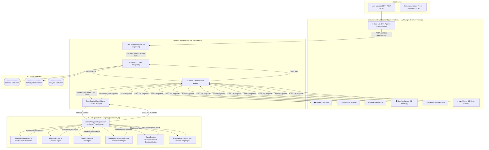

# QuantPulse Platform: End-to-End System, Data Flow & Architecture Guide

This comprehensive guide details the architecture, data pipeline, C++20 quantitative engine integration, data flow paths, input/output specifications, and all 7 institutional dashboard modules of the **QuantPulse** platform.

---

## 1. System Architecture

QuantPulse is structured as an institutional-grade, multi-tier quantitative trading and risk intelligence platform:



_Live mermaid diagram link :_ https://mermaid.ai/d/a5886aeb-e4c7-43df-b2d0-0ae3bbc964f7

---

## 2. Where Data is Passed: Step-by-Step End-to-End Data Flow

```text
[User File Upload]
       │
       ▼  (1) Multipart Form-Data (file, symbol, timeframe, name)
[Frontend Data Lab]
       │
       ▼  (2) HTTP POST /api/data-pipeline/upload
[Backend DataPipelineController]
       │
       ▼  (3) Buffer + MIME detection
[DataPipelineService (8-Stage ETL)]
       ├── Ingestion (UTF-8 decode, Line splitting)
       ├── Schema Detection (Delimiter sniffing: comma, tab, semicolon, pipe)
       ├── Validation (OHLC bounds, finite positive numbers, valid timestamps)
       ├── Normalization (IEEE 754 floats, alias mapping, currency cleaning)
       ├── Timestamp Normalization (ISO 8601 & UTC epoch milliseconds)
       ├── Symbol Normalization (Uppercase canonical ticker)
       ├── Deduplication (Unique (symbol, timestamp) key & chronological sort)
       └── Persistence (Save dataset metadata & bulk market bars)
       │
       ▼  (4) MongoDB Persisted State
[MongoDB collections: 'datasets' & 'market_data']
       │
       ▼  (5) Analytics Request (GET /api/analytics/datasets/:id or POST /api/market/analyze)
[AnalyticsService / MarketService]
       │
       ▼  (6) Format C++ IPC Payload: MarketAnalyticsRequest { symbol, bars: [ { timestamp, open, high, low, close, volume } ] }
[QuantEngineClient]
       │
       ▼  (7) Native Stdio IPC Stream (Child Process Spawn)
[C++20 CLI Binary: quantpulse_cli analyze-json]
       ├── MarketAnalyticsRequestJson::fromJson(stdin)
       ├── MarketDataAnalytics::analyze(request.symbol, request.bars)
       │      ├── StatisticsEngine (Mean, Skewness, Kurtosis)
       │      ├── ReturnsEngine (Log returns, Simple returns)
       │      ├── VolatilityEngine (Annualized volatility, Variance)
       │      ├── RiskEngine (VaR 95/99, Expected Shortfall 95/99)
       │      ├── MicrostructureEngine (Spread, Microprice, VWAP, Amihud, Roll Spread)
       │      └── RiskIntelligenceEngine & PerformanceEngine (Sharpe, Drawdown, Sizing)
       └── MarketAnalyticsJson::toJson(report) ──> stdout
       │
       ▼  (8) stdout JSON capture & schema validation
[QuantEngineClient]
       │
       ▼  (9) JSON API Response
[Node.js Backend Response]
       │
       ▼  (10) React Query / State Sync
[React Frontend Dashboards]
       ├── 🏠 Market Overview: Global Clocks, Hero Chart, AI Signals, Sector Matrix
       ├── 🔎 Opportunity Scanner: Bollinger Squeezes, Mean Reversion Z-Scores, OFI
       ├── 📊 Stock Intelligence: Microstructure metrics, Kyle's Lambda, Hurst Exponent
       ├── 🛡 Risk Intelligence: 3D Risk Heatmap Matrix, VaR/ES Curves, De-Risking Protocol
       ├── 🧪 Research & Backtesting: Strategy execution, Equity vs NIFTY 50, Drawdowns
       ├── ⚡ Live Market: Level-2 Order Book Ladder, Depth Imbalance, Microprice
       └── 📁 Data Lab: Full paginated dataset table, search & sort, pipeline telemetry
```

---

## 3. Supported Input Formats & Schemas

The Data Pipeline supports standard financial market data files from major data vendors, broker APIs, and historical databases.

### Supported File Types & Delimiters

- **CSV**: Comma-separated (`reliance.csv`, `nifty50.csv`)
- **TSV / TXT**: Tab-separated (`reliance-range-data.csv`)
- **European CSV**: Semicolon-separated (`;`)
- **Pipe Delimited**: Pipe-separated (`|`)
- **JSON**: Array of bar objects or wrapped records

### Canonical Market Bar Schema

Every record is normalized into the canonical market bar structure:

```typescript
interface MarketBar {
    timestamp: string | Date; // ISO 8601 string or Date object
    symbol: string; // Uppercase canonical ticker (e.g. 'RELIANCE')
    open: number; // Strictly positive float
    high: number; // Strictly positive float (>= low, >= open, >= close)
    low: number; // Strictly positive float (<= high, <= open, <= close)
    close: number; // Strictly positive float
    volume: number; // Non-negative integer or float (>= 0)
}
```

### Supported Column Aliases

The parser automatically maps heterogeneous column headers:

| Canonical Field | Supported Vendor / CSV Column Aliases                                                                   |
| :-------------- | :------------------------------------------------------------------------------------------------------ |
| **`timestamp`** | `Date`, `date`, `Time`, `time`, `datetime`, `trade_date`, `tradedate`, `dt`, `epoch`, `timestamp_utc`   |
| **`symbol`**    | `Symbol`, `symbol`, `Ticker`, `ticker`, `Stock`, `instrument`, `name`, `scrip`, `code`                  |
| **`open`**      | `Open`, `open`, `open_price`, `openprice`, `op`                                                         |
| **`high`**      | `High`, `high`, `high_price`, `highprice`, `hi`                                                         |
| **`low`**       | `Low`, `low`, `low_price`, `lowprice`, `lo`                                                             |
| **`close`**     | `Close`, `close`, `Close `, `Adj Close`, `adj_close`, `last`, `last_price`, `settle`                    |
| **`volume`**    | `Volume`, `volume`, `Vol`, `vol`, `qty`, `quantity`, `Shares Traded`, `shares_traded`, `totaltradedqty` |

### Special Robustness Features

1. **Formatted Prices & Numbers**: Prices with commas (`1,247.60`, `10,684,376`) and currency symbols (`₹`, `$`, `€`, `£`) are sanitized automatically.
2. **Missing / Dash Volume**: Missing volume values or hyphen placeholders (`-`) are converted to `0`.
3. **Corporate Action Rows**: Dividend and split annotations (e.g. `Jun 5, 2026 \t 6 Dividend`) from Yahoo Finance / NSE are skipped.
4. **Symbol Derivation**: If the file lacks a symbol column, the ticker is derived from:
    - User form field (`symbol`)
    - File name (e.g. `reliance-range-data.csv` -> `RELIANCE`, `TCS_1d.csv` -> `TCS`)
    - Fallback `MARKET_DATA`

---

## 4. The 7 Institutional Dashboards

The QuantPulse platform provides 7 specialized dashboards:

```text
QUANTPULSE
│
├── 🏠 Market Overview
├── 🔎 Opportunity Scanner
├── 📊 Stock Intelligence
├── 🛡 Risk Intelligence
├── 🧪 Research & Backtesting
├── ⚡ Live Market
└── 📁 Data Lab
```

### 1. 🏠 Market Overview (`MarketOverviewDashboard.tsx`)

- **Global Financial Clocks**: Live synchronized clocks for New York (EST), London (GMT), Tokyo (JST), and Mumbai (IST).
- **Market Status & Tickers**: Real-time ticker strip tracking NIFTY 50, SENSEX, BANKNIFTY, and INDIA VIX.
- **Hero Price Chart**: High-performance candlestick and volume overlay with multi-timeframe toggles (1D, 1W, 1M, 1Y, ALL).
- **AI Signal Matrix**: Real-time algorithmic signal feed (Signal, Confidence score, Suggested Action, Target, Stop Loss).
- **Sector Performance & Heatmap**: Performance ranking of major sectors (Banking, IT, Auto, Energy, FMCG, Pharma).
- **C++ Engine System Telemetry**: Live status of C++ quantitative services (Returns, Volatility, Microstructure, Risk).

### 2. 🔎 Opportunity Scanner (`OpportunityScannerDashboard.tsx`)

Specialized in extracting alpha from **congested, rangebound, and choppy markets**:

- **Volatility Squeeze Scanner**: Identifies Bollinger Bands contracting inside Keltner Channels to predict explosive breakouts.
- **Extreme Mean Reversion Engine**: Scans for price deviations exceeding $\ge 2.2\sigma$ Z-scores with RSI $< 28$ or $> 72$.
- **Order Flow Imbalance (OFI) Accumulation**: Detects institutional accumulation in tight consolidation zones.
- **Statistical Arbitrage / Cointegration Pairs**: Analyzes spread Z-scores on highly cointegrated pairs (e.g., HDFCBANK/ICICIBANK, TCS/INFY).

### 3. 📊 Stock Intelligence (`MarketDashboard.tsx`)

Deep asset microstructure and quantitative factor analysis:

- **C++ Quantitative Indicators**: Amihud Illiquidity, Kyle's Lambda, Roll Spread, Microprice, Hurst Exponent.
- **Distribution Moments**: Mean return, annualized volatility, skewness, kurtosis.
- **Position Sizing Engine**: Half-Kelly and Fractional Kelly optimal capital allocation sizing.
- **Interactive Price Chart**: TradingView Lightweight Charts canvas rendering with volume histogram.

### 4. 🛡 Risk Intelligence (`RiskIntelligenceDashboard.tsx`)

Institutional risk dashboard matching `Portfolio.png` and `Portfolio1.png`:

- **3D Risk Heatmap Matrix**: Interactive multi-dimensional risk matrix mapping portfolio exposures against volatility and liquidity.
- **Cross-Asset Correlation Matrix**: Heat-coded correlation coefficients across all active instruments.
- **VaR & Expected Shortfall (CVaR) Distribution**: Historical and Gaussian Parametric 95% and 99% Value at Risk curves.
- **Automated De-Risking Protocol Sequences**: Multi-stage automated circuit-breaker protocols (Warning $\to$ Hedge $\to$ De-Leverage $\to$ Emergency Liquidation).

### 5. 🧪 Research & Backtesting (`BacktestingDashboard.tsx`)

Quantitative strategy development and simulation:

- **Strategy Selection**: Momentum Breakout, Statistical Mean Reversion, Squeeze Volatility, Order Flow Scalper.
- **Simulation Engine**: Slippage modeling, commission deduction, fill latency, position sizing constraints.
- **Performance Analytics**: Equity Curve vs NIFTY 50 benchmark, Max Drawdown underwater curve, Sharpe Ratio, Sortino Ratio, Profit Factor, Win Rate %.
- **Execution Log**: Comprehensive trade fill log with entry/exit timestamps, executed price, quantity, and realized P&L.

### 6. ⚡ Live Market (`LiveMarketDashboard.tsx`)

High-frequency market microstructure and order book execution:

- **Level-2 Order Book Ladder**: Real-time bid and ask depth ladder showing quantity and price levels.
- **Depth Imbalance Gauge**: Live ratio of bid volume vs ask volume with buy/sell pressure indicators.
- **Microprice & Spread Telemetry**: Real-time spread (bps) and volume-weighted microprice calculations.
- **Live Trade Execution Stream**: Low-latency trade tick stream with aggressive buyer/seller identification.

### 7. 📁 Data Lab (`DataLabPage.tsx`)

Data ingestion, validation, and exploration:

- **Interactive 8-Stage ETL Pipeline**: Visual real-time stage execution with pass/fail indicators and row telemetry.
- **Multi-Format Ingestion**: Drag-and-drop file upload for CSV, TSV, Semicolon CSV, Pipe-delimited, and JSON files.
- **Full Dataset Viewer & Pagination**: Paginated data grid with page size selector (`10`, `25`, `50`, `100`, `250`, or `All`), column sorting, and instant search.
- **One-Click Terminal Bridge**: Instant transition to Market Terminal with pre-loaded dataset and C++ analytics.

---

## 5. API Reference & IPC Specifications

### A. Data Pipeline API (`/api/data-pipeline`)

- `POST /api/data-pipeline/upload` - Upload file and execute full 8-stage ETL pipeline.
- `GET /api/data-pipeline/preview/:datasetId` - Fetch full normalized dataset records for table pagination.
- `GET /api/data-pipeline/stages` - Fetch supported pipeline stages metadata.

### B. Datasets API (`/api/datasets`)

- `GET /api/datasets` - List all uploaded and persisted datasets.
- `GET /api/datasets/:id` - Fetch metadata for a specific dataset.
- `DELETE /api/datasets/:id` - Delete dataset and associated market bars.

### C. Analytics API (`/api/analytics`)

- `GET /api/analytics/datasets/:datasetId` - Run C++ quantitative engine on dataset and return metrics.
- `POST /api/market/analyze` - Run C++ engine on an on-the-fly array of market bars.

### D. Native C++ IPC Specification (`quantpulse_cli analyze-json`)

**Input JSON Schema (stdin)**:

```json
{
    "symbol": "RELIANCE",
    "bars": [
        {
            "timestamp": 1785748500000,
            "open": 1398.2,
            "high": 1400.1,
            "low": 1397.8,
            "close": 1399.5,
            "volume": 125000
        }
    ]
}
```

**Output JSON Schema (stdout)**:

```json
{
    "symbol": "RELIANCE",
    "observationCount": 250,
    "firstPrice": 1257.5,
    "lastPrice": 1240.4,
    "totalVolume": 3120500000.0,
    "averageVolume": 12482000.0,
    "returnPercentage": -1.359,
    "volatility": 0.238,
    "series": [
        {
            "timestamp": 1785748500000,
            "price": 1257.5,
            "volume": 0
        }
    ]
}
```

---

## 6. Build, Verification & Testing Guide

### C++ Quantitative Engine

```bash
# Build C++ Engine
cd cpp-engine
mkdir -p build && cd build
cmake ..
make -j$(nproc)

# Run All C++ Unit Tests (594 Tests)
ctest --output-on-failure

# Test Native CLI directly
./bin/quantpulse_cli analyze ../../data/samples/reliance-market-bar-v1.csv
```

### Backend (Node.js / Express / TypeScript)

```bash
cd backend
npm install

# Run All Backend Vitest Test Suites (72 Tests across 12 files)
npm test

# Run Development Server
npm run dev
```

### Frontend (React 19 / Vite / Tailwind CSS)

```bash
cd frontend
npm install

# Build & Typecheck Frontend
npm run build

# Run Development Server
npm run dev
```
