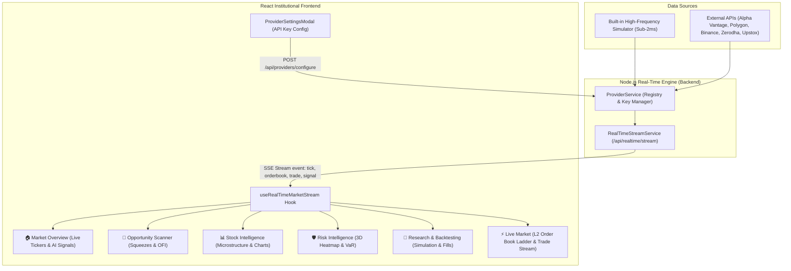

# QuantPulse Real-Time Market Streaming & Multi-Vendor Exchange API Guide

This document explains the real-time data streaming architecture, built-in exchange simulator, external vendor/broker API key integration, and dynamic synchronization across all 7 QuantPulse dashboards.

---

## 1. Real-Time Streaming Architecture (Server-Sent Events)

QuantPulse provides sub-millisecond real-time market data streaming to the frontend using **Server-Sent Events (SSE)** over `/api/realtime/stream`.



_Live Mermaid link:_ link https://mermaid.ai/d/a6f4b6d0-1c91-4936-9014-b046be32cc1d

### Why Server-Sent Events (SSE)?

- **Native Browser Support**: Uses standard browser `EventSource` with automatic reconnection and zero external socket dependencies.
- **Low Latency & High Throughput**: Streamlined unidirectional streaming of quotes, level-2 depth updates, and trade executions.
- **Firewall & Proxy Resilient**: Works over standard HTTP/HTTPS without WebSocket handshake or proxy timeout drops.

---

## 2. Multi-Vendor Stock Exchange & Broker Connector Subsystem

QuantPulse comes equipped with a multi-provider subsystem allowing seamless switching between local simulations and live broker feeds:

```text
┌─────────────────────────────────────────────────────────────────────────────┐
│                    MARKET DATA PROVIDER REGISTRY                            │
├──────────────────────────┬──────────────────────────────────────────────────┤
│ 1. Built-in Simulator    │ Realistic order book depth & trades (No key req) │
│ 2. Alpha Vantage         │ Global Equities, FX, and Intraday series         │
│ 3. Polygon.io            │ US Equities & Options market data                │
│ 4. Binance Spot          │ Real-time Crypto spot order books & trades       │
│ 5. Zerodha Kite Connect  │ Indian Equities & F&O broker feed                │
│ 6. Upstox Pro API        │ Indian Equities live feed & WebSocket            │
│ 7. Custom Webhook / REST │ User-hosted proprietary exchange bridge          │
└──────────────────────────┴──────────────────────────────────────────────────┘
```

### A. Built-in High-Frequency Simulator (Default)

- **Zero Configuration**: Active by default upon initial launch.
- **Deterministic Microstructure Dynamics**:
    - Generates 10-level Bid and Ask depth ladders.
    - Computes volume-weighted **Microprice** and **Spread (bps)**.
    - Generates **Order Flow Imbalance (OFI)** and tick-by-tick time & sales.

### B. User Custom API Key & Broker Integration

Users can attach their own exchange/broker API keys directly through the UI or REST API.

#### 1. Configuring via UI

1. Click the **`Feed: Built-in Simulator ⚙`** badge in the platform top header.
2. Select your desired data provider (e.g. _Alpha Vantage_, _Polygon.io_, _Zerodha Kite_, _Binance_, or _Custom Webhook_).
3. Paste your **API Key**, **API Secret**, or **Custom Endpoint URL**.
4. Click **Test Connection** to measure live latency and verify credentials.
5. Click **Activate Data Feed**. The platform immediately routes live ticks to the SSE stream and dashboards.

#### 2. Configuring via REST API

`POST /api/providers/configure`

```json
{
    "providerType": "alphavantage",
    "name": "Alpha Vantage",
    "enabled": true,
    "apiKey": "YOUR_ALPHA_VANTAGE_API_KEY",
    "environment": "live"
}
```

**Response**:

```json
{
    "success": true,
    "data": {
        "success": true,
        "message": "Activated Alpha Vantage as current market data provider.",
        "activeProvider": "alphavantage"
    }
}
```

#### 3. Testing Provider Connection

`POST /api/providers/test`

```json
{
    "providerType": "polygon",
    "apiKey": "YOUR_POLYGON_KEY"
}
```

---

## 3. Real-Time Event Types Streamed via SSE

Clients connecting to `GET /api/realtime/stream?symbol=RELIANCE` receive categorized events:

### Event 1: `tick` (Multi-Asset Quotes)

```json
event: tick
data: [
  {
    "symbol": "RELIANCE",
    "price": 2945.20,
    "change": 35.80,
    "changePercent": 1.23,
    "high24h": 2958.30,
    "low24h": 2905.10,
    "volume": 12450000,
    "timestamp": 1785748500000
  },
  {
    "symbol": "NIFTY50",
    "price": 24862.30,
    "change": 178.40,
    "changePercent": 0.72,
    "timestamp": 1785748500000
  }
]
```

### Event 2: `orderbook` (Level-2 Order Book Ladder)

```json
event: orderbook
data: {
  "symbol": "RELIANCE",
  "bids": [
    { "price": 2945.00, "quantity": 1420, "total": 1420, "orderCount": 5 },
    { "price": 2944.50, "quantity": 2850, "total": 4270, "orderCount": 8 }
  ],
  "asks": [
    { "price": 2945.50, "quantity": 980, "total": 980, "orderCount": 4 },
    { "price": 2946.00, "quantity": 1650, "total": 2630, "orderCount": 7 }
  ],
  "spread": 0.50,
  "spreadBps": 1.70,
  "midPrice": 2945.25,
  "microprice": 2945.32,
  "depthImbalance": 0.44,
  "timestamp": 1785748500000
}
```

### Event 3: `trade` (Executed Time & Sales)

```json
event: trade
data: {
  "id": "TRD-1785748500000-1",
  "symbol": "RELIANCE",
  "price": 2945.50,
  "quantity": 250,
  "side": "BUY",
  "timestamp": 1785748500000
}
```

### Event 4: `heartbeat` (Connection Keep-Alive)

```json
event: heartbeat
data: {
  "status": "alive",
  "provider": "simulated"
}
```

---

## 4. Frontend Clean URL Formatting & Navigation

The frontend supports clean, formatted hash URLs for direct navigation, bookmarking, and tab switching:

| Browser URL                                      | Target Dashboard           | Description                                             |
| :----------------------------------------------- | :------------------------- | :------------------------------------------------------ |
| `http://localhost:5173/#overview`                | 🏠 **Market Overview**     | Global clocks, NIFTY tickers, hero chart, AI signals    |
| `http://localhost:5173/#scanner`                 | 🔎 **Opportunity Scanner** | Volatility Squeezes, Mean Reversion Z-scores, OFI       |
| `http://localhost:5173/#stocks` or `/#market`    | 📊 **Stock Intelligence**  | Deep microstructure, Kyle's Lambda, C++ analytics       |
| `http://localhost:5173/#risk`                    | 🛡 **Risk Intelligence**   | 3D Risk Heatmap, Correlation Matrix, VaR/ES, De-risking |
| `http://localhost:5173/#backtest`                | 🧪 **Research & Backtest** | Strategy parameters, equity curves vs NIFTY, trade logs |
| `http://localhost:5173/#live` or `/#live-market` | ⚡ **Live Market**         | Level-2 depth ladder, microprice, live trade ticks      |
| `http://localhost:5173/#data-lab`                | 📁 **Data Lab**            | 8-Stage ETL pipeline, paginated dataset viewer          |

---

## 5. Backend REST API Reference

### Provider & Key Management

- `GET /api/providers`: Returns list of all supported providers, active provider, latency, and status.
- `POST /api/providers/configure`: Save user API key, credentials, or custom webhook endpoint and activate feed.
- `POST /api/providers/test`: Test authentication and measure latency against vendor API.
- `POST /api/providers/switch`: Instantly switch active provider (e.g. back to simulator).

### Real-Time Market Stream

- `GET /api/realtime/stream?symbol=RELIANCE`: Connect to live SSE event stream.

### Dynamic Dashboard APIs

- `GET /api/overview/market-status`: Major index quotes and global clocks.
- `GET /api/overview/signals`: Algorithmic signals with confidence scores and targets.
- `GET /api/overview/sectors`: Sector performance matrix and momentum scores.
- `GET /api/overview/telemetry`: C++ quantitative engine health.
- `GET /api/scanner/opportunities`: Volatility Squeezes, Mean Reversions, and Cointegration pairs.
- `GET /api/risk/summary`: 3D Heatmap, Correlation Matrix, VaR (95%/99%), and De-risking sequence.
- `POST /api/backtesting/run`: Execute strategy backtest simulation.
- `GET /api/live-market/orderbook/:symbol`: Fetch Level-2 order book depth snapshot.
- `GET /api/live-market/trades/:symbol`: Fetch recent executed trade ticks.
