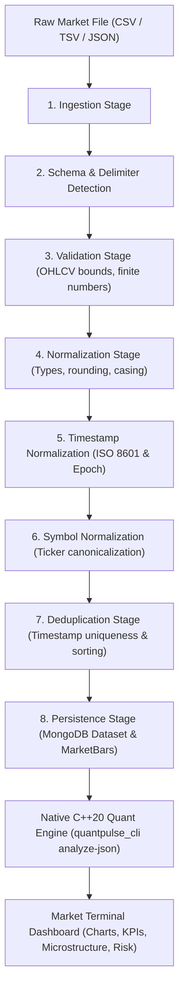

# QuantPulse Data Pipeline & Quantitative Engine Guide

This document explains the end-to-end architecture, input specifications, transformation pipeline, C++20 quantitative engine integration, and visualization layer of the QuantPulse platform.

---

## 1. Architecture Overview

QuantPulse implements a high-throughput, deterministic ETL pipeline designed to convert raw, heterogeneous stock market data (from brokers, exchanges, or historical CSV/TSV/JSON files) into canonical OHLCV bars, persist them to MongoDB, and feed them directly to the native C++20 Quantitative Analytics Engine.



---

## 2. Supported Inputs & Formats

The pipeline accepts standard financial market data files via upload in the **Data Lab** or direct API invocation.

### Supported File Formats

- **CSV** (Comma Separated Values)
- **TSV / TXT** (Tab Separated Values)
- **Semicolon-separated CSV** (European format)
- **Pipe-delimited values** (`|`)
- **JSON** (Array of objects or structured records)

### Automatic Delimiter Detection

The ingestion parser dynamically detects delimiters (`,`, `\t`, `;`, `|`) by analyzing column consistency across lines. You do not need to manually configure the delimiter.

### Header Mapping & Aliases

The parser automatically normalizes column names and matches common aliases:

| Canonical Field | Supported Header Aliases                                                                                |
| :-------------- | :------------------------------------------------------------------------------------------------------ |
| **`timestamp`** | `Date`, `date`, `Time`, `time`, `datetime`, `trade_date`, `tradedate`, `dt`, `epoch`, `timestamp_utc`   |
| **`symbol`**    | `Symbol`, `symbol`, `Ticker`, `ticker`, `Stock`, `instrument`, `name`, `scrip`, `code`                  |
| **`open`**      | `Open`, `open`, `open_price`, `openprice`, `op`                                                         |
| **`high`**      | `High`, `high`, `high_price`, `highprice`, `hi`                                                         |
| **`low`**       | `Low`, `low`, `low_price`, `lowprice`, `lo`                                                             |
| **`close`**     | `Close`, `close`, `Close `, `Adj Close`, `adj_close`, `last`, `last_price`, `settle`                    |
| **`volume`**    | `Volume`, `volume`, `Vol`, `vol`, `qty`, `quantity`, `Shares Traded`, `shares_traded`, `totaltradedqty` |

### Date & Timestamp Parsing

The validation stage parses any standard date format:

- **ISO 8601**: `2026-09-22T09:15:00.000Z`, `2026-09-22 09:15:00`
- **Human Readable**: `Sep 22, 2026`, `22-Sep-2026`, `September 22, 2026`
- **Standard Dates**: `2026-09-22`, `22/09/2026`, `22-09-2026`
- **Unix Epoch**: Seconds (e.g. `1785748500`) or Milliseconds (`1785748500000`)

### Number Formatting & Special Handling

- **Formatted Numbers**: Numbers with commas (`1,247.60`, `10,684,376`) and currency symbols (`$`, `₹`, `€`, `£`) are sanitized automatically.
- **Missing / Hyphen Volume**: Missing volumes or `-` (common on non-trading days or index data) are converted to `0`.
- **Corporate Action Lines**: Inline event annotations (e.g. `Jun 5, 2026 \t 6 Dividend`) from financial data providers like Yahoo Finance are detected and skipped cleanly.
- **Symbol Inference**: If no symbol column exists in the file, the symbol is derived from:
    1. Upload form metadata (`metadata.symbol`)
    2. Filename (e.g. `reliance-range-data.csv` -> `RELIANCE`, `AAPL_1d.csv` -> `AAPL`)
    3. Default fallback `MARKET_DATA`

---

## 3. The 8-Stage ETL Pipeline

When a file is uploaded, the Data Lab visualizes the execution of each stage in real time:

```
[ Ingestion ] ──> [ Schema Detection ] ──> [ Validation ] ──> [ Normalization ]
      │
      └───> [ Timestamp Norm ] ──> [ Symbol Norm ] ──> [ Deduplication ] ──> [ Persistence ]
```

1. **Ingestion (`ingestion`)**:
   Reads the raw buffer, detects MIME and file format, decodes UTF-8 text, and streams it into initial memory rows.
   _A MIME type is a two-part identifier sent with a file or data stream that indicates its format and nature._
2. **Schema Detection (`schema_detection`)**:
   Determines delimiters and matches headers against the canonical alias dictionary.
3. **Validation (`validation`)**:
    - Ensures all OHLC values are strictly positive finite numbers.
    - Verifies `High >= Low`.
    - Checks that `Open` and `Close` fall within the `[Low, High]` band (with a 1% provider-rounding auto-adjustment tolerance).
    - Validates timestamps into UTC Date objects.
4. **Normalization (`normalization`)**:
   Converts all numbers to IEEE 754 floating point numbers and removes provider-specific artifacts.
5. **Timestamp Normalization (`timestamp_normalization`)**:
   Normalizes all timestamps into standard ISO 8601 UTC strings and millisecond epochs.
6. **Symbol Normalization (`symbol_normalization`)**:
   Trims whitespace and converts ticker symbols to uppercase alphanumeric characters (e.g., `reliance` -> `RELIANCE`).
7. **Deduplication (`deduplication`)**:
    - Identifies and eliminates duplicate records sharing the same `(symbol, timestamp)`.
    - Sorts all market bars into strictly ascending chronological order (oldest to newest) required by quantitative algorithms.
8. **Persistence (`persistence`)**:
    - Creates a dataset metadata record in the MongoDB `datasets` collection.
    - Persists clean, validated bars in the MongoDB `market_data` collection with indexing on `(datasetId, timestamp)`.

---

## 4. Native C++20 Quantitative Engine Integration

Once a dataset is persisted, QuantPulse runs the C++20 quantitative engine to calculate market microstructure, risk intelligence, and time-series statistics.

### C++ Invocation Architecture

The Node.js backend spawns the native binary `quantpulse_cli analyze-json`:

```
Node.js (QuantEngineClient) ───[ JSON over stdin ]───> C++20 Binary (quantpulse_cli)
Node.js (QuantEngineClient) <───[ JSON over stdout ]<── C++20 Binary (quantpulse_cli)
```

### Quantitative Metrics Computed by C++ Engines

| Engine                    | Metrics Computed                                           | Formula / Methodology                                    |
| :------------------------ | :--------------------------------------------------------- | :------------------------------------------------------- |
| **Returns Engine**        | Return %, Mean Return, Log Returns                         | \(R*t = \frac{P_t - P*{t-1}}{P\_{t-1}}\)                 |
| **Volatility Engine**     | Annualized Volatility, Variance                            | \(\sigma*{ann} = \sigma*{daily} \times \sqrt{252}\)      |
| **Statistics Engine**     | Skewness, Kurtosis, Sample Mean                            | Higher-order moments of return distributions             |
| **Risk Engine**           | Value-at-Risk (VaR 95/99), Expected Shortfall (ES 95/99)   | Historical simulation & Parametric Gaussian methods      |
| **Performance Engine**    | Sharpe Ratio, Sortino Ratio, Max Drawdown                  | Risk-adjusted excess return over downside deviation      |
| **Microstructure Engine** | VWAP, TWAP, Amihud Illiquidity, Kyle's Lambda, Roll Spread | Volume-weighted execution benchmarks & liquidity proxies |

---

## 5. End-to-End Workflow: From Data Lab to Market Terminal

### Step 1: Uploading Data in Data Lab

1. Navigate to **Data Lab** (click the "Data Lab" tab in the header or browse to `#data-lab`).
2. Drop or select a market data file (e.g., `reliance-range-data.csv` or `data-lab-test.csv`).
3. (Optional) Provide a dataset name, ticker symbol, and timeframe.
4. Click **Start Pipeline Processing**.

### Step 2: Live Processing Visualization

The Data Lab interface displays:

- Real-time progress across all 8 pipeline stages with green completion checks.
- Row counts processed, validated, and deduplicated.
- Any non-fatal warnings (e.g., date formatting adjustments).
- An interactive preview table showing the first 10 sanitized OHLCV records.

### Step 3: Transition to Market Terminal

1. Once the pipeline completes, the **Dataset Ready & Available** card appears.
2. Click **View in Terminal**.
3. QuantPulse navigates to the **Market Terminal** dashboard, automatically selecting the newly created dataset.
4. The backend pulls the bars from MongoDB, passes them to the C++20 engine, and renders:
    - **KPI Metric Strip**: Last price, Return %, Annualized Volatility, Total Volume, Total Observations.
    - **Candlestick & Volume Chart**: Interactive price and volume series powered by Lightweight Charts.
    - **Market Summary Card**: First price, Last price, Average volume, and C++ engine status.
    - **Market Microstructure & Risk Panels**: Ready for strategy backtesting and live execution.

---

## 6. API Reference

### 1. Upload & Process Dataset

`POST /api/data-pipeline/upload`

**Headers**: `Content-Type: multipart/form-data`

**Form Fields**:

- `file`: The binary file (CSV, TSV, JSON)
- `name`: (Optional) Custom dataset display name
- `symbol`: (Optional) Ticker symbol override
- `timeframe`: (Optional) e.g., `1d`, `1m`, `5m`
- `source`: (Optional) Data source identifier

**Response**:

```json
{
    "success": true,
    "data": {
        "pipelineId": "38a834c0-f8dc-4e4b-b0b3-9e4554b38d39",
        "datasetId": "66f1bfd83a15ec58d10b7491",
        "status": "completed",
        "fileName": "reliance-range-data.csv",
        "format": "csv",
        "totalRows": 250,
        "processedRows": 250,
        "duplicateRows": 0,
        "stages": [
            {
                "name": "ingestion",
                "status": "completed",
                "inputRows": 250,
                "outputRows": 250
            },
            {
                "name": "schema_detection",
                "status": "completed",
                "inputRows": 250,
                "outputRows": 250
            },
            { "name": "validation", "status": "completed", "outputRows": 250 },
            { "name": "normalization", "status": "completed" },
            { "name": "timestamp_normalization", "status": "completed" },
            { "name": "symbol_normalization", "status": "completed" },
            {
                "name": "deduplication",
                "status": "completed",
                "outputRows": 250
            },
            { "name": "persistence", "status": "completed", "outputRows": 250 }
        ],
        "dataset": {
            "id": "66f1bfd83a15ec58d10b7491",
            "name": "reliance-range-data.csv",
            "symbol": "RELIANCE",
            "timeframe": "1d",
            "source": "user-upload",
            "barCount": 250
        }
    }
}
```

### 2. List All Datasets

`GET /api/datasets`

**Response**:

```json
{
    "success": true,
    "data": [
        {
            "id": "66f1bfd83a15ec58d10b7491",
            "name": "reliance-range-data.csv",
            "symbol": "RELIANCE",
            "timeframe": "1d",
            "source": "user-upload",
            "barCount": 250,
            "createdAt": "2026-09-23T19:30:00.000Z"
        }
    ]
}
```

### 3. Run C++ Quantitative Analytics on Dataset

`GET /api/analytics/datasets/:datasetId`

**Response**:

```json
{
    "success": true,
    "data": {
        "symbol": "RELIANCE",
        "observationCount": 250,
        "firstPrice": 1257.5,
        "lastPrice": 1240.4,
        "totalVolume": 3120500000,
        "averageVolume": 12482000,
        "returnPercentage": -1.359,
        "volatility": 0.238,
        "series": [
            {
                "timestamp": 1785748500000,
                "price": 1257.5,
                "volume": 0
            },
            {
                "timestamp": 1785834900000,
                "price": 1240.4,
                "volume": 10684376
            }
        ]
    }
}
```

---

## 7. Sample Datasets in the Repository

The repository includes ready-to-test market datasets in `data/samples/`:

1. **`data/samples/reliance-range-data.csv`**: Real-world 250-bar daily historical dataset for RELIANCE with tab delimiters, formatted dates (`Sep 22, 2026`), comma-separated prices (`1,247.60`), missing volume (`-`), and corporate action annotations.
2. **`data/samples/data-lab-test.csv`**: Multi-day daily dataset for RELIANCE with ISO 8601 timestamps and varying case symbols.
3. **`data/samples/reliance-market-bar-v1.csv`**: Intraday 1-minute market bar series with Unix epoch timestamps.
